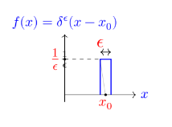

**Informations légales et de version :**

*Licence :* Ce document est placé sous licence Creative Commons Attribution 4.0 International (CC BY 4.0).

*Version :* 1.0.5 (Dernière mise à jour : 24 août 2026)

Ce travail a pour vocation d'être un socle théorique et pédagogique en amont de formations appliquées. Il s'adresse aux acteurs et professionnels concernés par la convergence entre quantique et réseaux.

Il ne remplace pas un cours universitaire standard (L3/M1 en cursus de physique), notamment car le contenu mathématique y est moins développé et le public visé diffère.

Ce document n'a fait l'objet d'aucune évaluation par les pairs (peer-review).

:::{.callout-note title="Note d'édition"}
Ce document a été rédigé et structuré par l'auteur. Une intelligence artificielle (LLM) a été utilisée comme outil d'assistance pour la relecture textuelle, la clarification de certaines notions théoriques et l'optimisation pédagogique du plan.
:::

# Démarche et motivation pédagogique :

Ce document est l'aboutissement d'une démarche construite sur trois piliers distincts, reliant l'histoire de l'enseignement à l'innovation architecturale :

1.  **Évolution de l'enseignement quantique : La seconde révolution**

    - *Ancienne vocation (Il y a 40 ans) :* acquérir une compétence pratique dans le domaine des semi-conducteurs.

    - *Vocation actuelle :* sensibiliser le futur ingénieur aux enjeux industriels de la **seconde révolution quantique**, qui, portée par la vérification expérimentale de l'intrication, a ouvert la porte à l'informatique quantique.

2.  **Valorisation pédagogique : l'approche par la mécanique matricielle**

    - *Source :* l'ouvrage "Calcul matriciel. application à la physique quantique" [@alma991002711779705804] (1960).

    - *Intérêt :* Proposer une approche progressive et ambitieuse du formalisme de l'algèbre linéaire, jugée particulièrement aidante pour l'appropriation par les non-mathématiciens.

3.  **Analogie architecturale : nouveaux formalismes pour la décentralisation**

    - **Problématique :** La représentation et la modélisation des architectures décentralisées de la technologie Blockchain nécessitent de nouveaux formalismes.

    - **Hypothèse de synergie :** Une recherche par analogie dans d'autres domaines, notamment la quantique, peut enrichir la conception de la blockchain, créant un bénéfice structurel et conceptuel réciproque.

# Introduction historique :

## Le document de rupture de 1925 :

On situe quelquefois la naissance de la quantique par la découverte de la constante de Planck, ou bien celle de l'équation de Schrödinger, ou bien le papier de Heisenberg de 1925 :"Über quantentheoretische Umdeutung kinematischer und mechanischer Beziehungen" [@Heisenberg1925] qui pose un nouveau formalisme.

::: callout-warning
Avertissement : Le document de 1925 n'est pas simple du tout à lire car certaines étapes sont peu détaillés. Il donne l'impression d'un "brouillon de fin de nuit blanche". Il constitue pourtant un document charnière.
:::

{fig-align="center" width="500"}

Nous allons rentrer dans le document afin d'introduire des themes nouveaux.

::: callout-tip
C'est semble t il une simple discussion avec Niels Bohr qui a convaincu Heisenberg de s'attaquer au problème de la détermination de la trajectoire de l’électron autour d'un atome. Ensuite Heisenberg a profité de son isolement sur l'île de Heligoland pour soigner une allergie aux pollens de fleurs pour y réfléchir.
:::

## Seconde loi de Newton en physique classique :

Formulée en 1687 dans ses Principia, la seconde loi de Newton révolutionne la physique en liant la force au changement de mouvement. Elle s'exprime par la célèbre relation $\vec{F} = m\vec{a}$ qu'Heisenberg exprime sous forme simplifiée :

$$\ddot{x} + f(x) = 0$$

Si Heisenberg pose cette formule connu, ce n'est pas pour le plaisir de faire de la physique classique mais car il pense que l'on peut partir de cette formule et en trouver une extension quantique. Il cherche une algèbre. Ainsi il cherche à construire en théorie quantique un formalisme qui corresponde le plus étroitement possible à celui de la mécanique classique.

## Définition de l'action pour Bohr :

Le concept d'action naît au XVIIIe siècle avec Maupertuis et Euler, qui postulent que la nature est "économe" et minimise toujours une quantité physique lors d'un mouvement.

Heisenberg s’intéresse à la notion d'action, prise comme l'impact et qui peut s'exprimer comme une énergie que multiplie une durée, ou comme une vitesse que multiplie une distance. $h$ signifie ici le quantum d'action. Cela signifie qu'en quantique la constante de planck $h$ introduit une nouvelle dimension à l'action.

$$\oint pdq=\oint m\dot{x}dx=J(=nh)$$

Toutefois ici il faut se placer dans la physique de époque et J représente l'action et elle est un multiple de n. Cela signifie que plus le niveau énergie est élevé plus l'action pour l'atteindre est importante. L'action peut être le produite de énergie par la durée ou du déplacement par la vitesse. *Cette formulation de l'action va être profondément remise en cause par Heisenberg.*

## Introduction du paramètre position :

- tout d'abord, nous cherchons a exprimer la position x d'une particule. En supposant la fonction périodique nous allons la décomposer en série de fourier,

$$x=\Sigma_{+\infty}^{-\infty}a_{\alpha}(n)e^{i\alpha\omega_{n}t}$$

::: callout-tip
Attention ici il s'agit d'une expression en physique classique. Mais nous allons voir que Heisenberg va "abandonner" $x$ car considere comme non observable. Toutefois nous restons encore dans le cadre la la mécanique classique. Un mouvement périodique peut être un oscillateur harmonique mais surtout la trajectoire d'un electron sur son orbite imaginée dans le modele de Bohr. On dirait que Heisenberg presuppose que le mouvement quantique est périodique. **En realite il exige que si un mouvement quantique existe alors il permet un mouvement classique périodique**. Dans le modèle de Bohr le mouvement classique était considéré comme un cas particulier du mouvement quantique (celui ou $n$ est très grand). C'est pour cette raison (qu'on appelle principe de correspondance) que l'on peut prendre le mouvement périodique classique comme point de départ du raisonnement. Plus tard on se détachera de la vision continue de x(t) de la physique classique.
:::

## Mise en evidence de l'energie :

Il suffit de la dériver pour prendre l'expression de v.

$$m\dot{x}=\Sigma_{+\infty}^{-\infty}a_{\alpha}(n)i\alpha\omega_{n}e^{i\alpha\omega_{n}t}$$

::: callout-tip
En basculant de dq en dt on introduit un carre. L'énergie cinétique est une vitesse au carrée. **Le carre introduit qu'il s'agit d'une énergie.** On remarque que ici on raisonne toujours en physique classique. Toutefois on se positionne a raisonner en terme d'énergie, or une transition entre un état n et un état n+1 et bien quelque chose qui coûte une certaine énergie. On voit l'intuition d'Heisenberg. Le terme a\_${\alpha}(n) \cdot a_{-\alpha}(n)$ préfigure $\left|a_{\alpha}(n)\right|^2$. Heisenberg s’intéresse beaucoup aux amplitudes et a leurs significations physiques.
:::

$$\oint m\dot{x}dx=\oint m\dot{x}^2dt=2\pi m\Sigma_{+\infty}^{-\infty}a_{\alpha}(n)a_{-\alpha}(n)\alpha^2\omega_{n}$$

## Limite classique dans la formulation de l'action :

On obtient ainsi le terme suivant :

$$\oint mx^2dt=2\pi \Sigma_{+\infty}^{-\infty} |a_{\alpha}(n)|^2\alpha^2\omega_{n}$$

Ici Heisenberg explique que cette formulation ne le satisfait pas. Il en préfère une autre :

$$\frac{d}{dn}(nh)=\frac{d}{dn}\oint m\dot{x}dt$$

Dans cette partie difficile, Heisenberg cherche à tout prix à exprimer l'action non pas comme liée a un niveau d’énergie n donné mais a la différence entre deux niveaux, d’où l'expression de la derivée $\frac{d}{dn}$

::: callout-tip
On construira plus tard une matrice dérivée (opérateur de dérivation) et nous verrons qu'elle permettra de mettre en valeurs des valeurs propres ou valeurs mesurables de la vitesse de la particule. Ainsi le formalisme est pose.
:::

Pour n grand dn est tres petit et donc la derivve de nh par rapport a n vaut h d ou la formule suivante :

$$h=2\pi m \Sigma_{+\infty}^{-\infty} \alpha \frac{d}{dn} a\alpha \omega_{n} |a_{\alpha}|^2$$

On peut remarquer que jusqu'ici on est toujours dans la physique classique car la difference de niveaux est exprimee par dn.

## Introduction de la quantification dans les indices :

Revenons a la formule classique de l'action : $\oint p \, dq = nh$.

p est une impulsion ($p = m \dot{q}$) et q une position. En remplacant x et v par leurs valeurs mais en ajoutant les indices on finit par obtenir la formule suivante :

$$h = 4\pi m \Sigma_{0}^{+\infty}\alpha{|a(n,n+\alpha)|^2\omega(n,n+\alpha)}-{|a(n,n-\alpha)|^2\omega(n,n-\alpha)}$$

::: callout-note
Enfin ici Heisenberg a utilise la théorie de Kramer qui introduit des amplitudes de transition. On a réalisé le "saut".

On voit qu'il y a des transitions dans le sens montants, d'autres dans le sens descendant mais la différence n'est pas nulle : elle est même constante, égale à $h$. On introduit l’algèbre non commutative (celle qui dit que $p.x \neq p.x$) dans la physique.

On remarque aussi qu'il n'y a dans la formule pas de mention de la position ni de la vitesse.
:::

Cet article de Heisenberg de 1925 est très abstrait, en particulier le concept de position dont je rappelle les points ici, au risque de tomber dans l’interprétation :

- le point de départ est la physique classique et la formulation de x(t) sous la forme d'une série de fourrier. Il s'agit de voir la quantique comme une extension de la physique classique (et pas l'inverse comme on le fait souvent).

- on abandonne la possibilité de la position. Il s'agit quasiment d'un choix arbitraire.

- en troisième lieu la position ressuscite sous forme de la matrice position X. Toutefois prendre un stylo et une feuille de papier, dessiner une matrice avec un X dedans ne suffit pas a faire une matrice position. Les composantes de la matrice expriment des transitions d’états (on remplace un espace des positions par un espace des transitions). C'est bien la position de X dans la relation de la non commutation ($X.Y\neq Y.X$) qui fait les propriétés de la matrice X.

On voit comment la spacialité éclate complètement au profit des composantes de la matrices qui expriment des potentialités.

## L'oscillateur anharmonique :

Ce paragraphe est important car il prouve la validité de la méthode de Heisenberg. Elle a des similitudes avec la méthode utilisée jusqu’à présent. Tout d’abord Heisenberg par de la physique classique

Voici la définition :

$$x=\lambda a_{0}+a_{1}coswt +\lambda a_{2}cos2wt + \lambda^2a_{3}cos3wt + ...+ \lambda^{\tau-1}a_{r}cos\tau\omega t$$

on a les relations de récurrence :

$$\omega_0^2 (\lambda a_0) + \lambda \langle x^2 \rangle = 0$$

Ici encore Heisenberg s’intéresse aux amplitudes : on laisse tomber x et on exprimer l'amplitude en fonction de n et de la fréquence. Ces amplitudes constituent des transitions d’états.

Sans rentrer dans les details on tombe sur :

$$a^2(n,n-1)=\frac{(n+const)h}{\pi\omega_{0}}$$

et de fil en aiguille Heisenberg finie par aboutir à la formule de l'oscillateur :

$$W=(n+\frac{1}{2})hw_{0}/2\pi$$

Dans le document de 1925 la partie sur l'oscillateur harmonique est de loin la plus obscure à première lecture et pourtant le résultat est juste.

## Conclusion :

On entend quelquefois que Heisenberg abouti aux résultats de la mécanique ondulatoire mais en "évitant l'onde". De plus le document de 1925 présente une très grande cohérence d'approche dans sa méthode puisque qu’il applique pour l'oscillateur anharmonique exactement la même méthode qu'avant dans le document.

L'image ci-dessous présente les participants au congres de Solvay de 1927. En deux ans, la nouvelle physique était née.

{#fig-solvay fig-align="center" width="100%"}


# Principe d'incertitude d'Heisenberg :

## Expérience courante du principe d'incertitude :

Dans la vie courante, est il possible de "faire l’expérience" du principe d'incertitude ? A Nice sur la Promenade Des Anglais il y a des petites chaises bleues sur le front de mer oú les passants s'assoient. Un jour dans le Vieux-Nice j'ai vu un magasin de souvenirs qui vendait les mêmes chaises bleues mais en miniature. Si j'en achete une et que le vendeur l'emballe dans une petite boite, quelle est l'incertitude sur la position de la chaise dans la boite ?

{#fig-chaise fig-align="center" width="40%"}

::: callout-warning
Attention à la limite de l'exemple de la chaise : il s'agit d'une analogie macroscopique pour illustrer un phénomène microscopique.
:::

Quand un objet va vite, sa trajectoire est plus difficile à décrire (je perds sa position) comme s'il fallait choisir entre vitesse et position. Par exemple, pour suivre la trajectoire d'un oiseau, je suis obligé de le suivre du regard pour identifier sa trajectoire : je compense l'incertitude par la multiplicité des mesures.

La vitesse de l'oiseau n’apparaît comme n’étant rien d'autre que le résultat d'un changement de position : il semble y avoir un lien de causalité entre vitesse et position dans le sens ou tout changement de position de l'oiseau se fait à une certaine vitesse.

Ainsi Niels Bohr [@BOHR1928] dit, en citant Heisenberg :

> "On peut même dire, remarque-t-il à ce sujet, que les phénomènes ordinaires (macroscopiques) sont en quelque sorte engendrés par des observations répétées."

Cette approche accorde de importance à l’expérience. Pour Heisenberg si l’expérience montre une impossibilité a déterminer avec précision une position alors il faut l'admettre comme fondement et faire avec.

Conclusion : ce paragraphe introductif pour but de vous faire vous poser des questions.

## Principe d'incertitude des radioelectriciens :

En principe le terme de principe d'incertitude des radioelectriciens n'est pas l'objet d'un usage. Il est toutefois cité par Augustin Blaquiere [@alma991002711819705804]. Je choisis de le mettre en valeur dans ce cours car il a un intérêt pédagogique : en effet il fait le pont entre une notion classique et une notion quantique. Dans le cas classique nous sommes tous familiarisés avec le fait par exemple que le son de la voix peut être représentée par son spectre.

Le principe d'incertitude est une propriété *mathématique des séries de fourier*. Il n'est pas spécifique à la physique quantique. Ainsi on le retrouve en électronique lorsqu'on on associe à un signal temporel un spectre en fréquence. Toutefois il existe des différences entre les deux :

En électronique on raisonne systématiquement sur une amplitude (tension ou intensité) en fonction du temps, en physique quantique on parle le plus souvent d'une amplitude fonction de x.

Pour l’électronicien le principe d'incertitude prendra la forme $\Delta t \times \Delta f \approx 1$

Lorsque le signal est une impulsion brève dans le temps, la gamme de fréquence est très étendue mais les fréquences sont très serrées. Lorsque $\Delta t$ tend vers 0 (impulsion breve) le spectre devient continu.

Avec le principe d'incertitude de radioelectriciens on ne prend pas en compte la condition de quantification présente dans la relation : $E=h\mu$

::: callout-tip
Il est intéressant de remarquer que dans un cas classique (électronique ou acoustique) si il est possible d'avoir une bande de fréquence très étirée (voir infinie) ce n'est pas en général la bande de fréquence "utile". Par exemple :

1.  En électronique on a l'habitude de fabriquer des filtres passe haut, passe bas ou passe bande afin d’éliminer les fréquences excentrées qui constituent du bruit.

2.  En acoustique, le timbre d'une voix humaine est un mélange de différentes fréquences. Personne n'a une voix “monocorde". Toutefois ici encore le message utile à la compréhension d'une voix humaine est regroupé sur une bande de fréquence limitée. On peut remarquer que en cas de bruit de fond, dans une salle très bruyante par exemple, à condition de se concentrer il est possible d'isoler la conversation qui nous intéresse comme si le cerveau avait une capacité de filtrage sélective. De même l'oreille réussit à isoler des sons isolés. Autre exemple : dans une salle de restaurant bruyante, si une cuillerée tombe par terre, on isole très bien cet "évènement" du bruit de fond constitué des autres sons.
:::

## Transposition au domaine électromagnétique :

Toutefois on peut se demander si un principe équivalent au principe d'incertitude des radioelectriciens existe dans le cas d'ondes électromagnétiques c'est à dire d'ondes lumineuses.

Nous savons qu’en quantique il y a une condition de quantification ($E=h\nu$). nous savons depuis l’expérience du corps noir que cette condition s'applique aux ondes lumineuses. Mais que se passe t il si on applique pas la condition de quantification et qu'on en reste a $\nu$ et pas à $E$.

Bohr était un bon pédagogue et des 1928 il a pu communiquer une synthèse assez aboutie. Rappelez vous de la photo de la page 5 qui correspond au congre Solvay de 1927. Celui-ci a permis les discussions que l'on appelle quelquefois par abus de langage le "consensus de Copenhague".

Ainsi Bohr [@BOHR1928] décrit cette forme première du principe d'incertitude avant quantification en prenant l'exemple d'une onde plane élémentaire ayant la forme : $$A\cos 2 \pi(\nu t -\sigma x -\sigma y -\sigma z + \delta)$$ ou $A$ et $\delta$ sont des constantes désignant l'amplitude et la phase ; $\mu$ est la fréquence ; $\sigma x$, $\sigma y$ et $\sigma z$ sont les nombres d'onde dans les directions des axes.

Alors selon Bohr, stricto sensu la représentation d'un champ d'ondes limite exige une multiplicité d'ondes élémentaires correspondant à toutes les valeurs possibles de $\nu$ e de $\sigma$. Cependant *dans les cas les plus favorables* les valeurs moyennes des différentes grandeurs (...) seront données par la relation : $$\Delta t \Delta \nu = \Delta x \Delta \sigma x =  \Delta y \Delta \sigma y =  \Delta z \Delta \sigma z =1$$

## La publication de 1925 d'Heisenberg : vers un nouveau formalisme :

Revenons un peu en arriere. En 1924 alors qu'il n'est age que de 24 ans et qu'il n'a pas encore sa thèse, Heisenberg écrit : [@Heisenberg1925]

> "Dans cette situation, il paraît judicieux d'abandonner tout espoir d'observer des grandeurs jusqu'ici inobservables, comme la position et la période d'un électron, et d'admettre que l'accord partiel entre les règles quantiques et l’expérience est plus ou moins fortuit. Au lieu de cela, il semble plus raisonnable de tenter d’établir une mécanique de la théorie quantique analogue a la mécanique classique, mais dans laquelle seules apparaissent des relations entre des grandeurs observables."

On voit dans l'extrait ci-dessus que l'objectif d'Heisenberg est de ne baser l’interprétation que sur des résultats observables. Ainsi il s'agit de "renoncer" à une interprétation au delà de ce que la mesure peut nous donner.

Ceci est la première publication d'Heisenberg. Elle pose un formalisme base sur des tableaux. Heisenberg parlera de matrices un peu plus tard. Il posera le principe d'incertitude qui porte son nom en 1927.

Ainsi Andre Coret [@PHSC_2001__5_1_105_0] écrit : "En s'appuyant sur l’expérience c'est a dire sur la nécessite de considérer l émission lumineuse comme issue d'un changement d'état de l electron et non de son mouvement, Heisenberg se permet une opération qu'il qualifie lui-même d'arbitraire (willkur)."

## Apport du formalisme hamiltonien :

Sir William Rowan Hamilton était un physicien irlandais du 19 eme siècle.

Fritz London et Edmond Bauer écrivent : [@london1939theorie]

> L’évolution du système dans le temps est réglée en mécanique classique par une "fonction hamiltonienne" H(p,q) caractéristique du système en question. Cette fonction de coordonnées q1,q2,...,qf et des impulsions p1,p2,pf (..) permet d’écrire les fonctions hamiltoniennes du mouvement. C'est cette même fonction H(q,p) qui en mécanique quantique aussi donne la loi d’évolution du représentant \phi de l’état du système : on forme l’opérateur $H(q,\frac{h}{2\pi i\frac{\delta}{\delta q}})$ en remplaçant p dans l'hamiltonien par l’opérateur de différentiation : $\frac{h}{2\pi i\frac{\delta}{\delta q}}$

On voit qu'en formalisme hamiltonien le paramètre t n'est plus visible. Le temps passe, t est sous entendu mais ce n'est pas lui qui apparaît dans la formule mais q la position et p la quantité de mouvement. On va par exemple décrire le diagramme de phase d'un oscillateur harmonique classique en fonction de p et de q. (et non pas par exemple de q et de t). *On prend l'habitude "en douceur" de lier les variables de position et de quantité de mouvement.* Ce formalisme hamiltonien est lui-même une branche de ce que l'on appelle la physique analytique.

## Approche intuitive de la non commutation des fonctions :

Comme le souligne Augustin Blaquière [@alma991002711779705804], le concept de non-commutation peut être introduit par des opérations mathématiques simples appliquées à une fonction d'onde $\Psi(x)$ (que nous appellerons ici $f(x)$ à titre d'illustration).

Considérons les deux opérateurs mathématiques suivants :

L'opérateur de position : $\hat{x}$ (simplement la multiplication par $x$).

L'opérateur de dérivation : $\hat{D} = \frac{d}{dx}$.

Nous allons appliquer ces opérateurs à une fonction $f(x)$ dans les deux ordres possibles et calculer leur différence, appelée commutateur.

Ordre 1 : Appliquer la dérivation puis la multiplication par $x$.

$$\hat{D} \left[ x f(x) \right] = \frac{d}{dx} \left[ x f(x) \right]$$ En utilisant la règle de dérivation d'un produit, $(uv)'=u'v+uv'$ :

$\frac{d}{dx} \left[ x f(x) \right] = \frac{dx}{dx} f(x) + x \frac{d}{dx} f(x) = f(x) + x \frac{d}{dx} f(x)$

Ordre 2 : Appliquer la multiplication par $x$ puis la dérivation.

$\hat{x} \left[ \frac{d}{dx} f(x) \right] = x \frac{d}{dx} f(x)$

Le Commutateur $\left[\hat{D}, \hat{x}\right]$ Calculons la différence (le commutateur) des deux opérations appliquées à $f(x)$

$\left( \frac{d}{dx} x - x \frac{d}{dx} \right) f(x) = \left( f(x) + x \frac{d}{dx} f(x) \right) - x \frac{d}{dx} f(x) = f(x)$

En isolant l'opérateur, nous obtenons la relation de commutation purement mathématique :

$\left[\frac{d}{dx}, x\right] = \frac{d}{dx} x - x \frac{d}{dx} = 1$

Le Lien Quantique :

Cette relation mathématique devient physique en mécanique quantique grâce au Postulat de Quantification, qui définit l'opérateur d'impulsion ($\hat{p}$) :

$\hat{p}_x = \frac{\hbar}{i} \frac{d}{dx} = -i \hbar \frac{d}{dx}$

En utilisant ce postulat, nous pouvons remplacer $\frac{d}{dx}$ par $\frac{i}{\hbar} \hat{p}_x$ dans la relation précédente :

$\left[ \frac{i}{\hbar} \hat{p}_x, \hat{x} \right] = 1$

Puis, en sortant les constantes $\frac{i}{\hbar}$ du commutateur (qui est une opération linéaire) :

$\frac{i}{\hbar} \left[ \hat{p}_x, \hat{x} \right] = 1$

D'où, la relation de commutation fondamentale en mécanique quantique pour la position et l'impulsion :

$\left[ \hat{x}, \hat{p}_x \right] = \hat{x} \hat{p}_x - \hat{p}_x \hat{x} = i\hbar$

## Cas limites du principe d'incertitude :

On appelle cas limites les situations où l'incertitude est concentrée sur une seule des deux grandeurs : soit l'incertitude sur la position est très élevée, soit l'incertitude sur l'impulsion est très élevée, mais pas les deux en même temps ni aucun des deux.

Ces cas correspondent aux situations où le produit des incertitudes atteint son minimum théorique :

$$\Delta x \Delta p \approx \frac{\hbar}{2}$$

Au contraire, dans le cas général, l'incertitude suit la forme d'une inégalité stricte : $\Delta x \Delta p > \frac{\hbar}{2}$.

[@alma991013035899705804]

{#fig-incert1 fig-align="center" width="80%"}

\begin{center}
\begin{tikzpicture}[x=1cm, y=1cm]
    % Axes
    \draw[->, >=stealth] (-1,0) -- (10,0) node[right] {$x$};
    \draw[->, >=stealth] (0,-1.5) -- (0,1.5) node[above] {$\psi(x)$};

    % Tracé de l'onde (Paquet large)
    % On utilise une fonction sinus avec une enveloppe pour éviter les coupures nettes
    \draw[blue, thick, samples=400, domain=0:9] 
        plot (\x, {sin(5 * \x r)}); % 'r' pour radians

    % Indication de l'incertitude (La "bande")
    \draw[<->, >=stealth, red, thick] (0,-1.2) -- (9,-1.2) 
        node[midway, below] {$\Delta x$ élevé};
    
    % Note explicative plus sobre
    \node[draw, fill=green!10, text width=5cm, align=center, rounded corners] at (4.5, 2) 
        {\small La bande est large : position peu précise, mais fréquence (impulsion $p$) mieux définie.};
        
\end{tikzpicture}
\end{center}

Par exemple dans le cours de Berkeley [@alma991013035899705804] il est donné en exemple les cas ou une des 2 formes d'incertitude est franche dans le cas d'un electron en "orbite" autour d'un noyau :

1.  Si l'électron est confine dans une très petite région autour du noyau, l'incertitude sur sa position est faible. l'incertitude sur sa quantité de mouvement doit être grande, ce qui signifie que son énergie cinétique doit être grande.

2.  Si vous voulons que l'énergie cinétique soit très petite nous devons accorde assez de place a l'électron : l'incertitude sur sa position doit être grande, sa distance moyenne au noyau doit alors être grande.

{#fig-incert2 fig-align="center" width="70%"}

\begin{center}
\begin{tikzpicture}
  % Axes
  \draw[->] (0,0) -- (7,0) node[right] {$x$};
  \draw[->] (0,-2) -- (0,2) node[above] {$\psi(x)$};
  
  % Courbe de battement (Somme de deux fréquences)
  \draw[blue, thick, samples=200, domain=0:6.5] 
    plot (\x, {sin(2*\x r) + sin(6*\x r)});
    
  % Annotation
  \node [draw, fill=green!10, text width=5cm, text centered, rounded corners] 
    at (3.5, 2.5) {$\Delta x \cdot \Delta p \geq \frac{\hbar}{2}$ \\ \small Difficile de trancher l'incertitude ici.};
\end{tikzpicture}
\end{center}

{#fig-incert3 fig-align="center" width="80%"}

\begin{tikzpicture}[x=2cm, y=2cm]
    % Axes
    \draw[->, >=stealth] (-2.2,0) -- (2.2,0) node[right] {$x$};
    % On décale le label psi(x) à gauche pour libérer l'espace du haut
    \draw[->, >=stealth] (0,-1) -- (0,1.5) node[left, at start] {} node[near end, left] {$\psi(x)$};

    % Le Paquet d'ondes serré (Delta x faible)
    \draw[red, thick, samples=400, domain=-2:2] 
        plot (\x, { exp(-8 * \x * \x) * cos(25 * \x r) }); 

    % Indication Delta x sous la courbe pour ne rien surcharger
    \draw[<->, >=stealth, blue, thick] (-0.35,-0.3) -- (0.35,-0.3) 
        node[midway, below] {$\Delta x$ réduit};
        
    % Cartouche informatif placé dans un coin libre (en haut à droite)
    \node[draw, fill=green!10, rounded corners, font=\small, text width=4cm, align=center] at (1.2, 1.2) {
        \textbf{Localisation} \\ 
        Somme d'une infinité de fréquences.
    };
\end{tikzpicture}

C'est l'image type d'un photon ou d'un électron qui voyage dans un environnement sans obstacles.

En résumé :

``` text
+-----------+------------------+----------------------------------------------+
| RÉFÉRENCE | ÉTAT PHYSIQUE    | TRADUCTION "RÉSEAU"                          |
+-----------+------------------+----------------------------------------------+
| Figure 7  | Onde Pure        | Un signal continu (porteuse seule).          |
|           | (Monochrome)     | Fréquence connue, position inconnue.         |
+-----------+------------------+----------------------------------------------+
| Figure 8  | Interférence     | Un signal qui commence à être modulé.        |
|           | (Battement)      | Perte de précision sur la fréquence brute.   |
+-----------+------------------+----------------------------------------------+
| Figure 9  | Paquet d'ondes   | Un "Pulse" ou un Qubit qui voyage.           |
|           | (Pulse localisé) | On sait quand il passe (timing précis).      |
+-----------+------------------+----------------------------------------------+
```

## Premier principe d'incertitude d'Heisenberg (position-impulsion) :

La relation suivante limite les précisions avec lesquelles on peut mesurer la position et l'impulsion :

$$\boxed{\Delta x \times \Delta p \geq \frac{\hbar}{2\pi}}$$ C'est le premier principe d'incertitude d'Heisenberg.

Avec :

$\Delta x$ indétermination sur la position

$\Delta p$ indétermination sur la quantité de mouvement de la particule

$\hbar$ est le symbole utilisé en physique pour représenter la constante de Planck réduite. Elle est une version simplifiée de la constante de Planck, notée généralement $h$, divisée par $2\pi$.

Attention à la portée de ce principe : il ne s'agit pas d'une contrainte expérimentale liée par exemple aux instruments du laboratoire mais de plus que cela. Nous pouvons le considérer comme un fondement théorique.*C'est independant des instruments utilisés.*

## Principe d'incertitude temps-energie :

On l'appelle aussi second principe d'incertitude d'Heisenberg.

Ce n'est pas la traduction du premier principe en d'autres termes mais quelque chose de différent.

On a parlé du principe d'incertitude des radioelectriciens : $$\Delta t \times \Delta f \approx 1$$

On peut l'utiliser par exemple en acoustique dans l'analyse fréquentielle d'un son.

Appliquons lui maintenant la condition de quantification :

$E=h\mu$

La relation d'incertitude des radioelectriciens devient :

$$\Delta t \times \Delta \frac{E}{h} \approx 1$$

$$\Delta t \times \Delta E \approx h$$

Ce qui donne lorsqu'on le généralise :

$$\boxed{\Delta E \times \Delta t \geq \frac{\hbar}{2}}$$

Il s'agit du second principe d'incertitude d'Heisenberg ou inégalité d'Heisenberg énergie-temps.

Avec :

$\Delta E$ l'incertitude sur énergie du système. $\Delta t$ l'intervalle de temps pendant lequel le système reste dans un état énergétique.

Par exemple plus la durée de vie d'un état quantique est courte, plus l'incertitude sur son énergie est grande.

On voit ici que c'est la condition de quantification qui fait que ce second principe existe. Cela traduit le fait que quand la fequence est elevee l'energie associee est importante. Ce fait qui fut decouvert par planck n'est pas intuitif du tout.

## Base en représentation par t :

La problématique de départ est plus compliquée ici. Une derivee représente un intervalle entre 2 positions. Pour être dans une représentation en position on s’intéresse a un simple point dans l'espace. Toutefois dans notre démarche nous allons commencer par poser les choses en t et non pas en x comme si le point auquel on s’interesse mais pas un point dans l'espace mais dans le temps. Nous nous intéressons donc a un intervalle très court sur la ligne du temps et nous l'assimilons a une impulsion de Dirac.

Physiquement parlant, une impulsion de Dirac peut se comparer en terme temporel a une timbale qui émet un son fort mais très bref. On va ainsi filtrer le signal sur un intervalle temporel très petit.

{fig-align="center"}

\begin{figure}
\centering
\begin{tikzpicture}
  % Définir la largeur epsilon
 % \def\epsilon{0.2}
  
  % Tracer l'axe horizontal
  \draw[->] (0,0) -- (2,0) node[right, blue] {$x$};
  \draw[->] (0,-0.2) -- (0,1.7) node[above, blue] {$f(x)=\delta^{\epsilon}(x-x_{0})$};
  
  % Tracer la fonction créneau
  \draw[thick, blue] 
    (1,0) -- (1,1) -- (1.3,1) -- (1.3,0);
  
  % Optionnel : ajouter des points ou des annotations
  \fill (0,1) circle (1pt);
  \fill (1.15,0) circle (1pt) node[below, red] {$x_{0}$} -- (1,1);
%  \fill (0.5+\epsilon,1) circle (1pt);
%  \fill (1,0) circle (1pt);

\draw[dashed] (0,1) node[left, red] {\Large $\frac{1}{\epsilon}$} -- (1,1) ;
  
  % Ajouter des labels
 \node at (0, 1) {$\frac{1}{\epsilon}$};

 \draw[<->,line width=0.5pt] (1,1.2) node[above, red] {\Large $\epsilon$} -- (1.3,1.2) ;

\end{tikzpicture}
\end{figure}

> **Rappel** [@Najib2022-qq] La distribution de dirac appelée par abus de language fonction $\delta$ de dirac est informellement considérée comme une fonction $\delta(x-x_{0})$ qui n'a de valeur qu'au voisinage de $x_{0}$ et qui prend une valeur infinie en ce point et la valeur 0 partout ailleurs, et dont l'intégrale sur tout l'espace est égale à 1. Considérons $\delta^{\epsilon}(x-x_{0})=1$, alors $\int_{-\infty}^{+\infty}\delta^{\epsilon}(x-x_{0})=1$. La fonction de dirac est definie par : $\delta(x-x_{0})=\lim_{x \to 0}\delta^{\epsilon}(x-x_{0})$

Nous raisonnons en t. Une impulsion peut être un signal très bref en termes temporels. Toutefois en termes spatiaux cela peut se représenter par une distance très courte. Ici encore la fonction impulsion $\delta x$ s'applique

## Utilité de la fonction porte :

$\delta x$ est une vue théorique car sa largeur est nulle. En pratique nous allons utiliser la fonction échelon mais sur une distance très courte : c'est la fonction porte.

{fig-align="center"}

\begin{figure}
\centering
  \begin{tikzpicture}[scale=0.8]
  \begin{axis}[
    domain=-10:10,
    samples=200,
    axis lines=middle,
    xlabel=$k$,
    ylabel=$g(k)$,
    xtick={-10,-8,...,10},
    ytick={-0.5,0,0.5,1},
    height=8cm,
    width=12cm,
    grid=both,
    clip=false
  ]
    \addplot [blue, thick] {sin(deg(x))/x};
    \addplot [mark=*, only marks] coordinates {(0,1)};
  \end{axis}
\end{tikzpicture}
\caption{La fonction sinus cardinal qui est la TF de la fonction porte ici prise en exemple sur l'intervel [-10,10]}
\end{figure}

Attention :

1.  La solution de l'équation de Schrödinger est une gaussienne dans le cas d'une particule libre. Dans le cas d'une particule confinée dans un puits de potentiel on se ramène à une onde stationnaire.

2.  Contrairement au cas de la lumière, pour le particule le milieu est dit dispersif, ce qui signifie que la gaussienne (c'est a dire la densité de probabilité) va s'étaler (s'aplatir) sur une surface de plus en plus grande au cours du temps.

## Conséquence : concept de paquet d'onde :

Nous devons parler ici du cas de la particule libre qui n'est pas confinée dans un espace comme c'est le cas dans un puits de potentiel.

*Délocalisation de la Particule Libre :*

La longueur d'onde de de Broglie implique du fait du principe d'incertitude que $\Delta x=+\infty$. Dans ce cas, on ne sait pas où chercher ce qui rend la mesure impossible.

On dit que la particule n'est pas normalisable.

*Localisation par Superposition :*

Physiquement, une particule réelle (même libre) est toujours relativement localisée. Pour modéliser cette localisation, la mécanique quantique utilise le principe de superposition :

Formation du Paquet d'Ondes : Pour obtenir une fonction d'onde $\psi(x,t)$ localisée dans l'espace (petit $\Delta x$), on est obligé de la construire comme la somme (superposition) d'une infinité d'ondes planes de de Broglie, chacune ayant une impulsion ($p$) légèrement différente.

Rôle des Impulsions : Cette addition d'ondes de fréquences très proches crée une interférence constructive dans une petite région de l'espace, et une interférence destructive partout ailleurs.

Le Paquet d'Ondes : La fonction d'onde résultante, $\psi(x,t)$, appelée paquet d'ondes, est localisée dans l'espace. Le cas le plus célèbre, car il représente l'état d'incertitude minimale, est le paquet d'ondes gaussien.

*Linéarité de l'Équation de Schrödinger :*

Le principe de superposition est valide car l'équation de Schrödinger est linéaire : toute onde qui est la somme d'ondes solutions de l’équation de Schrödinger est elle-même solution de l’équation de Schrödinger. $$ \Psi_{\text{paquet}} = \sum_i c_i \psi_i$$ où chaque $\psi_i$ est une solution de l'équation.

## Vitesse de phase et vitesse de groupe :

Nous continuons à parler d'une particule libre qui n'est pas soumise a un potentiel.

On s'attend à ce que la vitesse de la particule soit celle de l'onde de De Broglie, c'est à dire l'onde individuelle. On peut en effet associer une vitesse *de phase* à l'onde de De Broglie. Toutefois ce n'est pas la vitesse de la particule mais une valeur approchée. C'est la *vitesse de groupe* qui constitue la vitesse de la particule.

Plus précisément :

Vitesse de phase : $$v_{\phi}=\frac{\omega}{k}$$

Vitesse de groupe : $$v_{g}=\frac{d\omega}{dk}|_{k=k_{0}}$$

*Conclusion :*

La vitesse de groupe $v_{g}$ est rigoureusement égale à la vitesse classique de la particule, $v_{classique}$.

En mécanique quantique, la vitesse physique d'une particule est donnée par la vitesse de groupe de son paquet d'ondes. Le paquet d'ondes est ainsi la contrepartie quantique de la particule localisée.

# Faits experimentaux :

## Le corps noir :

Le corps noir n'est pas forcément noir. C'est un concept théorique désignant un objet idéal qui absorbe tout le rayonnement électromagnétique qu'il reçoit. Dans la pratique, il est modélisé par une cavité avec une ouverture qui piège les rayons lumineux à l'intérieur. S'il ne reçoit aucun rayonnement extérieur, l'objet émet son propre rayonnement (chaleur ou lumière), uniquement en fonction de sa température. C'est cette émission d'énergie, dont la courbe spectrale n'est pas explicable par la physique classique, qui a conduit à la quantification de l'énergie.

{#fig-corps-noir fig-align="center" width="70%"}

\usetikzlibrary{arrows}
\begin{figure}
\centering
    
 
\begin{tikzpicture}[scale=0.5]
  \fill [fill=black!40, draw=black, very thick, semitransparent]  
  (0,0) 
    -- (10,0) 
    -- (10,5.5) 
    -- (9,5.5) 
    -- (9,1)
    -- (1,1)
    -- (1,11)
    -- (9,11)
    -- (9,6.5)
    -- (10,6.5)
    -- (10,12)
    -- (0,12) ;
 \draw[->, magenta,line width=2pt] (12,7) -- (1,3.5) -- (4,11) -- (9,8) [dashed, blue] node[left, purple] {\begin{tabular}{c}L’énergie électromagnétique (lumière) \\ est piégée par le corps noir\end{tabular}};

 \draw [arrows = {-Latex[width=7pt, length=7pt]},dashed, blue,line width=1pt] (10,2) -- (12,2);
 \draw [arrows = {-Latex[width=7pt, length=7pt]},dashed, blue,line width=1pt] (10,4) -- (12,4);
 \draw [arrows = {-Latex[width=7pt, length=7pt]},dashed, blue,line width=1pt] (10,8) -- (12,8);
 \draw [arrows = {-Latex[width=7pt, length=7pt]},dashed, blue,line width=1pt] (10,10) -- (12,10);

\draw [arrows = {-Latex[width=7pt, length=7pt]},dashed, blue,line width=1pt] (0,2) -- (-2,2);
 \draw [arrows = {-Latex[width=7pt, length=7pt]},dashed, blue,line width=1pt] (0,4) -- (-2,4);
 \draw [arrows = {-Latex[width=7pt, length=7pt]},dashed, blue,line width=1pt] (0,8) -- (-2,8);
 \draw [arrows = {-Latex[width=7pt, length=7pt]},dashed, blue,line width=1pt] (0,10) -- (-2,10);

\draw [arrows = {-Latex[width=7pt, length=7pt]},dashed, blue,line width=1pt] (1,12) -- (1,14);
 \draw [arrows = {-Latex[width=7pt, length=7pt]},dashed, blue,line width=1pt] 
 (3,12) -- (3,14);
 \draw [arrows = {-Latex[width=7pt, length=7pt]},dashed, blue,line width=1pt] (5,12) -- (5,14);
 \draw [arrows = {-Latex[width=7pt, length=7pt]},dashed, blue,line width=1pt] (7,12) -- (7,14);

 \draw [arrows = {-Latex[width=7pt, length=7pt]},dashed, blue,line width=1pt] (1,12) -- (1,14);
 \draw [arrows = {-Latex[width=7pt, length=7pt]},dashed, blue,line width=1pt] 
 (3,12) -- (3,14);
 \draw [arrows = {-Latex[width=7pt, length=7pt]},dashed, blue,line width=1pt] (5,12) -- (5,14);
 \draw [arrows = {-Latex[width=7pt, length=7pt]},dashed, blue,line width=1pt] (7,12) -- (7,14);

 \draw [arrows = {-Latex[width=7pt, length=7pt]},dashed, blue,line width=1pt] (1,0) -- (1,-2);
 \draw [arrows = {-Latex[width=7pt, length=7pt]},dashed, blue,line width=1pt] 
 (3,0) -- (3,-2);
 \draw [arrows = {-Latex[width=7pt, length=7pt]},dashed, blue,line width=1pt] (5,0) -- (5,-2);
 \draw [arrows = {-Latex[width=7pt, length=7pt]},dashed, blue,line width=1pt] (7,0) -- (7,-2);
 \draw (5,-3) node [purple] {\begin{tabular}{c}L’énergie est ensuite restituée \\ sous forme de rayonnement thermique\end{tabular}};

       
\end{tikzpicture}
       
 
\caption{Certains objets, comme l'intérieur d'un four chauffé uniformément, peuvent approcher le modèle du corps noir.}
\end{figure}

A un moment Planck eut l'idée d'introduire une constante h qui règle le problème qui vaut : $h=6,626.10^{-34}J.s$. Il imaginait que le corps noir se comportait comme un oscillateur harmonique de fréquence $\mu$ mais dont les niveaux énergie sont quantifiés. Il s'agissait d'une astuce afin de faire coller les résultats avec l’expérience. Planck ne prévoyait pas un très grand avenir scientifique à la constante $h$ qu'il avait introduite. C'est Einstein qui valorisa cette constante en proposant en 1905 une interprétation simple et efficace de l'effet photoélectrique en postulant que le rayonnement électromagnétique était lui même composé de quantas de lumière, appelés plus tard photons d'énergie $\epsilon=h\mu$. Ces quantas d' énergie ne furent appelées photons qu'en 1926.

{#fig-corps-noir2 fig-align="center" width="70%"}

Max Planck [@Planck1901-fc] écrit :

> "si nous appliquons la loi de déplacement de Wien sous sa dernière forme à l'expression de l'entropie S, nous nous rendons compte que l’élément d’énergie $\epsilon$ doit être proportionnel au nombre d'oscillations $\mu$ et que donc : $\epsilon=h\mu$"

puis un peu plus loin Planck donne une première estimation pour $h$ : $h=6.55.10^{-27} erg.sec$

A comparer avec la valeur réelle : $6,62607015 \times 10^{-34} J.s$

$h$ s'exprime en joules secondes : en physique il s'agit d'une action. Pour cette raison on appelle aussi $h$ le quantum d'action.

## L'effet photoélectrique :

Albert Einstein écrit : [@Einstein1905-zf]

> "Il me semble que les observations portant sur le "rayonnement noir" (...) apparaissent comme plus compréhensibles si on admet que l'energie de la lumière est distribuée de façon discontinue dans l'espace. Selon l’hypothèse envisagée ici, lors de la propagation d'un rayon lumineux émis par une source ponctuelle, l’énergie n'est pas distribuée de façon continue sur des espaces de plus en plus grands, mais est constituée d'un nombre fini de quantas d’énergie localises en des points de l'espace".

Einstein pose dans cet article daté du 09 juin 1905 (soit environ 6 mois avant son célèbre article sur la relation masse énergie) la discontinuité de l'énergie non plus comme une constatation expérimentale mais comme un fondement théorique. Cet article lui vaudra le Prix Nobel de physique en 1921.

{#fig-photo-elec fig-align="center" width="50%"}

\usetikzlibrary {arrows.meta}
\usetikzlibrary {decorations.pathmorphing}
\begin{figure} 
\centering
 
     
 \begin{tikzpicture}[scale=0.5]

 %   \tikzset{shift={(current page.center)},yshift=-1.5cm}
  
  \foreach \x in {-5,-4,-3,-2,-1,-2,0,1,2,3}
    \foreach \y in {-1,0,1,2,3}
      {
        \draw [fill=red] (\x,\y) circle (0.3cm);
      %  \fill (\x,\y) circle (0.1cm);
      }

 %   \draw[decorate,decoration={snake,segment length=2cm},->] (0,0) - - (10,0);
    \draw[decorate,decoration=snake,magenta,-{Stealth[length=5mm]}] (-5,7) - - (-1,3.2) ;
    \draw[decorate,decoration=snake,magenta,-{Stealth[length=5mm]}] (-6,7) - - (-2,3.2) ;
    \draw[decorate,decoration=snake,magenta,-{Stealth[length=5mm]}] (-7,7) - - (-3,3.2) ;

    
    \draw [fill=blue] (2,5) circle (0.3cm);
    \draw[blue,-{Stealth[length=5mm]}] (2,5) -- (3,8);

     \draw [fill=blue] (0,4) circle (0.3cm);
    \draw[blue,-{Stealth[length=5mm]}] (0,4) -- (1,6);
    
   % \draw[decorate,decoration=snake ] (0,0) arc (0:180:3 and 2);

   
   
\end{tikzpicture}

\caption{ L'énergie reçue par le rayonnement électromagnétique va permettre à des électrons de s'éjecter du matériau. On observe une corrélation entre l'énergie reçue (quantifiée) et celle de l'électron}
\end{figure}

L'équation d'Einstein pour l'effet photoélectrique s'écrit :

$$ \boxed{h\nu =W_{S}+{\frac {1}{2}}mv^{2}}$$ où :

$h\nu$ est l'énergie du photon ;

$W_{S}$ est l'énergie de liaison de l'électron ;

$\frac {1}{2}mv^{2}$ est l'énergie cinétique finale de l'électron. L'énergie d'un photon est caractérisée par la formule.

*On considère que l'effet photoélectrique a fait apparaître l'aspect corpusculaire de la lumière (en plus de ondulatoire). [@Greiner2009-sw]*

## Expérience des fentes d'Young :

### Fentes d'Young avec la lumière :

En optique on admet que les trous S1 et S2 se comportent comme des sources secondaires qui, issues de la même source primaire S, mettent de sondes sphériques cohérentes entre elles. C'est le principe d'Huygens-Fresnel.

En tout point P du plan d'observation la fonction d'onde $\Phi$ résulte de la superposition linéaire des fonctions d'onde $\Phi 1$ et $\Phi 2$.

$$\Phi=\Phi 1 +\Phi 2$$

### Fentes d'Young avec des électrons :

{fig-align="center"}

\begin{tikzpicture}
\draw[->] (1,0) -- (3,0);
\draw[->] (3,0) -- (8,0);
\draw (1,0) node[scale=1.2]{$\bullet$} node [left]{$S$};
\draw[{-]}, blue] (3,2) -- (3,4) node[above]{};
\node [red] (A) at (3,1.5) {$S_1$};
\node [red] (B) at (3,-1.5) {$S_2$};
%\node [red] (C) at (3,-5) {Trous d'Young};
\node [red] (D) at (3,4.5) {Feuille de cuivre};
\node [red] (E) at (10,-3) {\begin{tabular}{l}Plan d'observation \\ ou de détection \end{tabular}};
\draw[{-]}, blue] (3,1) -- (3,-1);
\draw[{-]}, blue] (3,-4) -- (3,-2);
\draw[{-]}, red] (8,3) -- (8,-3);
\draw[dashed, <->] (3,-3) -- node[above]{$d$} (8,-3) ;
\draw[dashed, <->] (2,-2) -- node[above, right]{$a$} (2,-4) ;
\draw[->, magenta] (1,0) -- (3,2);
\draw[->, magenta] (1,0) -- (3,1);
\draw[->, magenta] (1,0) -- (3,-1);
\draw[->, magenta] (1,0) -- (3,-2);
%realisation des franges d'interference
\foreach \x in {0,0.1,...,0.8}
{
\draw [magenta] (7.8,\x) -- (8.2,\x+0.2); 
}
\foreach \x in {0,-0.1,...,-0.8}
{
\draw [magenta] (7.8,\x) -- (8.2,\x+0.2); 
}
\node [magenta] (F) at (10,0) {Franges d'interférence};

\end{tikzpicture}

L'expérience pionnière de Faget et Fert a été reproduite avec deux fentes et plus par le physicien allemand Claus Joösson en 1961. En envoyant des électrons d'énergie cinétique $E_{k}=50$ keV sur une feuille de cuivre percée de deux fentes de largeur $0,5\mu m$, distantes de $0,2\mu m$, Jönsson observa sur une plaque photographique placée dans le plan d'observation P, des franges d'interférence des ondes électroniques[@Perez2013-it].

Dans l’expérience précédente la source primaire S émet des électrons que l'on détecte en P dans le plan P, après traversée des trous S1 et S2. En réduisant le flux d’électrons de telle sorte qu'entre S et P, à tout instant il n'y ait qu'un seul électron, on observe des points d'impact discrets dus aux électrons collectés pendant la durée d'exposition.

Si cette durée est faible, les points d'impact semblent se répartir de manière aléatoire. En revanche, si elle est suffisante, les impacts se répartissent peu à peu selon la figure d'interférence. *Ceci est surprenant car à un électron unique on associe bien aussi une onde*.

L'onde considérée en quantique est une onde de probabilité : elle diffère donc fondamentalement d'une onde physique habituelle, mécanique ou électromagnétique, puisque elle ne représente pas la variation d'une grandeur physique.

*Nous reviendrons plus tard dans le cours sur l'approche statistique de la physique quantique.*


# L'onde de Louis De Broglie :

## Equation des ondes ou de d'Alembert :

Le scientifique français Jean le Rond d'Alembert, qui a établi l'équation des ondes en une dimension d'espace en 1746. $$\frac {\partial ^{2}{\vec {\mathrm {E} }}}{{\partial x^{2}}} + \frac {\partial ^{2}\vec {\mathrm {E} }}{\partial y^{2}} + {\frac {\partial ^{2}{\vec {\mathrm {E} }}}{\partial z^{2}}}={\frac {1}{c^{2}}}{\frac {\partial ^{2}{\vec {\mathrm {E} }}}{\partial t^{2}}}$$ On remarque que le terme qui représente l'énergie est en dérivée seconde.

## La thèse de De Broglie de 1924 :

Dans sa thèse de 1924, Louis de Broglie écrit : [@debroglie:tel-00006807]

> "L’électron est pour nous le type du morceau isolé celui que nous croyons, peut-être à tort, le mieux connaître ; or d’après les conceptions reçues, l’énergie de l’électron est répandue dans tout l’espace avec une très forte condensation dans une région de très petites dimensions dont les propriétés nous sont d’ailleurs fort mal connues. Ce qui caractérise l’électron comme atome d’énergie, ce n’est pas la petite place qu’il occupe dans l’espace, je répète qu’il l’occupe tout entier, c’est le fait qu’il est insécable, non divisible, qu’il forme une unité. Ayant admis l’existence d’une fréquence liée au morceau d’énergie, cherchons comment cette fréquence se manifeste a l’observateur fixe dont il fut question plus haut."

On lit que Louis de Broglie admet une fréquence liée : c'est le début de la relation onde-corpuscule. Cette intuition conduit de Broglie à sa célèbre relation : $\lambda = \frac{h}{p}$, reliant la longueur d'onde à la quantité de mouvement, pierre angulaire de la mécanique ondulatoire

## Concept d'onde de matière :

L’électron étant une particule matérielle on appelle par extension onde matérielle l'onde associée à une particule.

On représente cette onde par la fonction d'onde complexe : $$\boxed{\Psi(\vec{r},t)=ae^{-i(wt-k\vec{r})}}$$ avec :

- $a$ étant l'amplitude,
- $k$ le vecteur d'onde,
- $\omega$ la pulsation,
- $\nu$ etant la fréquence.
- $\vec{p}=\hbar \vec{k}$ le vecteur impulsion

On peut ainsi trouver la forme suivante :

$$\Psi(\vec{r},t)=ae^{-i(Et-\vec{p}\vec{r})/\hbar^2}$$

Dans sa forme cette onde ressemble à une onde plane monochromatique que l'on utilise en optique,

Voici la *relation de de Broglie ou relation de la longueur d'onde de de Broglie* :

$$\boxed{p=\frac {h}{\lambda}}$$ $\lambda$ étant la longueur d'onde de l'onde de De Broglie.

Elle traduit la dualité onde-corpuscule en associant la longueur d'onde $\lambda$ d’un rayonnement à la quantité de mouvement $p$ d’une particule.

On trouve la forme suivante : $$\lambda=\frac{2\pi}{k}$$.

Ces relations sont également valables pour les photons.

Toutefois la vitesse de phase de l'onde de De Broglie n'est pas la vitesse de la particule mais une valeur approchée. Ainsi De Broglie envisage qu'une particule n'est pas représentée par une onde sinusoïdale pure mais par une superposition de plusieurs ondes sinusoïdales appelées paquet d'ondes.

La relation $\lambda=\frac{h}{p}$ ne joue pas le rôle de postulat de base. Toutefois elle a permis d'arriver à la conclusion qu'il faut voir un lien entre la position de la particule et celle de l'amplitude du paquet d'ondes.

```{=html}
<!--

|  |  |  |
|------------------------|------------------------|------------------------|
| **Caractéristique** | **Onde Plane Standard** | **Électron de De Broglie (1924)** |
| **Localisation** | Rigoureusement nulle (étalée partout). | Étale partout, mais **condensé** en un point. |
| **Énergie** | Densité constante partout. | Condensée mais indivisible (atome d'énergie). |
| **Fréquence** | Paramètre mathématique pur. | Fréquence liée à la masse/énergie ($E=hf$). |
| **Structure** | Sinusoïde infinie. | Proche du concept de **paquet d'ondes**. |

-->
```

+-----------------+---------------------------------------+----------------------------------------------+
|                 |                                       |                                              |
+=================+=======================================+==============================================+
| Caractéristique | Onde Plane Standard                   | Électron de De Broglie (1924)                |
+-----------------+---------------------------------------+----------------------------------------------+
| Localisation    | Rigoureusement nulle (étalée partout) | Étale partout, mais **condensé** en un point |
+-----------------+---------------------------------------+----------------------------------------------+
| Énergie         | Densité constante partout             | Condensée mais indivisible (atome d'énergie) |
+-----------------+---------------------------------------+----------------------------------------------+
| Fréquence       | Paramètre mathématique pur            | Fréquence liée à la masse/énergie (E=hf)     |
+-----------------+---------------------------------------+----------------------------------------------+
| Structure       | Sinusoïde infinie                     | Proche du concept de **paquet d'ondes** \|   |
+-----------------+---------------------------------------+----------------------------------------------+


# Équation de Schrödinger :

## Rappel de physique des ondes :

Il s'agit simplement de faire quelques rappels terminologiques pour éviter toutes confusions dans les termes.

*Onde progressive :* une onde progressive "progresse", par exemple le son se propage dans l'air. Elle transporte de l'énergie sans transport de matière.

*Onde stationnaire :* C'est une onde qui apparaît immobile. Idéalement, elle est la conséquences de deux ondes progressives qui arrivent en sens opposées et interfèrent. "Naturellement" il faut des conditions très précises pour s'en approcher. On peut aussi penser a la corde d'une guitare classique qui va vibrer sur elle-même.

*Onde plane :* il s'agit d'un concept plus que d'une onde que l'on rencontre réellement. Toutefois, c'est une modélisation suffisamment approchée dans certains milieux comme les milieux homogènes. Il s'agit bien d'une sinusoïde mais qui dépend d'une seule variable spatiale.

*Équation d'onde :* Posée la première fois par Jean Le Rond d'Alembert en 1747 elle s'applique en toutes les ondes en physique classique. En physique quantique elle sera remplacée par équation de Schrödinger.

Voici la formule de l'équation d'onde en une dimension :

$$\boxed{\frac{\partial^2 u}{\partial t^2} - c^2 \frac{\partial^2 u}{\partial x^2} = 0}$$

## Exemple tiré des télécommunications :

Voici l'exemple d'un circuit RLC (filtre passe bande).

Les paramètres L, C et R sont appelés des impédances.

{fig-align="center"}

\begin{center}
\begin{circuitikz}
    \draw (0,0) to [short] ++(0,1) node [right] {$-$}
    to [open, v^>=$E(t)$, o-o] ++(0,1) node [right] {$+$}
    to [short] ++(0,1)
    to [R=$R$, i>^=$I$, resistors/zigs=6] ++(4,0)
    to [curved capacitor, l_=$C$, capacitors/thickness=8] ++(0,-3)
    to [cute inductor, l_=$L$, mirror] ++(-4,0);
\end{circuitikz}
\end{center}

La tension et l'intensite sont des grandeurs electriques que l'on peut representer par des sinusoides. Le comportement du circuit est decrit par une equation differentielle :

$$ \left\{
    \begin{array}{ll}
        L\frac{di(t)}{dt} =-Ri(t) -V_{c}(t) -e(t) \\
        i(t)=C\frac{dv_{c}(t)}{dt}
    \end{array}
\right.$$

Notez qu'il s'agit d'une représentation fonctionnelle et on est tenté de remplacer les variables par des matrices. Ce n'est toutefois pas possible de façon directe.

Pour utiliser des matrices, l'équation doit être modifiée de la façon suivante :[@Dixneuf2007-oc] $$\frac{dX(t)}{dt}=\begin{bmatrix}
-R/L & -1/L \\
1/C & 0 
\end{bmatrix}X(t)+\begin{bmatrix}
-1/L  \\
0 
\end{bmatrix}U(t)$$\
Dans ce cas X(t) est un vecteur d'état qui représente par exemple le courant. C'est une "vision moderne" ou on introduit la notion d'état en électronique.

En physique quantique on aussi besoin d'une équation différentielle pour décrire évolution de l’état d'un corpuscule.

C'est l'équation de Schrödinger.

Elle est régie par des opérateurs (comme l'Hamiltonien $\hat{H}$) qui sont l'équivalent des paramètres physiques du système (tels que les impédances $R, L, C$).

La solution de l'équation de Schrödinger est la fonction d'onde $\Psi(x, t)$, qui est l'équivalent quantique du vecteur d'état $X(t)$ décrivant le système.

## Extrait de la publication de Schrödinger de 1926 :

Erwin Schrödinger écrit : [@Schrodinger1926-vy]

> Je ne saurais passer sous silence que je dois l'impulsion première qui a fait éclore ce travail pour la plus grande part a la remarquable thèse de Louis de Broglie. (...) la principale différence entre ses résultats et les nôtres consiste en ce que monsieur de Broglie imagine de sondes progressives tandis que si on interprète nos formules au moyens d'une hypothèse ondulatoire on est conduit a des vibrations d'ondes stationnaires.

Cet extrait exprime la différence entre l'onde de De Broglie (onde progressive pour une particule libre) et la fonction d'onde solution de l'équation de Schrödinger (ondes stationnaires pour les états liés).

## Equation de Schrödinger dépendante du temps :

### Principe de conservation de l'énergie :

Exprimons que pour une particule en mouvement dans un champ de force l' énergie totale est la somme de l' énergie cinétique et de l' énergie potentielle. Nous supposons le système isolé.

Soit en adoptant l'approximation non relativiste si la particule est animée d'une assez faible vitesse (devant la vitesse de la lumière):

$$E=\frac{p^2}{2m} + V(x,y,z)$$ $E$ est l’énergie totale de la particule

$V(x,y,z)$ son énergie potentielle qui ne dépend que des coordonnées de position.

Ainsi :

$$p_x^2 + p_y^2 + p_z^2 -2m(E-V)=0$$

### Principe de correspondance :

Poser une équation même si elle est juste nous conserve dans le cas de la mécanique classique.

Toutefois nous avons vu qu'en quantique il n'existe pas une expression d'un paramètre physique mais plusieurs qui dépendent de la base utilisée. C'est la raison pour laquelle l'équation de Schrödinger apparaît contre intuitive quand on la voit pour la première fois.

Voici la correspondance entre grandeurs classiques et grandeurs quantiques :

```{=html}
<!--Ce code forme un paragraphe 

| Classique     |                  Quantique                   |
|:--------------|:--------------------------------------------:|
| Energie $E$   | $\hat{E} =i\hbar\frac{\partial}{\partial t}$ |
| Impulsion $p$ |           $\hat{p}=-i\hbar\nabla$            |
| Position $x$  |                 $x=\hat{x}$                  |

-->
```

``` text
+---------------+--------------------------------------------+
|   Classique   |                 Quantique                  |
+---------------+--------------------------------------------+
|  Energie E    |      Ê = iℏ * ∂ / ∂t                       |
+---------------+--------------------------------------------+
|  Impulsion p  |      p̂ = -iℏ∇                              |
+---------------+--------------------------------------------+
|  Position x   |      x = x̂                                 |
+---------------+--------------------------------------------+
```

Ceci correspond à une représentation en position. Si nous utilisons une représentation en impulsion, la base est différente et les valeurs associées aux grandeurs seront différentes.

A titre d'illustration dans le cas classique $p$ correspond a une grandeur physique et dans le cas quantique à un opérateur $\hat{p}$.

Un opérateur agit sur une fonction : la fonction d'onde $\Psi$ solution de l'équation de Schrödinger.

### Expression de l'équation de Schrodinger dépendante du temps :

Remplaçons les termes par les opérateurs qui leurs sont associés dans l'équation de l'énergie :

Nous obtenons : $$\frac{h^2}{8\pi^2m}[\frac{d^2\Psi}{dx^2}+\frac{d^2\Psi}{dy^2}+\frac{d^2\Psi}{dz^2}]-\frac{h}{i2\pi}\frac{d\Psi}{dt} -V(x,y,z)\Psi=0$$ *C'est l’équation de Schrödinger.*

On pose habituellement :

$$\nabla^2 f = \frac{\partial^2 f}{\partial x^2} + \frac{\partial^2 f}{\partial y^2} + \frac{\partial^2 f}{\partial z^2}$$ Où $\nabla^2$ est l'opérateur Laplacien en coordonnées cartésiennes.

Et en remplacant $\frac{h}{2\pi}$ par $\hbar$

En utilisant l'opérateur Laplacien et en isolant le terme temporel à droite, nous retrouvons la forme canonique de l'équation de Schrödinger dépendante du temps (ESDT) :

$\boxed{-\frac{\hbar}{2m}\nabla^2\Psi(r,t)+V(r,t)\Psi(r,t)=i\hbar\frac{\partial}{\partial t}\Psi(r,t)}$

Attention à l'expression de l'énergie cinétique : il ne s'agit pas d’une dérivée en $t$ mais en $x$. Ce n'est donc pas la représentation classique de la vitesse mais l'expression de l'opérateur impulsion $\hat{p}$ exprimée dans une base en $x$ (représentation position). Ainsi l'équation de Schrödinger est une représentation en $x$. Si on voulait une représentation en $p$, il s'agirait d'une autre formulation de l'équation.

Il faut remarquer que le terme d'énergie totale du système ($i\hbar\frac{\partial}{\partial t}\Psi$) est bien une fonction du temps, mais il s'agit d'une dérivée première et non d'une dérivée seconde. En cela, elle se différencie de l'équation d'onde classique.

### Formulation moderne de l'équation de Schrödinger dépendante du temps :

Nous utilisons le formalisme posé par Dirac dont nous avons longuement parlé dans ce cours avec l'utilisation des BRA et des KETS. Dans ce formalisme, l'état du système est représenté par le vecteur d'état $|\Psi(t)\rangle$ (le ket).

L'opérateur Hamiltonien $\hat{H}$, qui représente l'énergie totale du système, est défini comme la somme des opérateurs d'énergie cinétique et d'énergie potentielle :

$\hat{H} = \hat{T} + \hat{V} = \frac{{\hat{\vec{P}}}^{2}}{2m} + V({\hat{\vec{R}}}, t)$

L'équation de Schrödinger dépendante du temps prend alors sa forme la plus compacte et la plus fondamentale, indépendante de la base de représentation choisie (position ou impulsion) :

$\boxed{i\hbar \frac{\textrm{d}}{\textrm{d}t}|\Psi(t)\rangle = \hat{H}|\Psi(t)\rangle}$

Si l'on explicite l'opérateur Hamiltonien, on retrouve la forme que vous avez mentionnée :

$\boxed{{i}\hbar {{\textrm {d}} \over {\textrm {d}}t}|\Psi (t)\rangle = \left( {\frac {{\hat {\vec {P}}}^{2}}{2m}} + V{\Bigl (}{\hat {\vec {R}}},t{\Bigr )} \right)|\Psi (t)\rangle}$

Cette formulation est l'expression la plus générale de l'équation fondamentale de la dynamique quantique. Elle décrit comment l'état quantique $|\Psi(t)\rangle$ évolue dans le temps sous l'influence de l'énergie $\hat{H}$.

### Fonction d'onde solution de l'équation de Schrodinger dépendante du temps :

Nous savons que l'onde de De Broglie est une solution de l'équation de Schrodinger et représente une onde plane. La fonction d'onde représente une somme d'ondes de De Broglie et il est normal qu'elle ait la forme d'une onde plane.

$$\boxed{\psi(\vec{r},t)=ae^{-i\frac{(Et-\vec{p}\vec{r}}{\hbar}}}$$

## L'Équation de Schrödinger Indépendante du Temps (ESIT) :

L'ESIT n'est pas une équation d'évolution. C'est l'équation que l'on utilise uniquement pour trouver les états stationnaires (les états d'énergie bien définie) lorsque l'opérateur Hamiltonien $\hat{H}$ est constant dans le temps (c'est-à-dire que le potentiel $V$ ne dépend pas du temps).

L'ESIT est une équation aux valeurs propres de l'opérateur Hamiltonien :

$$\hat{H}\phi_k(\vec{r}) = E_k\phi_k(\vec{r})$$

$\phi_k(\vec{r})$ : Ce sont les fonctions propres, appelées états stationnaires.

$E_k$ : Ce sont les valeurs propres, représentant les énergies possibles (ou niveaux d'énergie) que le système peut posséder.

## La solution de l'ESDT via les solutions de l'ESIT :

Lorsque le potentiel $V(\vec{r})$ est indépendant du temps, la méthode de séparation des variables permet de décomposer la fonction d'onde totale $\Psi(\vec{r}, t)$ en un produit d'une partie spatiale et d'une partie temporelle :

$$\Psi(\vec{r}, t) = \phi(\vec{r}) \cdot f(t)$$

En insérant cette forme séparée dans l'ESDT, on obtient deux équations distinctes :

L'équation pour la partie spatiale : C'est exactement l'ESIT.

$$\hat{H}\phi(\vec{r}) = E\phi(\vec{r})$$

L'équation pour la partie temporelle :

$$i\hbar\frac{d}{dt}f(t) = E f(t)$$

La solution de l'équation temporelle est :

$$f_k(t) = e^\frac{-iE_{k}t}{\hbar}$$

Par conséquent, chaque état propre $\phi_k(\vec{r})$ de l'ESIT correspond à une solution particulière de l'ESDT, appelée état stationnaire complet :

$$\Psi_k(\vec{r}, t) = \phi_k(\vec{r}) e^\frac{-iE_{k}t}{\hbar}$$

Enfin, par le principe de superposition, la solution générale de l'ESDT pour un potentiel indépendant du temps est la superposition linéaire de tous les états stationnaires complets :

$$\Psi(\vec{r},t)=\sum_k c_{k}\Psi_{k}(\vec{r}, t) = \sum_k c_{k}e^\frac{-iE_{k}t}{\hbar}\phi_{k}(\vec{r})$$

C'est donc bien la solution générale de l'ESDT, mais elle est construite en utilisant les solutions $\phi_k$ et $E_k$ de l'ESIT.


# Mesure quantique :

## Représentation d'une grandeur physique par un opérateur :

Un système physique en mouvement étant décrit par une fonction d'onde $\phi(x,y,z,t)$, on convient de faire correspondre des opérateurs aux grandeurs physiques qui lui sont attachées.

Ainsi, à une fonction classique $g(x,y,z,p_x,p_y,p_z,E)$ qui dépend de la position, des moments et de l'énergie, on associera l'opérateur $\hat{G}$ en effectuant les substitutions suivantes :

Opérateur Position : Les opérateurs de position sont simplement la multiplication par la coordonnée :

$$\hat{X} = x \times, \quad \hat{Y} = y \times, \quad \hat{Z} = z \times$$

Opérateur Quantité de Mouvement : L'opérateur de la quantité de mouvement est donné par l'opérateur de dérivation spatial :

$$\hat{P}_x = \frac{h}{i2\pi}\frac{d}{dx} = -i\hbar\frac{d}{dx}$$

$$\hat{P}_y = \frac{h}{i2\pi}\frac{d}{dy} = -i\hbar\frac{d}{dy}$$

$$\hat{P}_z = \frac{h}{i2\pi}\frac{d}{dz} = -i\hbar\frac{d}{dz}$$

Opérateur Énergie : L'opérateur de l'énergie (souvent associé à l'Hamiltonien) est donné par l'opérateur de dérivation temporelle :

$$\hat{E} = -\frac{h}{i2\pi}\frac{d}{dt} = i\hbar\frac{d}{dt}$$

L'opérateur $\hat{G}$ associé à la grandeur physique $g$ est alors obtenu par la substitution dans la fonction classique $g$ :

$$\hat{G} = g\left[x,y,z, \frac{h}{i2\pi}\frac{d}{dx}, \frac{h}{i2\pi}\frac{d}{dy}, \frac{h}{i2\pi}\frac{d}{dz}, -\frac{h}{i2\pi}\frac{d}{dt}\right]$$

Cet opérateur agit sur une fonction, la fonction d'onde $\phi$ du système :

$$\hat{G}\phi = g\left[x,y,z, -i\hbar\frac{d}{dx}, -i\hbar\frac{d}{dy}, -i\hbar\frac{d}{dz}, i\hbar\frac{d}{dt}\right]\phi(x,y,z,t)$$

L'opérateur $\hat{G}$ ainsi construit doit être hermitique pour que ses valeurs propres (les résultats de mesure possibles) soient réelles.

## Mesure quantique : interaction et irréversibilité :

Dans certaines sciences, comme l’électronique, effectuer une mesure d’un système influe sur ce dernier. Il est possible de dire que : « j’observe donc je perturbe. ». En effet, lorsque l’on effectue une mesure sur un circuit électronique, il faut prendre en compte le fait que l’appareil de mesure est également un élément du circuit. Il peut disposer de sa propre résistance par exemple. Ainsi, effectuer une mesure revient à interagir avec le système [@cluzel:hal-04052636].

Ce principe de perturbation est amplifié en mécanique quantique. L'acte de mesure est l'interaction la plus violente que l'on puisse appliquer à un système quantique, car elle entraîne la perte irréversible de l'information sur l'état de superposition initial (via la réduction du paquet d'ondes). Cette notion d'irréversibilité est parfois mise en parallèle avec des concepts comme celui de la \textit{blockchain}, où un état est validé et ne peut pas être annulé.

Niels Bohr [@BOHR1928] écrit à propos de la nature des transitions atomiques :

Des lignes spectrales qui selon la théorie classique devraient provenir d'un même état de l'atome sont attribuées, d’après le postulat quantique, a différents processus de transition entre lesquels l'atome a le choix.

En d'autres termes, là où la théorie classique permet une somme continue de possibilités (comme la décomposition continue d'une voix en fréquences), la théorie quantique force l'état à choisir un niveau parmi un ensemble discret et possible.

**Les postulats de la mesure (Règles de Born) :**

Les trois "règles" ou postulats fondamentaux de la mesure, formalisées par Max Born en 1926 dans son article Zur Quantenmechanik der Stoßvorgänge, sont essentiels pour relier le formalisme mathématique à l'expérience physique.

Selon [@Wiggins2024] page 67, ces règles sont :

1.  Description de l'état et de l'observable

L'état d'un système physique est décrit par un ket normalisé $|\Psi \rangle$ dans un espace de Hilbert $\mathcal{H}$.

Chaque grandeur physique mesurable (observable) d'un système est décrite par un opérateur auto-adjoint $\hat{A}$ agissant sur l'espace de Hilbert $\mathcal{H}$.

2.  Résultat de la mesure (postulat sur les valeurs)

Le seul résultat possible de la mesure d'une observable physique $\hat{A}$ est une valeur propre de $\hat{A}$, notée $\lambda$.

3.  Probabilité pour un résultat particulier (règle de Born)

Supposons que le système soit dans l'état $|\Psi \rangle$ et que l'observable $\hat{A}$ soit mesurée. La probabilité que la valeur propre $\lambda$ de $\hat{A}$ soit le résultat de la mesure est donnée par :

$$\boxed{Prob_{\Psi}(\lambda)\equiv\langle\Psi|\hat{P}_{\lambda}|\Psi\rangle=||\hat{P}_{\lambda}|\Psi\rangle||^2}$$

où $\hat{P}_{\lambda}$ est l'opérateur de projection orthogonal sur le sous-espace propre engendré par les vecteurs propres correspondant à la valeur propre $\lambda$.

4.  État du système après la mesure (postulat de réduction)

Si la mesure de $\hat{A}$ sur le système, initialement dans l'état $|\Psi\rangle$, donne le résultat $\lambda$, alors l'état du système immédiatement après la mesure est donné par le vecteur normalisé :

$$\boxed{\left| \Psi' \right\rangle = \frac{\hat{P}_{\lambda}|\Psi\rangle}{\sqrt{\langle{\Psi|\hat{P}_{\lambda}|\Psi\rangle}}}}$$

Ce postulat formalise la réduction du paquet d'ondes (Postulat V) : le système "saute" dans le sous-espace propre associé à la valeur mesurée $\lambda$.

## Le Pari sur l'aléatoire :

L’interprétation statistique de la mécanique quantique, qui confère une nature intrinsèquement probabiliste aux mesures, fut un point de friction majeur lors de l'établissement de la théorie. Albert Einstein, notamment, s'opposait à cette indétermination fondamentale, résumée par sa célèbre phrase : « Dieu ne joue pas aux dés ».

En 1939, les physiciens Fritz London et Edmond Bauer ont formalisé cette approche dans leur ouvrage pionnier, en écrivant : [@london1939theorie]

> L’interprétation statistique de la mécanique ondulatoire peut être considérée comme une tentative particulièrement conservatrice pour maintenir l'image de Bohr et d'Einstein et l'encadrer en un système théorique cohérent.

Malgré les réserves d'Einstein et d'autres sur le fait que les lois de la physique "se jouent aux dés", le formalisme mathématique statistique appliqué à la physique quantique a formé un cadre théorique cohérent et expérimentalement validé, qui est aujourd'hui la base de l'Interprétation de Copenhague.

Il est important de noter que l'utilisation des outils de la physique statistique ne se limite pas à la physique quantique. Elle est également fondamentale dans des domaines macroscopiques, comme la thermodynamique.

Comme le présente le cours de François Chevoir [@Chevoir2013-fq], la physique statistique est l'outil qui permet de faire le pont entre le comportement microscopique d'un grand nombre de particules (atomes, molécules) et les propriétés macroscopiques d'un système, telles que la température, la pression ou l'entropie. En thermodynamique, elle permet de déduire des lois déterministes à partir de l'étude des probabilités d'états d'une collection immense d'éléments.

## Précisions concernant le symbolisme matriciel :

Le formalisme de P.A.M. Dirac est la base de l'algèbre quantique, permettant de manipuler les états et les opérateurs de manière compacte et élégante.

À la fonction d'onde (ou état) $\phi$ correspond le KET (ou vecteur colonne) : $|\phi \rangle$. À la fonction conjuguée $\bar \phi$ (ou dual de l'état) correspond le BRA (ou vecteur ligne) : $\langle\phi|$.

### Condition d'orthonormalité :

Les fonctions propres $|\phi_i\rangle$ d'un opérateur hermitien sont supposées former une base orthonormée, ce qui implique les lois d'orthogonalité :

$$\langle \phi_i | \phi_j \rangle = 0 \quad \text{si } i \neq j$$

et de normalisation (si les vecteurs sont normés à l'unité) :

$$\langle \phi_i | \phi_i \rangle = 1$$

### Normalisation de l'état et probabilités :

Le produit hermitien $\langle \phi | \phi \rangle$ donne la norme au carré de l'état $|\phi\rangle$. En utilisant la décomposition et les conditions d'orthonormalité :

$$\langle \phi | \phi \rangle = \left( \sum_i \bar c_i \langle \phi_i | \right) \left( \sum_j c_j |\phi_j \rangle \right) = \sum_{i,j} \bar c_i c_j \langle \phi_i | \phi_j \rangle$$

Puisque $\langle \phi_i | \phi_j \rangle = \delta_{ij}$ (symbole de Kronecker), la somme se réduit aux termes où $i=j$ :

$$\langle \phi | \phi \rangle = \sum_{n=1}^{N} \bar c_n c_n \langle \phi_n | \phi_n \rangle$$

En utilisant la relation $\bar c_n c_n = |c_n|^2$ et la condition de normalisation $\langle \phi_n | \phi_n \rangle = 1$, on obtient :

$$\langle \phi | \phi \rangle = |c_1|^2 + |c_2|^2 + \cdots + |c_n|^2$$

Pour un état $|\phi\rangle$ normalisé, on impose $\langle \phi | \phi \rangle = 1$. L'expression précédente devient :

$$\boxed{|c_1|^2 + |c_2|^2 + \cdots + |c_n|^2 = 1}$$

Selon la Règle de Born (Postulat III de la Mesure), le carré du module des coefficients de décomposition $|c_n|^2$ est la probabilité que le système "saute" dans l'état propre $|\phi_n\rangle$ et que la mesure de l'observable $\hat{A}$ donne la valeur propre $a_n$ associée.

$|c_1|^2$ est la probabilité que le système saute dans l’état $|\phi_1\rangle$ et que l'on trouve la valeur $a_1$.

$|c_n|^2$ est la probabilité que le système saute dans l’état $|\phi_n\rangle$ et que l'on trouve la valeur $a_n$.

### L'Interprétation de la mesure et l'espérance mathématique :

En présence d'un état de superposition, deux conceptions sont possibles :

Conception de la présence simultanée de divers états selon des taux définis (souvent associée à l'interprétation des mondes multiples, non majoritaire).

Conception de la réduction ou passage du système de l'état $|\phi\rangle$ à l'un ou l'autre des états propres de $\hat{A}$ (interprétation de Copenhague).

Nous adoptons la seconde interprétation, celle de Copenhague.

### Mesure certaine : état propre :

Si le système est dans l'état propre $|\phi_{n}\rangle$ de l’opérateur $\hat{A}$ (c'est-à-dire $\phi$ est identique à $\phi_n$), la signification physique de l'expression :

$$\langle \phi_n | \hat{A} | \phi_n \rangle$$

est simple : c'est la mesure exacte de $\hat{A}$ lorsque le système est dans l’état $|\phi_n\rangle$. On a en effet, puisque $\hat{A}|\phi_n\rangle = a_n |\phi_n\rangle$ :

$$\langle \phi_n | \hat{A} | \phi_n \rangle = \langle \phi_n | (a_n |\phi_n\rangle) = a_n \langle \phi_n | \phi_n \rangle = a_n \times 1 = a_n$$

### Mesure probabiliste : valeur moyenne (espérance mathématique) :

Essayons de comprendre le sens plus général de l'expression :

$$\langle\phi|\hat{A}| \phi\rangle$$

En utilisant la décomposition de $|\phi\rangle$ sur la base des états propres $|\phi_n\rangle$ de $\hat{A}$ (avec $\hat{A}|\phi_n\rangle = a_n |\phi_n\rangle$) et la condition d'orthonormalité :

$$\begin{aligned}
\langle\phi|\hat{A}| \phi\rangle &= \left( \sum\_i \bar c\_i \langle \phi\_i | \right) \hat{A} \left( \sum\_j c\_j |\phi\_j \rangle \right) \\
&= \sum\_{i,j} \bar c\_i c\_j \langle \phi\_i | \hat{A} |\phi\_j \rangle \\
&= \sum\_{i,j} \bar c\_i c\_j \langle \phi\_i | (a\_j |\phi\_j \rangle) \\
&= \sum\_{i,j} \bar c\_i c\_j a\_j \langle \phi\_i | \phi\_j \rangle \\
&= \sum\_{n} \bar c\_n c\_n a\_n \quad \text{car } \langle \phi\_i | \phi\_j \rangle = \delta\_{ij} \\
\end{aligned}$$

Donc :

$$\boxed{\langle\phi|\hat{A}| \phi\rangle=|c_1|^2 a_1 + |c_2|^2 a_2 + \cdots + |c_n|^2 a_n}$$

La signification de cette expression est celle d'une moyenne pondérée (ou Espérance Mathématique). Elle représente la moyenne des résultats que l'on obtiendrait en effectuant un grand nombre de mesures de l'observable $\hat{A}$ sur des systèmes préparés de manière identique dans l’état $|\phi\rangle$. Chaque valeur propre $a_n$ est pondérée par un coefficient égal à sa probabilité d'occurrence, $|c_n|^2$.

### Cas d'opérateurs non commutables :

Examinons un autre cas où le système est dans un état propre $|\phi_{n}\rangle$ de l’opérateur $\hat{A}$ (la mesure de $\hat{A}$ est certaine et donne $a_n$) et où l'on tente de mesurer une autre grandeur représentée par un opérateur $\hat{B}$ non commutable avec $\hat{A}$ (c'est-à-dire $[\hat{A}, \hat{B}] \neq 0$).

Le système étant dans l'état $|\phi_{n}\rangle$, nous pouvons former les expressions :

Mesure de $\hat{A}$ :

$$\langle\phi_n|\hat{A}|\phi_n\rangle = a_n$$

C'est la mesure exacte de $\hat{A}$.

Mesure de $\hat{B}$ :

$$\langle\phi_n|\hat{B}|\phi_n\rangle$$

Puisque $|\phi_n\rangle$ n'est pas un état propre de $\hat{B}$ (car $\hat{B}$ n'est pas commutable avec $\hat{A}$), cette expression représente une valeur moyenne de $\hat{B}$.

Si nous exigeons des mesures précises et simultanées de $\hat{A}$ et $\hat{B}$, cette tentative est vouée à l'échec en raison du principe d'incertitude : l'état $|\phi_n\rangle$ qui rend certaine la mesure de $\hat{A}$ rend incertaine celle de $\hat{B}$.

Je vous renvoie vers le livre d'Augustin Blaquière [@alma991002711819705804] pour ces développements.

De plus, selon [@Wiggins2024] page 17 :

Let $A$ be a linear operator on $\mathbb{C}^2$. We consider $A|\Psi \rangle$ and the inner product of this vector with another vector $|\phi\rangle$ $(|\phi\rangle,A|\Psi \rangle)=\langle\phi|A|\Psi\rangle$. This is referred to as the expectation value of $A$ in the state $|\Psi\rangle$ when $|\phi\rangle=|\Psi\rangle$.

The matrix element of $A$ in the basis $\{|e_i\rangle\}$ is given by $A_{ij}=\langle e_{i}|A|e_{j}\rangle$.

 
# Intrication quantique :

## Systèmes composés et influence locale :

La notion de système composé suppose que l'on peut séparer le système complet en deux sous-systèmes, sur lesquels il est possible de faire des mesures sans que les appareils puissent mutuellement s'influencer [@Degiovanni2020-yq, p. 168].

C'est cette condition d'indépendance physique et spatiale qui fut cruciale dans les expériences d'Alain Aspect à l'Université d'Orsay sur les paires de photons intriqués : il veilla à ce que les mesures effectuées sur un photon ne puissent pas influencer celles effectuées sur l'autre.

## Espaces de hilbert et produit tensoriel :

Pour décrire un système quantique composé de deux sous-systèmes $A$ et $B$, on utilise le produit tensoriel de leurs espaces de Hilbert respectifs.

Produit Tensoriel : Soient $\mathcal{H}_{A}$ et $\mathcal{H}_{B}$ des espaces vectoriels linéaires complexes de dimension finie munis d'un produit scalaire (espaces de Hilbert de dimension finie). Leur produit tensoriel, noté $\mathcal{H}_{A} \otimes \mathcal{H}_{B}$, est un espace vectoriel linéaire complexe de dimension finie, également muni d'un produit scalaire [@Wiggins2024, p. 146].

Base Orthonormale pour l'Espace Produit Tensoriel : Soit $\left\{|a_{i}\rangle\right\}, i=1,\dots,N_{A}$ une base orthonormale dans $\mathcal{H}_{A}$ et $\left\{|b_{j}\rangle\right\}, j=1,\dots,N_{B}$ une base orthonormale dans $\mathcal{H}_{B}$. Alors l'ensemble des vecteurs $|a_{i}\rangle \otimes |b_{j}\rangle, i=1,\dots,N_{A}, j=1,\dots,N_{B}$ forme une base orthonormale dans $\mathcal{H}_{A} \otimes \mathcal{H}_{B}$.

## États produit et états intriqués :

Un état quelconque $|\Psi\rangle$ de l'espace composé $\mathcal{H}_{A} \otimes \mathcal{H}_{B}$ peut être décomposé sur la base de produit tensoriel comme :

$$|\Psi\rangle=\sum_{i,j\in I_{A} \times I_{B}} a_{ij} |\phi^{A}_{i}\rangle \otimes |\phi^{B}_{j}\rangle$$

où $a_{ij}$ sont des amplitudes complexes.

*État Produit (Séparable) :* Tout état $|\Phi\rangle \in \mathcal{H}_{A} \otimes \mathcal{H}_{B}$ qui peut être écrit sous la forme :

$$|\Phi\rangle=|\phi_{A}\rangle \otimes |\phi_{B}\rangle$$

pour des états $|\phi_{A} \rangle \in \mathcal{H}_{A}$ et $|\phi_{B} \rangle \in \mathcal{H}_{B}$ est dit être un état produit (ou séparable) [@Wiggins2024, p. 146].

*État Intriqué (Non-Séparable) :* Tout état $|\Psi\rangle \in \mathcal{H}_{A} \otimes \mathcal{H}_{B}$ qui ne peut pas être écrit sous la forme simple de produit $|\phi_{A}\rangle \otimes |\phi_{B}\rangle$ est dit être un état intriqué (ou non-séparable) [@Wiggins2024, p. 146].

Dans le cas général où plusieurs amplitudes $a_{ij}$ sont non nulles dans la décomposition ci-dessus, l’état est dit intriqué.

## Opérateurs linéaires sur les espaces de produit tensoriel :

Soient $\hat{A} : \mathcal{H}_{A} \to \mathcal{H}_{A}$ et $\hat{B} : \mathcal{H}_{B} \to \mathcal{H}_{B}$ des opérateurs linéaires. On construit un opérateur linéaire sur $\mathcal{H}_{A} \otimes \mathcal{H}_{B}$ en utilisant $\hat{A}$ et $\hat{B}$. Si $\hat{A}$ a les valeurs propres $\lambda_i$ et les vecteurs propres $|a_i\rangle$, et si $\hat{B}$ a les valeurs propres $\mu_j$ et les vecteurs propres $|b_j\rangle$, alors l'opérateur produit $\hat{A} \otimes \hat{B}$ a les valeurs propres $\lambda_{i}\mu_{j}$ et les vecteurs propres $|a_{i}\rangle|b_{j}\rangle$ [@Wiggins2024, p. 148].

Un état quelconque $|\Phi\rangle$ peut être décompose sur une base de $\mathcal{H}$ = $\mathcal{H}_{A} \otimes \mathcal{H}_{B}$ comme :

$$|\Psi\rangle=\Large{\sum}_{i,j\in I_{A} \times I_{B}}^{} a_{ij} |\phi^{A}_{i}\rangle \otimes |\phi^{B}_{j}\rangle $$

ou les amplitudes a\_{ij} sont des nombres complexes.

Dans le cas général où plusieurs amplitudes sont non nulles l’état est dit intriqué.

## L'expérience de mesure sur un état intriqué :

Le processus de mesure sur un système intriqué illustre la non-localité quantique :

Une source émet un état intriqué $|\Psi\rangle = \sum_{i,j} a_{ij} |\phi^{A}_{i}\rangle \otimes |\phi^{B}_{j}\rangle$ de deux systèmes, l'un envoyé à Alice ($A$) et l'autre à Bob ($B$).

Si Bob effectue une mesure et trouve le résultat correspondant à l'état $|\phi_{j}^B\rangle$, l'état global se projette instantanément. Le système d'Alice se retrouve alors dans l'état relatif $|\psi(A|j)\rangle$, projeté par la mesure de Bob.

Ainsi selon Selon [@Degiovanni2020-yq] on a la figure suivante :

{fig-align="center"}

\usetikzlibrary {arrows.meta}
\begin{figure}
\centering
\begin{tikzpicture}
 
 \node (A) at (0,0) {\begin{tabular}{c} Source $|\Psi\rangle=$ \\ $\Large{\sum}_{i,j\in I_{A} \times I_{B}}^{} a_{ij} |\phi^{A}_{i}\rangle \otimes |\phi^{B}_{j}\rangle $ \end{tabular}};
 \node (B) at (-5,5) {\begin{tabular}{c} Alice recoit : \\ $ |\psi(A|j)\rangle$ \end{tabular}};
 \node (C) at (5,5) {\begin{tabular}{c} Bob mesure : \\ $ j \Rightarrow |\phi_{j}^{B}\rangle$ \end{tabular}};
    \draw[-{Stealth[red]},line width=1mm,blue] (A) -- (C) node[midway,sloped,above] {$|?^B\rangle$};
     \draw[-{Stealth[red]},line width=1mm,blue] (A) -- (B) node[midway,sloped,above] {$|?^A\rangle$};
      \draw[-{Stealth[red]}, dotted,line width=1mm,blue] (C) -- (B) node[midway,sloped,above] {Projection de l'état global};
\end{tikzpicture}
\caption{Une source émet un état intriqué de deux systèmes dont l'un est envoyé à Alice et l'autre a Bob. Si on considère les expériences dans lesquelles bob effectue une mesure et qu'il trouve le résultat correspondant à l'état $|\phi_{j}^B\rangle$ alors le système d'Alice est dans l'état relatif $|\psi(A|j)\rangle$.}
\end{figure}

- Source : Émet l'état intriqué $|\Psi\rangle$ à Alice et Bob.

- Bob mesure : Bob effectue une mesure et obtient le résultat $j$, l'état de Bob est projeté sur $|\phi_{j}^{B}\rangle$.

- Alice reçoit : En conséquence, le système d'Alice est instantanément projeté dans l'état relatif $|\psi(A|j)\rangle$.

## Le paradoxe Einstein-Podolsky-Rosen (EPR) :

Le paradoxe EPR, publié en 1935, est l'un des plus célèbres défis à l'interprétation de la mécanique quantique.

Il considère le cas d'une source créant deux particules de spin $\frac{1}{2}$ intriquées, l'une envoyée à Alice et l'autre à Bob [@Wiggins2024, p. 153].

Conséquence du Postulat de Mesure : Le postulat de mesure en mécanique quantique stipule que si Alice mesure une quantité (par exemple, le spin suivant l'axe $z$), l'état quantique global "s'effondre" dans l'état propre correspondant au résultat de la mesure d'Alice. Par conséquent, si Bob mesure la même quantité, il obtiendra exactement la même valeur que Alice.

Le résultat de cette expérience semble contraire à l'expérience commune de deux manières [@Wiggins2024, p. 156] :

Non-localité : La corrélation semble se produire instantanément, indépendamment de la distance entre Alice et Bob.

Non-réalité : La mécanique quantique implique que les propriétés n'existent pas avant la mesure, défiant la notion de réalité locale.

# Informatique et information quantique :

## Introduction :

Entre les fondements théoriques datant des années 1920-1930 abondamment développés dans ce cours, et la période actuelle a on l'impression que les choses ont peu avancées. En réalité, il a fallu du temps pour réaliser les vérifications expérimentales des prédictions théoriques. Ainsi le mécanisme de l'intrication a été vérifié seulement avec la thèse d'Alain Aspect soutenue le 1er février 1983 au centre d'Orsay de l'université Paris-Sud. [@aspect:tel-00011844] C'est ce décalage entre les prédictions théoriques et les vérifications expérimentales qui expliquent que les investissements industriels mettent beaucoup de temps à se faire. On entend quelquefois le terme "d'hiver quantique" pour qualifier cette période qui est située entre les deux révolutions quantiques, la première étant celle qui a permis le développement de l'électronique, et la seconde celle qui concerne l'ordinateur quantique. En annonçant en 2019 avoir atteint la suprématie quantique, Google a attiré l'attention du grand public. Ce terme de suprématie signifie simplement que l'ordinateur quantique a dépassé l'ordinateur classique en termes de performances.

En informatique classique on a longtemps parié sur la loi de Moore pour prédire l'amélioration des capacités classiques des processeurs. Ce sont les limites atteintes aujourd'hui qui renforcent le besoin pour la quantique.

## Qbit - porte logique :

Une autre approche qui ressemble à celle de l'électronique consiste à créer des portes logiques quantiques qui serviront de briques de base. Par exemple en électronique le transistor est un composant qui est un assemblage de portes logiques élémentaires. Une porte logique possède une fonction logique.

Un qbit est une unité d'information dont l'état peut être une superposition des états de base $|0\rangle$ et $|1\rangle$, représentant simultanément 0 et 1, jusqu'à ce qu'une mesure l'effondre vers un de ces deux états.

Mathématiquement un qbit est représenté par un vecteur colonne de dimension 2, et une porte par une matrice $2 \times 2$ (ou plus)

Du fait du principe de superposition, un qbit peut être dans une infinité d'états combinaison linéaire tels que $\alpha |0\rangle +\beta |1\rangle$ avec $\left|\alpha \right|^{2}+\left|\beta \right|^{2}=1$

Un exemple courant de porte est la fonction NOT (inversion logique) représentable par la matrice :

$$\begin{pmatrix}
0 & 1 \\
1 & 0 
\end{pmatrix}$$

Veuillez noter que contrairement au bit, le qubit n’a pas de valeur mais un état. [@cluzel:hal-04052636]. De même on pouvait voir une porte logique comme une fonction qui calcule et retourne un résultat et on peut voir une porte quantique comme une procédure qui effectue un traitement et modifie ses entrées.

# Quantique et reseaux :

## Le réseau pour la quantique :

La question du consensus est un angle de vue spécifique pour aborder la question.

A l'horizon 5 ans il faudra adapter les infrastructures actuelles pour permettre l'émergence de l'internet quantique : à quoi ressemblera le réseau d'interconnexion des QPUs (distributed quantum computing)?

Dans ce cas, le domaine des réseaux informatiques n'est pas une application de la quantique mais une infrastructure réseau adaptée aux ordinateurs quantiques constitue un besoin.

Voici un tableau de synthèse :

```{=html}
<!--

|  |  |  |
|------------------------|------------------------|------------------------|
| **Concept** | **Réseaux Classiques (IP)** | **Réseaux Quantiques** |
| **Vecteur d'info** | Flux de photons/électrons (Massif) | Particule unique ou intrication |
| **Nature du "paquet"** | Signal déterministe (0 ou 1) | Paquet d'ondes (Potentialités) |
| **Effet du temps** | Atténuation / Bruit | **Étalement / Décohérence** |
| **Observation** | Copie possible (Monitoring) | **Mesure = Altération irréversible** |
| **Objectif ingénieur** | Intégrité des données | **Maintien de la cohérence** |

-->
```

+--------------------+------------------------------------+-----------------------------------------+
|                    |                                    |                                         |
+====================+====================================+=========================================+
| ```                | Réseaux Classiques (IP)            | ```                                     |
|   Concept          |                                    |   Réseaux Quantiques                    |
| ```                |                                    | ```                                     |
+--------------------+------------------------------------+-----------------------------------------+
| Vecteur d'info     | Flux de photons/électrons (Massif) | Particule unique ou intrication         |
+--------------------+------------------------------------+-----------------------------------------+
| Nature du "paquet" | Signal déterministe (0 ou 1)       | Paquet d'ondes (Potentialités)          |
+--------------------+------------------------------------+-----------------------------------------+
| Effet du temps     | Atténuation / Bruit                | **Étalement / Décohérence** \|          |
+--------------------+------------------------------------+-----------------------------------------+
| Observation        | Copie possible (Monitoring)        | **Mesure = Altération irréversible** \| |
+--------------------+------------------------------------+-----------------------------------------+
| Objectif ingénieur | Intégrité des données              | **Maintien de la cohérence** \|         |
+--------------------+------------------------------------+-----------------------------------------+

Prenons la question en sens inverse dans le paragraphe suivant.

## La quantique pour la securité réseau : le consensus quantique ? :

::: callout-note
Avertissement : la convergence entre les lois de la physique quantique (intrication, superposition) et les problèmes des systèmes distribués (consensus) est un sujet de recherche avancé. Sa pertinence technique s'évalue sur deux horizons temporels distincts :

- Immédiate (court terme) : pour la sécurité des échanges cryptographiques (QKD).

- Théorique (long terme) : pour le remplacement ou l'amélioration des algorithmes de consensus classiques.
:::

Comme le souligne Stéphane Bortzmeyer [@bortzmeyerBlogStxE9phane] dans son article de blog le protocole TCP est la pierre angulaire du réseau internet depuis 30 ans. Le couple TCP/IP est toutefois sensible de base au man-in-the-middle : il est possible par exemple avec une sonde réseau d'interférer avec une trame de donnée, que ce soit dans le sens IP ou bien TCP.

Il est tentant de remplacer la validation par TCP par une validation décentralisée : dans le cas ou l'un des validateurs est corrompu cela est composé par l'honnêteté des autres. Il faut toutefois avoir confiance dans le consensus obtenu par les validateurs. *Le problème du consensus est né*.

La notion d'*algorithme de consensus* quantique existe. Il s'agit toutefois d'un thème de recherche à l'intersection de la blockchain (et plus largement des systèmes distribués) et de la quantique. En quantique il s'agit d'une autre façon de désigner le mécanisme de l'intrication. Toutefois la finalité est celle d'obtenir un consensus.

Citons comme techniques d'intrication :

- Intrication spatiale
- Intrication temporelle

Toutefois en matière de blockchain il existe deux grandes tendances de gouvernance :

1.  On-chain
2.  Off-chain

Par on-chain je veux dire : qui est situé dans le code informatique.

Dans le second cas (off-chain) les parties prenantes vont se mettre d'accord sur quelque chose qui sera dans un second temps intégré dans le code par exemple sous forme d'une règle dans un smart contract.

Dans le premier cas (on-chain) un consensus peut se faire sans intervention humaine. Toutefois on peut imaginer qu'ensuite des méchanismes de contrôle off-chain interviendront. L'algorithme de consensus quantique etant base sur les lois de la physique (puis traduit sous forme de code informatique) est on-chain.

La dynamique on-chain / off-chain est avant tout celle d'une interaction entre ces deux facettes de la gouvernance.

``` text
[ GOUVERNANCE OFF-CHAIN ]  <-- Humains / Stratégie
          |
==========================================================
[ GOUVERNANCE ON-CHAIN ]
          |
    +-----+-------+
    |    SMART    |  <-- Logique métier automatisée
    |  CONTRACTS  |      (Ex: "Si condition X alors action Y")
    +-----+-------+
          |
    +-----+-------+
    |  ALGORITHME |  <-- Validation de la vérité
    | DE CONSENSUS|      (Exemple:PoW,PoS)
    +-----+-------+
          |
==========================================================
[ COUCHE PHYSIQUE ]  
```

On peut classifier les algorithmes de consensus de la façon suivante :

``` text
+-----------------------------------+-----------------+
|        TYPE DE CONSENSUS          | CARACTÉRISTIQUE |
+-----------------------------------+-----------------+
| Agrément Byzantin (BFT)           |  Déterministe   |
|                                   |                 |
| Consensus Nakamoto (PoW/PoS)      |  Probabiliste   |
|                                   |                 |
| Algorithme de Consensus Quantique |  Probabiliste   |
+-----------------------------------+-----------------+
```

::: callout-warning
Ce tableau de synthèse est une esquisse. Par exemple en quantique la mesure est probabiliste, par contre l’équation de Schrödinger est déterministe.
:::

La problématique du consensus est fondamentale en matière de réseau car elle rejoint celle de la validation en environnement décentralisé : comment mettre d'accord des entités indépendantes.

Lorsque deux particules sont intriquées, l'information va pouvoir être communiquée de façon instantanée entre les deux. Les deux particules sont donc d'accord. Quelle est l'utilité de ce consensus en matière de réseau ? Où se trouve l'intervention humaine dans ce cas ? Ce ne sont que quelques pistes.

Le seminaire poincare [@PoincaréSeminar2021ITPS] met en valeur [@gheorghiu:hal-02164412] pour qui la question est :

> if a quatum experiment solves a problem which is proven to be intractable for classical computers, how caon one verify the outcome of the experiment ?

il y a plusieurs pistes possibles et les protocoles bases sur l'intrication en est une. a ce sujet l'experience du consensus pour la blockchain peut servir d'inspiration.

# L'écosystème de la quantique :

## Les acteurs en présence :

Le 10 juin 2025, Station F a accueilli la 4ᵉ édition de la conférence France Quantum [@FranceQuantum2025] Voici les priorités technologiques presentee lors du salon :

1.  Intégration des processeurs quantiques dans les super ordinateurs exemple : Pasqal a délivré un processeur de 100 qbits au CEA.

2.  Développer des ordinateurs quantiques tolérants aux fautes :

- Leadé par le CEA et l'Inria à Grenoble.

- Engagement sur 15 ans du ministère de la défense avec 5 starts up : Alice & Bob, C12, Pasqal, Quandela, et Quobly

3.  Quantum sensor

4.  Post quantum cryptographie

5.  Quantum communication (secure quantum communication networks)

{fig-align="center" width="400"}

Il n'y a pas véritablement un géant europeen de la quantique, toutefois il y a pas mal de start up engagées ainsi qu'un fort soutien de la commission européenne.

En France on compte Atos, Thales et EDF et des starts up.

Au niveau universitaire en Ile-de-France on peut citer entre autres Sorbonne Université, Paris Saclay, Telecom Paris notamment qui font de la recherche mais aussi des enseignements de longue date.

La Commission européenne a officialisé, le 2 juillet 2025, sa Stratégie Quantique Européenne. Cette initiative vise à positionner l’Europe comme un leader mondial des technologies quantiques d’ici 2030. Un « Quantum Act » est également en préparation, avec une proposition législative attendue pour 2026.

Au niveau américain Google, IBM et Microsoft sont très engagés sur le quantique.

Les chinois sont également très en pointe.


# Annexe mathématique

## Opérations sur les vecteurs

### Définition : vecteur

Comme indiqué par Laurent Pluchart dans son préambule [@pluchart2014introduction], un vecteur est défini par l'algèbre linéaire comme un élément qui appartient à un espace vectoriel.

### Définition : espace vectoriel

Voici les définitions fondamentales adaptées de @Wiggins2024.

::: callout-note
Un espace vectoriel, noté $\mathcal{V}$ sur un corps $\mathcal{F}$ (ici, l'ensemble des nombres complexes $\mathbb{C}$), est un ensemble d'éléments (appelés vecteurs) sur lequel deux opérations sont définies :

1. **Addition vectorielle** : $\forall |\psi \rangle, |\phi\rangle \in \mathcal{V} \implies |\psi\rangle + |\phi\rangle \in \mathcal{V}$
2. **Multiplication par un scalaire** : $\forall \alpha \in \mathbb{C}, |\psi \rangle \in \mathcal{V} \implies \alpha |\psi\rangle \in \mathcal{V}$
:::

::: callout-tip
### Anecdote : de la dimension 30 à l'infini

Lorsque j'étais étudiant, j'avais été invité à une soirée où un élève en mathématiques affirmait fièrement que les mathématiciens étaient des gens formidables. Il racontait que la veille, il s'était « amusé » avec des camarades à travailler sur un espace à une trentaine de dimensions. J'étais alors surpris et plutôt sceptique quant à l'utilité d'une telle démarche. 

Pourtant, en physique quantique, on travaille bel et bien sur des espaces abstraits de **dimension infinie** (comme les espaces de Hilbert pour les fonctions d'onde). C'est précisément cette abstraction qui rend ce formalisme si puissant, mais aussi réputé difficile.
:::


 


 


### Produit scalaire de deux vecteurs

En géométrie classique (dans $\mathbb{R}^3$), le produit scalaire de deux vecteurs réels correspond au produit de leurs longueurs par le cosinus de l'angle qu'ils forment :

$$\boxed{\vec{V_1} \cdot \vec{V_2} = V_1 \cdot V_2 \cdot \cos \theta}$$

$\theta$ étant l'angle formé par les deux vecteurs $\vec{V_1}$ et $\vec{V_2}$.

Si $(X_1, Y_1)$ et $(X_2, Y_2)$ sont les composantes respectives de $\vec{V_1}$ et $\vec{V_2}$, l'expression analytique de leur produit scalaire s'écrit :

$$\vec{V_1} \cdot \vec{V_2} = X_1 X_2 + Y_1 Y_2$$

Ce résultat peut être représenté sous forme matricielle :

$$\begin{pmatrix} X_2 & Y_2 \end{pmatrix} \begin{pmatrix} X_1 \\ Y_1 \end{pmatrix} \quad \text{ou} \quad \begin{pmatrix} X_1 & Y_1 \end{pmatrix} \begin{pmatrix} X_2 \\ Y_2 \end{pmatrix}$$

Deux vecteurs sont dits **orthogonaux** lorsque leur produit scalaire est nul.

::: callout-note
### Intérêt du produit scalaire
Le produit scalaire est une opération qui prend deux vecteurs et résume leur relation spatiale sous la forme d'un **seul nombre (un scalaire)**. C'est tout son intérêt : synthétiser l'information vectorielle sous une forme réduite.
:::

### Norme d'un vecteur

Selon Laurent Pluchart [@pluchart2014introduction], en géométrie euclidienne classique, la norme d'un vecteur représente la longueur du segment qui porte ce vecteur.

Mathématiquement, pour un vecteur $\vec{v} = (v_1, v_2, \dots, v_n)$ dans un espace réel de dimension $n$, la norme est donnée par la formule :

$$\boxed{\|\vec{v}\| = \sqrt{v_1^2 + v_2^2 + \dots + v_n^2}}$$

Voici une définition plus générale issue de l'algèbre linéaire :

> For any vector $\Phi \in V$, we define the norm of $\Phi$, denoted $\|\Phi\|$, as follows: $\|\Phi\| = \sqrt{(\Phi,\Phi)}$ [@Wiggins2024]

### Le produit hermitien (extension aux nombres complexes)

*En anglais : complex inner product.*

Le **produit hermitien** est la généralisation du produit scalaire aux espaces vectoriels complexes ($\mathbb{C}^n$). 

Prenons l'exemple d'un vecteur d'état complexe $|V_1\rangle$ :

$$|V_1\rangle = \begin{pmatrix} x \\ -ix \end{pmatrix}$$

Le vecteur dual correspondant (le *bra* $\langle V_1|$), obtenu par transproposition et conjugaison complexe, s'écrit :

$$\langle V_1| = \begin{pmatrix} x & ix \end{pmatrix}$$

Le produit hermitien de $|V_1\rangle$ avec lui-même nous donne la norme au carré $\|V_1\|^2$ :

$$\|V_1\|^2 = \langle V_1 | V_1 \rangle = \begin{pmatrix} x & ix \end{pmatrix} \begin{pmatrix} x \\ -ix \end{pmatrix} = x^2 + (ix)(-ix) = x^2 + x^2 = 2x^2$$

La norme est donc $\|V_1\| = \sqrt{2x^2} = \sqrt{2}x$.

Pour **normaliser** le vecteur $|V_1\rangle$ à l'unité ($\|V_1\| = 1$), il faut fixer la valeur $x = \frac{1}{\sqrt{2}}$. Le vecteur d'état normé s'écrit alors :

$$|V_1\rangle = \frac{1}{\sqrt{2}} \begin{pmatrix} 1 \\ -i \end{pmatrix}$$

---

#### Orthogonalité et propriété de symétrie hermitienne

Deux vecteurs complexes $|V_1\rangle$ et $|V_2\rangle$ sont dits **orthogonaux** si leur produit hermitien est nul :

$$\langle V_1 | V_2 \rangle = 0$$

Contrairement au produit scalaire réel, le produit hermitien n'est pas commutatif. Il possède la propriété de **symétrie hermitienne** (la permutation des kets entraîne la conjugaison complexe) :

$$\langle V_1 | V_2 \rangle = \overline{\langle V_2 | V_1 \rangle} \implies \langle V_1 | V_2 \rangle \neq \langle V_2 | V_1 \rangle$$

Lorsque les vecteurs n'ont que des composantes réelles, le produit hermitien se confond parfaitement avec le produit scalaire classique.

---

#### Généralisation continue et définition rigoureuse

Lorsque l'on passe de la dimension finie (matrices) à la dimension infinie (fonctions d'onde dans un domaine $D \subset \mathbb{R}$), la somme discrète devient une intégrale [@Wiggins2024] :

$$(\Psi, \phi) = \int_D \overline{\Psi(x)} \, \phi(x) \, dx$$

L'ensemble des fonctions vérifiant cette propriété forme l'espace de Hilbert $L^2(D)$.

Voici la définition mathématique générale d'un produit interne complexe :

> An inner product on a vector space $V$ is a map of an ordered pair of vectors $(\Psi, \phi)$ to the complex numbers that satisfies the following properties:
> 
> 1. $(\Psi, \alpha \phi + \beta \chi) = \alpha (\Psi, \phi) + \beta (\Psi, \chi)$
> 2. $(\Psi, \phi) = \overline{(\phi, \Psi)}$
> 3. $(\phi, \phi) \ge 0$, and equality holds if and only if $\phi = 0$,
> 
> for any $\alpha, \beta \in \mathbb{C}$ and $\Psi, \phi, \chi \in V$. [@Wiggins2024]

### Produit vectoriel et produit mixte

#### Produit vectoriel
Contrairement au produit scalaire ou hermitien qui renvoie un nombre, le **produit vectoriel** de deux vecteurs de $\mathbb{R}^3$ (noté $\vec{U} \times \vec{V}$ ou $\vec{U} \wedge \vec{V}$) produit un **troisième vecteur** orthogonal au plan formé par les deux premiers. 

Très utilisé en mécanique classique et en électromagnétisme (pour calculer un moment ou la force de Lorentz), il n'est **pas utilisé** dans la formulation standard des espaces d'états en mécanique quantique.

#### Produit mixte
Le **produit mixte** de trois vecteurs $(\vec{U}, \vec{V}, \vec{W})$ combine produit scalaire et produit vectoriel : $\vec{U} \cdot (\vec{V} \times \vec{W})$. Il correspond au volume orienté du parallélépipède formé par ces trois vecteurs.

Comme le produit vectoriel, cette notion ne s'applique qu'en géométrie tridimensionnelle réelle et reste **hors du cadre** de notre étude des espaces d'états complexes.

###  Notation Bra-Ket

Introduite par Paul Dirac (du mot anglais *bracket*, qui signifie crochet), cette notation est simplement un jeu d'écriture pratique :

* **Le Ket $|\psi\rangle$ :** C'est le **vecteur colonne** (l'état quantique).
* **Le Bra $\langle\phi|$ :** C'est le **vecteur ligne** (le vecteur conjugué).
* **Le Bra-Ket $\langle\phi|\psi\rangle$ :** C'est le **produit scalaire** entre le vecteur ligne et le vecteur colonne.

Le résultat d'un Bra-Ket est toujours un simple nombre complexe. Si le vecteur est normé à 1, le produit $\langle\psi|\psi\rangle = 1$ signifie que la probabilité totale de trouver le système dans un état quelconque est de 100 %.

### Espace de Hilbert

Nous allons utiliser la définition donnée par Dotsenko et al. [@dotsenko2025methodes] : **l'espace des fonctions $L^2$ muni du produit scalaire $(f|g)$ et de la norme $\|f\|_2$ est un espace de Hilbert.**

Comme le précisent les auteurs, il s'agit d'une définition restreinte à l'espace fonctionnel. Plus généralement, on considère un espace de Hilbert dans un sens plus large comme tout espace vectoriel équipé d'un produit scalaire pour ses éléments, y compris l'espace des vecteurs ordinaires en dimension finie.

::: callout-note
### Idées reçues sur l'espace de Hilbert

Une grande partie de la difficulté d'abstraction de la physique quantique vient du fait que l'on travaille dans un espace de Hilbert, c'est-à-dire un espace abstrait.

On entend parfois des affirmations fausses par simplification :
* **« L'espace de Hilbert est notre espace spatio-temporel avec un nombre infini de dimensions » : FAUX.**
* **« L'espace de Hilbert est un simple espace informationnel » : FAUX AUSSI**, car le principe d'incertitude donne les incertitudes sur la mesure à partir d'opérateurs qui sont des bases dans l'espace de Hilbert. L'espace de Hilbert est plutôt l'espace qui décrit les phénomènes *avant* la mesure (voir le paragraphe sur la mesure quantique).
:::

## Les opérateurs quantiques

Un **opérateur** est une application linéaire qui transforme un vecteur d'état (un Ket) en un autre vecteur d'état dans l'espace de Hilbert. Dans une base donnée, un opérateur se représente sous la forme d'une **matrice**.

On distingue deux grands types d'opérateurs :

1. **Les observables (ex. Position $\hat{X}$, Impulsion $\hat{P}$, Hamiltonien $\hat{H}$) :** 
   Ce sont des opérateurs hermitiens associés à des grandeurs physiques mesurables.
   
2. **L'opérateur densité (ou matrice densité $\hat{\rho}$) :** 
   Contrairement aux observables, cet opérateur ne mesure pas une grandeur physique mais **décrit l'état du système lui-même** (notamment pour les états mixtes ou les systèmes ouverts). Pour un état pur $|\psi\rangle$, il s'écrit sous forme de projeteur :
   
   $$\hat{\rho} = |\psi\rangle\langle\psi|$$

### Comparaison des formalismes : Opérateurs matriciels et fonctionnels

Dans son ouvrage de 1960, Austin Blaquière opère une comparaison entre le formalisme matriciel (issu de la mécanique matricielle d'Heisenberg) et le formalisme fonctionnel (la mécanique ondulatoire de Schrödinger). 

::: callout-note
**Précision sur le terme « d'opérateur » chez Blaquière**
À l'époque de Blaquière, la notion d'opérateur s'appliquait essentiellement aux **observables** (les grandeurs physiques mesurables comme la position $\hat{X}$ ou l'impulsion $\hat{P}$) :

* **Dans le formalisme fonctionnel (Schrödinger) :** L'observable est un **opérateur différentiel** agissant sur des fonctions d'onde $\psi(x)$ (ex. $\hat{P} = -i\hbar\frac{\partial}{\partial x}$).
* **Dans le formalisme matriciel (Heisenberg) :** L'observable est une **matrice** (un opérateur matriciel) agissant sur des vecteurs d'état.

Il ne faut pas confondre ces **opérateurs d'observables** (qui agissent *sur* les états) avec la **matrice densité** introduite plus tardivement dans les cours d'introduction, qui est un **opérateur d'état** servant à décrire les mélanges statistiques.
:::

## Représentation matricielle d'une observable

Généralisons les résultats vus précédemment.

Un vecteur est maintenant représenté dans une base à $n$ dimensions par une matrice unicolonne (un *ket*) :

$$|V\rangle = \begin{pmatrix}
x_1 \\
x_2 \\
\vdots \\
x_n
\end{pmatrix}$$

ou par sa matrice uniligne associée (le *bra*) :

$$\langle V| = \begin{pmatrix} x_1 & x_2 & \dots & x_n \end{pmatrix}$$

Une matrice carrée $A$ de dimension $n$ peut être considérée comme un opérateur linéaire agissant dans cet espace.

La loi de transformation s'exprime par l'égalité matricielle qui transforme un vecteur $|V\rangle$ en un vecteur $|V'\rangle$ :

$$\begin{pmatrix}
x_1' \\
x_2' \\
\vdots \\
x_n'
\end{pmatrix} =
\begin{pmatrix}
a_{11} & a_{12} & \dots & a_{1n} \\
a_{21} & a_{22} & \dots & a_{2n} \\
\vdots & \vdots & \ddots & \vdots \\
a_{n1} & a_{n2} & \dots & a_{nn}
\end{pmatrix}
\begin{pmatrix}
x_1 \\
x_2 \\
\vdots \\
x_n
\end{pmatrix}$$

Ce produit matriciel est équivalent au système d'équations linéaires suivant :

$$\begin{cases}
x_1' = a_{11}x_1 + a_{12}x_2 + \dots + a_{1n}x_n \\
x_2' = a_{21}x_1 + a_{22}x_2 + \dots + a_{2n}x_n \\
\quad \vdots \\
x_n' = a_{n1}x_1 + a_{n2}x_2 + \dots + a_{nn}x_n
\end{cases}$$

::: callout-note
### Précision sur la notion de linéarité

Dans son premier tome, Austin Blaquière pose le système d'équations algébriques linéaires comme fondement mathématique [@Blaquiere1960]. 

Lorsque l'on passe d'une représentation matricielle à une représentation fonctionnelle, l'équation aux valeurs propres prend la forme d'une **équation différentielle**. L'opérateur peut alors comporter des dérivées premières ou secondes ($\frac{d}{dx}, \frac{d^2}{dx^2}$), mais la fonction $f$ y apparaît toujours de façon linéaire (sans terme en $f^2$).

En réalité, le qualificatif **linéaire** ne dépend pas de l'ordre de dérivation, mais du fait que le système respecte le **principe de superposition** : si deux fonctions $f_1$ et $f_2$ sont solutions de l'équation, alors leur somme $f_1 + f_2$ (ou toute combinaison linéaire) est aussi solution.

Géométriquement, cela signifie que l'ensemble des solutions forme un sous-espace vectoriel : si l'on associe un vecteur à une fonction solution, toute combinaison linéaire de ces vecteurs reste dans le même espace. C'est cette propriété fondamentale que l'on nomme **linéarité**.
:::

### Équation aux valeurs propres

Un vecteur $|V\rangle$ non nul est dit **vecteur propre** de la matrice $A$ si l'opération se réduit à une simple multiplication de ce vecteur par un scalaire $\lambda$ (réel ou complexe).

Le vecteur transformé $|V'\rangle$ est alors simplement colinéaire à $|V\rangle$ :

$$|V'\rangle = \lambda |V\rangle$$

La relation fondamentale définissant un vecteur propre de la matrice $A$ s'écrit donc :

$$\boxed{A |V\rangle = \lambda |V\rangle}$$

Le nombre $\lambda$ est appelé la **valeur propre** associée au vecteur propre $|V\rangle$.

::: callout-important
### Rôle dans la mesure quantique
C'est cette **équation aux valeurs propres** qui va nous guider dans la recherche des grandeurs physiques mesurables.

Plus loin, nous utiliserons la fonction d'onde $\Psi$ pour décrire l'état d'une particule. Nous poserons que si $|\Psi_n\rangle$ est un vecteur propre d'un opérateur d'observable $A$ associé à la valeur propre $a_n$, alors :

$$\boxed{A |\Psi_n\rangle = a_n |\Psi_n\rangle}$$

Dans une expérience, la quantité $a_n$ représente l'une des valeurs numériques que l'on peut effectivement obtenir lors d'une mesure de l'observable $A$.
:::


## Représentation fonctionnelle d'une observable

### Définition fonctionnelle de l'équation aux valeurs propres

On dit qu'une fonction $f$ est fonction propre de l'opérateur $\hat{A}$ avec la valeur propre $a$ (nombre indépendant des variables) si l'on a :

$$\hat{A}f = af$$

L'opération se réduit dans ce cas à une simple multiplication de la fonction $f$ par le nombre $a$.

### Exemple 1 : Opérateur de dérivation du premier ordre

Cherchons les fonctions propres de l'opérateur :

$$\hat{A} = \frac{d}{dx}$$

Si la fonction $f(x)$ est fonction propre de $\hat{A}$, elle doit vérifier l'équation aux valeurs propres :

$$\frac{d}{dx}f(x) = a f(x)$$

où $a$ est la valeur propre associée.

Cette équation différentielle du premier ordre à variables séparables s'intègre comme suit :

$$\frac{1}{f}\frac{df}{dx} = a \quad \implies \quad \ln|f| = ax + C \quad \implies \quad f(x) = k e^{ax} \quad (k \in \mathbb{C})$$

Les fonctions propres de $\hat{A} = \frac{d}{dx}$ sont donc de la forme $f(x) = k e^{ax}$, associée à la valeur propre $a$.

::: callout-tip
### Intuition mathématique
Intuitivement, la fonction exponentielle est la seule fonction dont la dérivée est proportionnelle à elle-même (à une constante près). Il est donc tout à fait naturel d'obtenir une exponentielle comme solution de cette équation aux valeurs propres.
:::
 

### Exemple 2 : Opérateur de dérivation du second ordre

::: callout-note
**Rappel : méthode générale de résolution d'une équation différentielle du second ordre à coefficients constants :** 
[@Delbarre2022-bb] 

$$ay''+ by' + cy = 0$$ On considère l'équation caractéristique : $$ar² + br + c = 0$$ Soit $\Delta$ le discriminant de cette équation.

1.  Si $\Delta > 0$ on note r1 et r2 les deux solutions. Les solutions sont des fonctions du type $$y=A_1e^{r_1x} + A_2e^{r_2x}$$ avec $A_1$ et $A_2$ appartenant à $\mathbb{R}$

2.  Si $\Delta = 0$ on note r la solution. Les solutions sont des fonctions du type $$y=A_1e^{rx} + A_2e^{rx}$$ avec $A_1$ et $A_2$ appartenant à $\mathbb{R}$

3.  Si $\Delta < 0$ on note $r_1$ et $r_2$ les deux solutions complexes conjuguées de R avec $$r_1=\Re{r_1} + i\Im{r_1}$$ et $$r_2=\Re{r_2} + i\Im{r_2}$$
:::

Considérons maintenant l'opérateur du second ordre :

$$\hat{B} = \frac{d^2}{dx^2}$$

Cherchons ses fonctions propres $f(x)$ associées à la valeur propre $b$ :

$$\frac{d^2 f(x)}{dx^2} = b f(x)$$

Il s'agit d'une équation différentielle linéaire du second ordre à coefficients constants. La nature des solutions dépend du signe de la valeur propre $b$ :

1. **Si $b > 0$ (valeur propre positive) :**
   Les solutions sont des exponentielles réelles :
   $$f(x) = C_1 e^{\sqrt{b}x} + C_2 e^{-\sqrt{b}x}$$

2. **Si $b < 0$ (valeur propre négative) :**
   En posant $b = -k^2$ (avec $k \in \mathbb{R}$), l'équation devient $\frac{d^2 f}{dx^2} + k^2 f = 0$. Les solutions sont des fonctions oscillantes (sinus, cosinus ou exponentielles complexes) :
   $$f(x) = A e^{i k x} + B e^{-i k x} \quad \text{ou} \quad f(x) = C_1 \cos(kx) + C_2 \sin(kx)$$

::: callout-note
### Lien direct avec l'énergie cinétique
En physique quantique, l'opérateur d'énergie cinétique s'écrit $\hat{T} = -\frac{\hbar^2}{2m}\frac{d^2}{dx^2}$. 

Pourquoi la physique quantique impose $\Delta < 0$ ?

Une fonction d'onde $\psi(x)$ doit obligatoirement pouvoir être normalisée : la somme de ses probabilités sur tout l'espace doit être égale à 1 (espace $L^2$).

Si $\Delta > 0$ ($b > 0$) : la solution $f(x) \propto e^{\sqrt{b}x}$ s'envole vers $+\infty$. Une telle particule aurait une probabilité infinie d'être à l'infini, ce qui n'a aucun sens physique (sauf dans des cas très particuliers comme l'effet tunnel à l'intérieur d'une barrière de potentiel).

Si $\Delta < 0$ ($b < 0$) : la solution oscille ($e^{i k x}$), son module $\vert{}f(x)\vert{}^2$ reste borné et constant. C'est la signature d'une onde plane quantique associée à une particule libre de quantité de mouvement $p = \hbar k$.

Le discriminant $\Delta$ est donc naturellement négatif, ce qui fait émerger les nombres complexes et les ondes directement de la structure mathématique de l'équation aux valeurs propres !
:::

### Produit scalaire hermitien de deux vecteurs fonctionnels complexes

Nous pouvons considérer ces fonctions propres complexes comme des vecteurs généralisés complexes, c'est-à-dire des vecteurs d'un espace de Hilbert (ou vecteurs d'état).

Il convient d'étendre à ces vecteurs fonctionnels complexes la définition du produit scalaire rencontrée dans le cas des vecteurs réels : il s'agit du **produit hermitien**.

::: callout-note
### Définition du produit hermitien sur un intervalle $[0, T]$
Soient $f(x)$ et $g(x)$ deux fonctions complexes d'une variable réelle $x$, définies sur l'intervalle $[0, T]$, et $f^*(x)$ (ou $\overline{f(x)}$ dans la notation de Blaquière) la fonction conjuguée complexe de $f(x)$.

Le produit hermitien (ou produit scalaire dans cet espace fonctionnel) est défini par :

$$\boxed{\langle f | g \rangle = \frac{1}{T} \int_{0}^{T} f^*(x) g(x) \, dx}$$

Le facteur $\frac{1}{T}$ agit comme une moyenne spatiale ou temporelle sur l'intervalle d'intégration.
:::

### Pourquoi le produit doit-il être hermitien ?

Si l'on utilisait un produit scalaire classique sans la conjugaison complexe, la « norme au carré » d'une fonction complexe $f(x) = e^{i k x}$ serait :

$$\int_{0}^{T} f(x) f(x) \, dx = \int_{0}^{T} e^{2i k x} \, dx \quad \implies \text{qui est un nombre complexe !}$$

Or, en physique quantique, la norme d'un vecteur d'état doit être un **nombre réel positif** pour représenter une probabilité. Grâce à la conjugaison de la première fonction, le produit d'une fonction par elle-même donne :

$$\langle f | f \rangle = \frac{1}{T} \int_{0}^{T} f^*(x) f(x) \, dx = \frac{1}{T} \int_{0}^{T} |f(x)|^2 \, dx \ge 0$$

Ce produit hermitien est donc indispensable pour définir la **norme** et l'**orthogonalité** des fonctions d'onde dans la base.

### Propriété d'orthogonalité

Deux vecteurs fonctionnels complexes $|f\rangle$ et $|g\rangle$ sont dits **orthogonaux** si leur produit hermitien est nul :

$$\boxed{\langle f | g \rangle = 0}$$

Du fait de la définition du produit hermitien, nous avons la propriété de symétrie complexe :

$$\langle g | f \rangle = \langle f | g \rangle^*$$

Ainsi, si $\langle f | g \rangle = 0$, alors son conjugué complexe $\langle g | f \rangle = 0^* = 0$. L'orthogonalité est donc une propriété mutuelle et symétrique.

::: callout-important
### Théorème fondamental d'orthogonalité
Dans le formalisme fonctionnel, les fonctions propres d'un opérateur hermitien (comme l'opérateur $\frac{d^2}{dx^2}$ sous des conditions aux limites appropriées) associées à des **valeurs propres distinctes** sont automatiquement orthogonales entre elles.

Par conséquent, parler de « fonctions orthogonales » ou de « vecteurs d'état orthogonaux » est strictement équivalent, puisque l'ensemble de ces fonctions forme la base d'un espace de Hilbert.
:::

### Norme d'un vecteur fonctionnel

On appelle **norme au carré** du vecteur fonctionnel complexe $|f\rangle$ le produit hermitien de ce vecteur par lui-même :

$$\|f\|^2 = \langle f | f \rangle = \frac{1}{T} \int_{0}^{T} f^*(x) f(x) \, dx = \frac{1}{T} \int_{0}^{T} |f(x)|^2 \, dx$$

::: callout-note
### Lien avec la fonction d'onde $|\Psi\rangle$
Lorsque nous décomposerons la fonction d'onde $|\Psi\rangle$ sur une base de vecteurs propres ($|\Psi\rangle = \sum_i c_i |f_i\rangle$), la norme au carré s'exprimera très simplement par la somme des modules au carré des coefficients :

$$\langle \Psi | \Psi \rangle = \|\Psi\|^2 = \sum_{i} c_i^* c_i = \sum_{i} |c_i|^2 = 1$$

En physique quantique, cette égalité exprime le fait que la somme des probabilités de trouver le système dans un état donné est égale à 100% (conservation de la probabilité).
:::

### Norme des fonctions propres de l'opérateur $\frac{d^2}{dx^2}$

Calculons la norme des fonctions propres complexes associées à des conditions aux limites périodiques sur $[0, T]$ :

$$f_k(x) = e^{i k \frac{2\pi}{T} x} \quad (k \in \mathbb{Z})$$

Le calcul du produit hermitien de $f_k(x)$ par elle-même donne :

$$\begin{aligned}
\|f_k\|^2 = \langle f_k | f_k \rangle &= \frac{1}{T} \int_{0}^{T} \left( e^{i k \frac{2\pi}{T} x} \right)^* e^{i k \frac{2\pi}{T} x} \, dx \\
&= \frac{1}{T} \int_{0}^{T} e^{-i k \frac{2\pi}{T} x} e^{i k \frac{2\pi}{T} x} \, dx \\
&= \frac{1}{T} \int_{0}^{T} 1 \, dx = \frac{1}{T} \cdot T = 1
\end{aligned}$$

Les vecteurs de la suite $|f_k\rangle$ ont donc tous pour norme l'unité.

### Système orthonormé et complétude de la base

L'ensemble des fonctions propres $|f_k\rangle$ de l'opérateur $\frac{d^2}{dx^2}$ est à la fois **orthogonal** et **normé à l'unité**. On résume ces deux propriétés grâce au symbole de Kronecker $\delta_{jk}$ :

$$\boxed{\langle f_j | f_k \rangle = \delta_{jk} = \begin{cases} 1 & \text{si } j = k \\ 0 & \text{si } j \neq k \end{cases}}$$

Ces fonctions constituent un **système orthonormé**. 

De plus, ces fonctions forment un ensemble **complet** : n'importe quelle fonction d'onde physique $g(x)$ définie sur $[0, T]$ peut être développée de façon unique sous la forme d'une série de Fourier (combinaison linéaire de la base) :

$$g(x) = \sum_{k=-\infty}^{+\infty} c_k f_k(x)$$

### Développement complexe de fourier :

::: callout-note
En 1807 Joseph Fourier, alors préfet de l'Isère, présente ses travaux sur la propagation de la chaleur. Il émet l'idée révolutionnaire que n'importe quelle fonction périodique, aussi "brisée" soit-elle, peut être reconstruite par une somme de fonctions sinus et cosinus parfaitement lisses.

**Séries de Fourier :** [@Najib2022-qq]

$$f(x)=\sum _{n=-\infty }^{+\infty }C_{n}{e}^{{i}2\pi {\tfrac {n}{T}}x}$$

Cette formule exprime que la fonction $f(x)$ est une superposition (une somme) d'ondes élémentaires.

**Coefficients de Fourier :**

$$C_{n}={\frac {1}{T}}\int _{T}f(t){e}^{-{i}2\pi {\tfrac {n}{T}}t}\mathrm {d} t.$$ Chaque coefficient $C_n$ agit comme un "poids" qui détermine l'importance de l'harmonique $n$ dans le signal total.
:::

Sous forme algébrique, la décomposition d'un vecteur fonctionnel $\left| f \right\rangle$ sur la base des vecteurs propres $\left| f_n \right\rangle$ de l'opérateur $\frac{d^2}{dx^2}$ se traduit par l'identité :

$$f(x)=\sum _{n=-\infty }^{+\infty }C_{n}{e}^{{i}2\pi {\tfrac {n}{T}}x}$$

dans laquelle nous supposons que $f(x)$ est une fonction réelle de la variable réelle $x$ définie sur l'intervalle $[0, T]$. On reconnaît sous cette forme le développement de $f(x)$ en série complexe de Fourier.

Les coefficients $C_n$ (qui sont les composantes du vecteur $\left| f \right\rangle$ dans cette base) se calculent par la formule de Fourier, qui est l'expression du produit hermitien entre $\left| f_n \right\rangle$ et $\left| f \right\rangle$ :

$$C_{n} = \left\langle f_n | f \right\rangle = {\frac {1}{T}}\int _{0}^{T} f(t)\overline{e^{{i}2\pi {\tfrac {n}{T}}t}}\mathrm {d} t = {\frac {1}{T}}\int _{0}^{T}f(t){e}^{-{i}2\pi {\tfrac {n}{T}}t}\mathrm {d} t$$

 

### Calcul pratique des éléments de la matrice $\mathbf{B}$ :

Nous allons calculer les éléments de la matrice $\mathbf{B}$ pour un opérateur spécifique $\hat{B}$ dans la base des fonctions propres de $\hat{A} = \frac{d^2}{dx^2}$.

Nous rappelons deux théorèmes importants de l'algèbre linéaire [@Wiggins2024] :

Opérateur de Projection : Soit $P : V \to V$ un opérateur linéaire sur un espace vectoriel $V$. $P$ est appelé opérateur de projection si $P^2=P$.

Théorème Spectral pour les opérateurs auto-adjoints de dimension finie : Soit $\mathbf{A} : V \to V$ un opérateur linéaire auto-adjoint sur un espace produit scalaire complexe de dimension finie. Alors :

$\mathbf{A}$ a des valeurs propres réelles, et les vecteurs propres de $\mathbf{A}$ correspondant à des valeurs propres distinctes sont orthogonaux.

Les vecteurs propres de $\mathbf{A}$ engendrent $V$.

#### Exemple 1 : Opérateur dérivée $\hat{B} = \frac{d}{dx}$

Si $\hat{B}$ est l’opérateur de dérivation $\frac{d}{dx}$, et si nous adoptons pour base orthonormée les fonctions propres de l’opérateur $\hat{A} = \frac{d^2}{dx^2}$ déterminées précédemment :

$$f_n(x) = e^{in\omega x} \quad \text{avec } \omega = \frac{2\pi}{T}$$

L'élément de matrice générique $\mathbf{B}_{kn} = \left\langle f_k \right| \hat{B} \left| f_n \right\rangle$ est donné par :

$$\mathbf{B}_{kn} = \frac{1}{T}\int_{0}^{T} \overline{f_k(x)} \hat{B} f_n(x)\,dx = \frac{1}{T}\int_{0}^{T} e^{-ik\omega x} \frac{d}{dx} e^{in\omega x}\,dx$$

Calcul des éléments non-diagonaux ($\mathbf{B}_{kn}$ avec $k \neq n$) :

Prenons l'exemple de l'élément $\mathbf{B}_{21} = \left\langle f_2 \right| \hat{B} \left| f_1 \right\rangle$ (avec $\omega$ implicite) :

$$\mathbf{B}_{21} = \frac{1}{T}\int_{0}^{T}e^{-i2\omega x} \frac{d}{dx} e^{i\omega x}\,dx$$

$$=\frac{1}{T}\int_{0}^{T}e^{-i2\omega x} (i\omega e^{i\omega x})\,dx$$

$$=\frac{i\omega}{T}\int_{0}^{T}e^{-i\omega x}\,dx$$

$$=\frac{i\omega}{T}\left[ \frac{e^{-i\omega x}}{-i\omega} \right]_{0}^{T} = \frac{i\omega}{T} \left( \frac{e^{-i\omega T} - e^{0}}{-i\omega} \right)$$

Puisque $\omega = \frac{2\pi}{T}$, on a $\omega T = 2\pi$ et $e^{-i\omega T} = e^{-i2\pi} = 1$.

$$\mathbf{B}_{21} = \frac{i\omega}{T} \left( \frac{1 - 1}{-i\omega} \right) = 0$$

Plus généralement, pour $k \neq n$ :

$$\mathbf{B}_{kn} = \frac{i n \omega}{T}\int_{0}^{T}e^{-i(k-n)\omega x}\,dx = \frac{i n \omega}{T} \left[ \frac{e^{-i(k-n)\omega x}}{-i(k-n)\omega} \right]_{0}^{T}$$

Puisque $(k-n)\omega T = (k-n)2\pi$, on a $e^{-i(k-n)\omega T} = 1$. L'expression s'annule : $\mathbf{B}_{kn} \propto (1 - 1) = 0$.

Conclusion : Les éléments non diagonaux de la matrice représentative de $\frac{d}{dx}$ sont tous nuls.

Calcul des éléments diagonaux ($\mathbf{B}_{nn}$ avec $k = n$) :

L'élément diagonal $\mathbf{B}_{nn}$ s'obtient en remplaçant $k$ par $n$ :

$$\mathbf{B}_{nn} = \frac{1}{T}\int_{0}^{T}e^{-in\omega x} \frac{d}{dx} e^{in\omega x}\,dx$$

$$=\frac{1}{T}\int_{0}^{T}e^{-in\omega x} (in\omega e^{in\omega x})\,dx$$

$$=\frac{in\omega}{T}\int_{0}^{T}dx$$

$$=\frac{in\omega}{T}[x]_0^T = \frac{in\omega}{T} \cdot T$$

$$\mathbf{B}_{nn} = in\omega$$

où $\omega = \frac{2\pi}{T}$ est la fréquence angulaire de base.

La matrice représentative de $\hat{B} = \frac{d}{dx}$ dans cette base est donc une matrice diagonale (ici, infinie, car $n \in \mathbb{Z}$), dont les éléments diagonaux sont les valeurs propres de $\hat{B}$ :

$$\mathbf{B}=\begin{pmatrix}
\ddots & & & & & & & \\
& -i3\omega & 0 & 0 & 0 & 0 & 0 & \\
& 0 & -i2\omega & 0 & 0 & 0 & 0 & \\
& 0 & 0 & -i\omega  & 0 & 0 & 0 & \\
& 0 & 0 & 0 & 0 & 0 & 0 & \\ % Pour n=0
& 0 & 0 & 0 & 0 & i\omega & 0 & \\
& 0 & 0 & 0 & 0 & 0 & i2\omega & \\
& & & & & & & \ddots
\end{pmatrix}$$

Les termes diagonaux sont de la forme $in\omega$ et ne sont pas réels, donc la matrice $\mathbf{B}$ n'est pas hermitienne.

Cependant, on obtiendrait une matrice hermitienne en considérant l’opérateur $\hat{P}_x = \frac{1}{i}\frac{d}{dx}$ (qui, dans sa forme physique $\hat{P}_x = \frac{\hbar}{i}\frac{d}{dx}$, représente la quantité de mouvement). L'élément de matrice pour $\hat{P}_x$ serait $\mathbf{P}_{nn} = \frac{1}{i} (in\omega) = n\omega$, qui est un nombre réel.

Ce raisonnement se généralise et permet de représenter sous forme matricielle les opérateurs de dérivation successives $\frac{d^k}{dt^k}$.

Ces matrices sont toutes diagonales car elles ont le même système de vecteurs propres. Les valeurs propres sont les termes diagonaux, ce sont :

Pour l’opérateur $\frac{d}{dt}$ :

$$\ldots, -i2\omega_0, -i\omega_0, 0, i\omega_0, i2\omega_0, \ldots$$

Pour l’opérateur $\frac{d^2}{dt^2}$ :

$$\ldots, -4\omega_0^2, -\omega_0^2, 0, -\omega_0^2, -4\omega_0^2, \ldots$$

Selon [@Wiggins2024] :

Consider an approximately defined vector space of complex valued differentiable functions of a real scalar variable $x$. Then a linear operator on this vector space can be defined by differentiation as follows : $(\hat{A}\Phi)(x)=-i\frac{d\Phi}{dx}(x)$.

Conclusion sur les opérateurs : L'opérateur de dérivation simple $\frac{d}{dx}$ n'est pas hermitien, car ses valeurs propres dans une base orthonormée sont purement imaginaires ($in\omega$). L'opérateur $\frac{1}{i}\frac{d}{dx}$ (ou $\frac{1}{i}\frac{d}{dt}$ dans le cas temporel) est, lui, hermitien, car ses valeurs propres sont réelles ($n\omega$).

::: callout-tip
Une matrice représente une opération. Elle possède des vecteurs propres qui sont sa base privilégiée. La base n'est pas l'opération mais la structure de l'espace. Il est **étonnant** de voir qu'à partir de la série de fourier on peut construire une base, chaque harmonique étant associée à un vecteur. Cette base spécifique est base propre des fonctions : dérivées premières, secondes, ... Pour cette raison l 'appelle la représentation $v$, par opposition par exemple à la représentation en $x$. N'importe quelle opération représentée par une matrice peut être représentée dans cette base, mais seules certaines comme les dérivés successives auront une forme diagonale. Ceci nous mène droit vers le principe d'incertitude. Cette représentation classique de la fonction dérivée dans la base de fourier a une valeur pédagogique : elle prépare la représentation en quantique du vecteur impulsion dans l'espace de Hilbert. On est bien encore ici en classique car il existe une forme classique de l'impulsion (un nombre associé à l’espace des fréquences) et une forme quantique de l’impulsion (une matrice associée a l'espace des impulsions en accord avec le formalisme hamiltonien qui tient compte de la masse m).\
En acoustique on associe bien grâce aux séries de fourier un spectre à une voix. Toutefois ici on génère un espace abstrait grâce à une base donc cela va plus loin. Quelques semaines après son article de 1925 Heisenberg est allé voir Hilbert qui travaillait depuis longtemps sur les espaces abstraits infinis et Heisenberg n’en a pas voulu. La différence culturelle était trop grande. Une thèse d’historien est que si cela avait collé entre les deux l'évènement de la création de l'équation de Schrödinger par Schrödinger en 1926 serait passée plus inaperçue alors qu’elle a été accueillie comme révolutionnaire.
:::

#### Exemple 2 : Matrice non diagonale. Opérateur $\hat{X} = x \times$ :

Adoptons maintenant pour l'opérateur $\hat{B}$ l'opérateur de multiplication par la variable $\hat{X} = x \times$.

Le terme général $\mathbf{X}_{pq} = \left\langle f_p \right| \hat{X} \left| f_q \right\rangle$ est donné par :

$$\mathbf{X}_{pq} = \frac{1}{T}\int_{0}^{T}e^{-ip\omega x}x e^{iq\omega x}\,dx \quad \text{avec } \omega = \frac{2\pi}{T}$$

$$\mathbf{X}_{pq}=\frac{1}{T}\int_{0}^{T}x e^{i(q-p)\omega x}\,dx$$

avec $p$ et $q$ entiers, et $\omega = \frac{2\pi}{T}$.

Cas $p = q$ (Éléments diagonaux) :

Si $p = q$, l'exponentielle est $e^0 = 1$. L'intégrale se simplifie :

$$\mathbf{X}_{nn} = \frac{1}{T}\int_{0}^{T}x \,dx = \frac{1}{T} \left[ \frac{x^2}{2} \right]_{0}^{T} = \frac{1}{T} \frac{T^2}{2}$$

$$\mathbf{X}_{nn} = \frac{T}{2}$$

Tous les éléments diagonaux sont réels et égaux à $\frac{T}{2}$.

Cas $p \neq q$ (Éléments non-diagonaux) :

Si $p \neq q$, posons $\alpha = (q-p)\omega = (q-p)\frac{2\pi}{T}$. Nous cherchons à calculer l'intégrale :

$$I_{pq} = \int_{0}^{T}x e^{i\alpha x}\,dx$$

Nous utilisons l'intégration par parties : $\int u\,dv = uv - \int v\,du$. Posons $u = x$ (d'où $du = dx$) et $dv = e^{i\alpha x}\,dx$ (d'où $v = \frac{1}{i\alpha} e^{i\alpha x}$).

$$I_{pq} = \left[ x \frac{e^{i\alpha x}}{i\alpha} \right]_{0}^{T} - \int_{0}^{T} \frac{e^{i\alpha x}}{i\alpha} \,dx$$

Terme non intégré :

$$\left[ x \frac{e^{i\alpha x}}{i\alpha} \right]_{0}^{T} = \left( T \frac{e^{i\alpha T}}{i\alpha} \right) - (0)$$

Comme $\alpha T = (q-p)\omega T = (q-p)2\pi$, l'exponentielle vaut $e^{i\alpha T} = e^{i(q-p)2\pi} = 1$.

$$\left[ x \frac{e^{i\alpha x}}{i\alpha} \right]_{0}^{T} = \frac{T}{i\alpha}$$

Terme intégré (reste) :

$$- \int_{0}^{T} \frac{e^{i\alpha x}}{i\alpha} \,dx = - \frac{1}{i\alpha} \left[ \frac{e^{i\alpha x}}{i\alpha} \right]_{0}^{T} = - \frac{1}{(i\alpha)^2} \left[ e^{i\alpha x} \right]_{0}^{T}$$

Puisque $e^{i\alpha T} = 1$, on a $e^{i\alpha T} - e^{0} = 1 - 1 = 0$. Le deuxième terme est nul.

$$I_{pq} = \frac{T}{i\alpha} - 0 = \frac{T}{i\alpha}$$

Calcul de l'élément de matrice $\mathbf{X}_{pq}$ :

En substituant $I_{pq}$ dans l'expression du terme de matrice :

$$\mathbf{X}_{pq} = \frac{1}{T} I_{pq} = \frac{1}{T} \left( \frac{T}{i\alpha} \right) = \frac{1}{i\alpha}$$

En remplaçant $\alpha$ par sa valeur $\alpha = (q-p)\frac{2\pi}{T}$ :

$$\mathbf{X}_{pq} = \frac{1}{i(q-p)\frac{2\pi}{T}} = \frac{T}{i(q-p)2\pi}$$

Pour rendre l'expression plus propre, on peut multiplier le numérateur et le dénominateur par $i$ :

$$\mathbf{X}_{pq} = \frac{i T}{i^2(q-p)2\pi} = -i \frac{T}{2\pi (q-p)}$$

Ou en utilisant $\omega = \frac{2\pi}{T}$ :

$$\mathbf{X}_{pq} = -i \frac{1}{\omega (q-p)}$$

Conclusion sur l'opérateur $\hat{X} = x$ :

La matrice représentative de l'opérateur de position $\hat{X}$ dans la base des fonctions de Fourier est une matrice non-diagonale.

Éléments diagonaux ($\mathbf{X}_{nn}$) : $\frac{T}{2}$ (Réels).

Éléments non-diagonaux ($\mathbf{X}_{pq}, p \neq q$) : $-i \frac{T}{2\pi (q-p)}$ (Purement imaginaires).

La matrice $\mathbf{X}$ n'est donc pas réelle (elle est hermitienne).

# Produit ouvert (outer product) et matrice densite


# Produit tensoriel et intrication


# Références :
