**Informations légales et de version :**

*Licence :* Ce document est placé sous licence Creative Commons Attribution 4.0 International (CC BY 4.0).

*Version :* 1.0.5 (Dernière mise à jour : 24 août 2026)

Ce travail a pour vocation d'être un socle théorique et pédagogique en amont de formations appliquées. Il s'adresse aux acteurs et professionnels concernés par la convergence entre quantique et réseaux.

Il ne remplace pas un cours universitaire standard (L3/M1 en cursus de physique), notamment car le contenu mathématique y est moins développé et le public visé diffère.

Ce document n'a fait l'objet d'aucune évaluation par les pairs (peer-review).

::: {.callout-note title="Note d'édition"}
Ce document a été rédigé et structuré par l'auteur. Une intelligence artificielle (LLM) a été utilisée comme outil d'assistance pour la relecture textuelle, la clarification de certaines notions théoriques et l'optimisation pédagogique du plan.
:::

# Démarche et motivation pédagogique :

Ce document est l'aboutissement d'une démarche construite sur trois piliers distincts, reliant l'histoire de l'enseignement à l'innovation architecturale :

1.  **Évolution de l'enseignement quantique : La seconde révolution**

    - *Ancienne vocation (Il y a 40 ans) :* acquérir une compétence pratique dans le domaine des semi-conducteurs.

    - *Vocation actuelle :* sensibiliser le futur ingénieur aux enjeux industriels de la **seconde révolution quantique**, qui, portée par la vérification expérimentale de l'intrication, a ouvert la porte à l'informatique quantique.

2.  **Valorisation pédagogique : l'approche par la mécanique matricielle**

    - *Source :* l'ouvrage "Calcul matriciel. application à la physique quantique" [@alma991002711779705804] (1960).

    - *Intérêt :* Proposer une approche progressive et ambitieuse du formalisme de l'algèbre linéaire, jugée particulièrement aidante pour l'appropriation par les non-mathématiciens.

3.  **Analogie architecturale : nouveaux formalismes pour la décentralisation**

    - **Problématique :** La représentation et la modélisation des architectures décentralisées de la technologie Blockchain nécessitent de nouveaux formalismes.

    - **Hypothèse de synergie :** Une recherche par analogie dans d'autres domaines, notamment la quantique, peut enrichir la conception de la blockchain, créant un bénéfice structurel et conceptuel réciproque.
  
 
# Introduction historique :

## Le document de rupture de 1925 :

On situe quelquefois la naissance de la quantique par la découverte de la constante de Planck, ou bien celle de l'équation de Schrödinger, ou bien le papier de Heisenberg de 1925 :"Über quantentheoretische Umdeutung kinematischer und mechanischer Beziehungen" [@Heisenberg1925] qui pose un nouveau formalisme.

::: callout-warning
Avertissement : Le document de 1925 n'est pas simple du tout à lire car certaines étapes sont peu détaillés. Il donne l'impression d'un "brouillon de fin de nuit blanche". Il constitue pourtant un document charnière.
:::

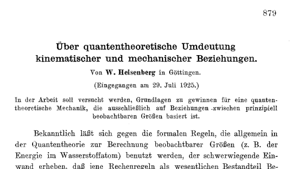{fig-align="center" width="500"}

Nous allons rentrer dans le document afin d'introduire des themes nouveaux.

::: callout-tip
C'est semble t il une simple discussion avec Niels Bohr qui a convaincu Heisenberg de s'attaquer au problème de la détermination de la trajectoire de l’électron autour d'un atome. Ensuite Heisenberg a profité de son isolement sur l'île de Heligoland pour soigner une allergie aux pollens de fleurs pour y réfléchir.
:::

## Seconde loi de Newton en physique classique :

Formulée en 1687 dans ses Principia, la seconde loi de Newton révolutionne la physique en liant la force au changement de mouvement. Elle s'exprime par la célèbre relation $\vec{F} = m\vec{a}$ qu'Heisenberg exprime sous forme simplifiée :

$$\ddot{x} + f(x) = 0$$

Si Heisenberg pose cette formule connu, ce n'est pas pour le plaisir de faire de la physique classique mais car il pense que l'on peut partir de cette formule et en trouver une extension quantique. Il cherche une algèbre. Ainsi il cherche à construire en théorie quantique un formalisme qui corresponde le plus étroitement possible à celui de la mécanique classique.

## Définition de l'action pour Bohr :

Le concept d'action naît au XVIIIe siècle avec Maupertuis et Euler, qui postulent que la nature est "économe" et minimise toujours une quantité physique lors d'un mouvement.

Heisenberg s’intéresse à la notion d'action, prise comme l'impact et qui peut s'exprimer comme une énergie que multiplie une durée, ou comme une vitesse que multiplie une distance. $h$ signifie ici le quantum d'action. Cela signifie qu'en quantique la constante de planck $h$ introduit une nouvelle dimension à l'action.

$$\oint pdq=\oint m\dot{x}dx=J(=nh)$$

Toutefois ici il faut se placer dans la physique de époque et J représente l'action et elle est un multiple de n. Cela signifie que plus le niveau énergie est élevé plus l'action pour l'atteindre est importante. L'action peut être le produite de énergie par la durée ou du déplacement par la vitesse. *Cette formulation de l'action va être profondément remise en cause par Heisenberg.*

## Introduction du paramètre position :

- tout d'abord, nous cherchons a exprimer la position x d'une particule. En supposant la fonction périodique nous allons la décomposer en série de fourier,

$$x=\Sigma_{+\infty}^{-\infty}a_{\alpha}(n)e^{i\alpha\omega_{n}t}$$

::: callout-tip
Attention ici il s'agit d'une expression en physique classique. Mais nous allons voir que Heisenberg va "abandonner" $x$ car considere comme non observable. Toutefois nous restons encore dans le cadre la la mécanique classique. Un mouvement périodique peut être un oscillateur harmonique mais surtout la trajectoire d'un electron sur son orbite imaginée dans le modele de Bohr. On dirait que Heisenberg presuppose que le mouvement quantique est périodique. **En realite il exige que si un mouvement quantique existe alors il permet un mouvement classique périodique**. Dans le modèle de Bohr le mouvement classique était considéré comme un cas particulier du mouvement quantique (celui ou $n$ est très grand). C'est pour cette raison (qu'on appelle principe de correspondance) que l'on peut prendre le mouvement périodique classique comme point de départ du raisonnement. Plus tard on se détachera de la vision continue de x(t) de la physique classique.
:::

## Mise en evidence de l'energie :

Il suffit de la dériver pour prendre l'expression de v.

$$m\dot{x}=\Sigma_{+\infty}^{-\infty}a_{\alpha}(n)i\alpha\omega_{n}e^{i\alpha\omega_{n}t}$$

::: callout-tip
En basculant de dq en dt on introduit un carre. L'énergie cinétique est une vitesse au carrée. **Le carre introduit qu'il s'agit d'une énergie.** On remarque que ici on raisonne toujours en physique classique. Toutefois on se positionne a raisonner en terme d'énergie, or une transition entre un état n et un état n+1 et bien quelque chose qui coûte une certaine énergie. On voit l'intuition d'Heisenberg. Le terme a\_${\alpha}(n) \cdot a_{-\alpha}(n)$ préfigure $\left|a_{\alpha}(n)\right|^2$. Heisenberg s’intéresse beaucoup aux amplitudes et a leurs significations physiques.
:::

$$\oint m\dot{x}dx=\oint m\dot{x}^2dt=2\pi m\Sigma_{+\infty}^{-\infty}a_{\alpha}(n)a_{-\alpha}(n)\alpha^2\omega_{n}$$

## Limite classique dans la formulation de l'action :

On obtient ainsi le terme suivant :

$$\oint mx^2dt=2\pi \Sigma_{+\infty}^{-\infty} |a_{\alpha}(n)|^2\alpha^2\omega_{n}$$

Ici Heisenberg explique que cette formulation ne le satisfait pas. Il en préfère une autre :

$$\frac{d}{dn}(nh)=\frac{d}{dn}\oint m\dot{x}dt$$

Dans cette partie difficile, Heisenberg cherche à tout prix à exprimer l'action non pas comme liée a un niveau d’énergie n donné mais a la différence entre deux niveaux, d’où l'expression de la derivée $\frac{d}{dn}$

::: callout-tip
On construira plus tard une matrice dérivée (opérateur de dérivation) et nous verrons qu'elle permettra de mettre en valeurs des valeurs propres ou valeurs mesurables de la vitesse de la particule. Ainsi le formalisme est pose.
:::

Pour n grand dn est tres petit et donc la derivve de nh par rapport a n vaut h d ou la formule suivante :

$$h=2\pi m \Sigma_{+\infty}^{-\infty} \alpha \frac{d}{dn} a\alpha \omega_{n} |a_{\alpha}|^2$$

On peut remarquer que jusqu'ici on est toujours dans la physique classique car la difference de niveaux est exprimee par dn.

## Introduction de la quantification dans les indices :

Revenons a la formule classique de l'action : $\oint p \, dq = nh$.

p est une impulsion ($p = m \dot{q}$) et q une position. En remplacant x et v par leurs valeurs mais en ajoutant les indices on finit par obtenir la formule suivante :

$$h = 4\pi m \Sigma_{0}^{+\infty}\alpha{|a(n,n+\alpha)|^2\omega(n,n+\alpha)}-{|a(n,n-\alpha)|^2\omega(n,n-\alpha)}$$

::: callout-note
Enfin ici Heisenberg a utilise la théorie de Kramer qui introduit des amplitudes de transition. On a réalisé le "saut".

On voit qu'il y a des transitions dans le sens montants, d'autres dans le sens descendant mais la différence n'est pas nulle : elle est même constante, égale à $h$. On introduit l’algèbre non commutative (celle qui dit que $p.x \neq p.x$) dans la physique.

On remarque aussi qu'il n'y a dans la formule pas de mention de la position ni de la vitesse.
:::

Cet article de Heisenberg de 1925 est très abstrait, en particulier le concept de position dont je rappelle les points ici, au risque de tomber dans l’interprétation :

- le point de départ est la physique classique et la formulation de x(t) sous la forme d'une série de fourrier. Il s'agit de voir la quantique comme une extension de la physique classique (et pas l'inverse comme on le fait souvent).

- on abandonne la possibilité de la position. Il s'agit quasiment d'un choix arbitraire.

- en troisième lieu la position ressuscite sous forme de la matrice position X. Toutefois prendre un stylo et une feuille de papier, dessiner une matrice avec un X dedans ne suffit pas a faire une matrice position. Les composantes de la matrice expriment des transitions d’états (on remplace un espace des positions par un espace des transitions). C'est bien la position de X dans la relation de la non commutation ($X.Y\neq Y.X$) qui fait les propriétés de la matrice X.

On voit comment la spacialité éclate complètement au profit des composantes de la matrices qui expriment des potentialités.

## L'oscillateur anharmonique :

Ce paragraphe est important car il prouve la validité de la méthode de Heisenberg. Elle a des similitudes avec la méthode utilisée jusqu’à présent. Tout d’abord Heisenberg par de la physique classique

Voici la définition :

$$x=\lambda a_{0}+a_{1}coswt +\lambda a_{2}cos2wt + \lambda^2a_{3}cos3wt + ...+ \lambda^{\tau-1}a_{r}cos\tau\omega t$$

on a les relations de récurrence :

$$\omega_0^2 (\lambda a_0) + \lambda \langle x^2 \rangle = 0$$

Ici encore Heisenberg s’intéresse aux amplitudes : on laisse tomber x et on exprimer l'amplitude en fonction de n et de la fréquence. Ces amplitudes constituent des transitions d’états.

Sans rentrer dans les details on tombe sur :

$$a^2(n,n-1)=\frac{(n+const)h}{\pi\omega_{0}}$$

et de fil en aiguille Heisenberg finie par aboutir à la formule de l'oscillateur :

$$W=(n+\frac{1}{2})hw_{0}/2\pi$$

Dans le document de 1925 la partie sur l'oscillateur harmonique est de loin la plus obscure à première lecture et pourtant le résultat est juste.

## Conclusion :

On entend quelquefois que Heisenberg abouti aux résultats de la mécanique ondulatoire mais en "évitant l'onde". De plus le document de 1925 présente une très grande cohérence d'approche dans sa méthode puisque qu’il applique pour l'oscillateur anharmonique exactement la même méthode qu'avant dans le document.

L'image ci-dessous présente les participants au congres de Solvay de 1927. En deux ans, la nouvelle physique était née.

{#fig-solvay fig-align="center" width="100%"}

# Faits experimentaux :

## Le corps noir :

Le corps noir n'est pas forcément noir. C'est un concept théorique désignant un objet idéal qui absorbe tout le rayonnement électromagnétique qu'il reçoit. Dans la pratique, il est modélisé par une cavité avec une ouverture qui piège les rayons lumineux à l'intérieur. S'il ne reçoit aucun rayonnement extérieur, l'objet émet son propre rayonnement (chaleur ou lumière), uniquement en fonction de sa température. C'est cette émission d'énergie, dont la courbe spectrale n'est pas explicable par la physique classique, qui a conduit à la quantification de l'énergie.

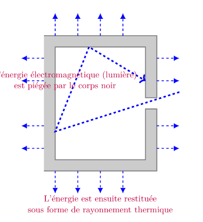{#fig-corps-noir fig-align="center" width="70%"}

\usetikzlibrary{arrows}
\begin{figure}
\centering
    
 
\begin{tikzpicture}[scale=0.5]
  \fill [fill=black!40, draw=black, very thick, semitransparent]  
  (0,0) 
    -- (10,0) 
    -- (10,5.5) 
    -- (9,5.5) 
    -- (9,1)
    -- (1,1)
    -- (1,11)
    -- (9,11)
    -- (9,6.5)
    -- (10,6.5)
    -- (10,12)
    -- (0,12) ;
 \draw[->, magenta,line width=2pt] (12,7) -- (1,3.5) -- (4,11) -- (9,8) [dashed, blue] node[left, purple] {\begin{tabular}{c}L’énergie électromagnétique (lumière) \\ est piégée par le corps noir\end{tabular}};

 \draw [arrows = {-Latex[width=7pt, length=7pt]},dashed, blue,line width=1pt] (10,2) -- (12,2);
 \draw [arrows = {-Latex[width=7pt, length=7pt]},dashed, blue,line width=1pt] (10,4) -- (12,4);
 \draw [arrows = {-Latex[width=7pt, length=7pt]},dashed, blue,line width=1pt] (10,8) -- (12,8);
 \draw [arrows = {-Latex[width=7pt, length=7pt]},dashed, blue,line width=1pt] (10,10) -- (12,10);

\draw [arrows = {-Latex[width=7pt, length=7pt]},dashed, blue,line width=1pt] (0,2) -- (-2,2);
 \draw [arrows = {-Latex[width=7pt, length=7pt]},dashed, blue,line width=1pt] (0,4) -- (-2,4);
 \draw [arrows = {-Latex[width=7pt, length=7pt]},dashed, blue,line width=1pt] (0,8) -- (-2,8);
 \draw [arrows = {-Latex[width=7pt, length=7pt]},dashed, blue,line width=1pt] (0,10) -- (-2,10);

\draw [arrows = {-Latex[width=7pt, length=7pt]},dashed, blue,line width=1pt] (1,12) -- (1,14);
 \draw [arrows = {-Latex[width=7pt, length=7pt]},dashed, blue,line width=1pt] 
 (3,12) -- (3,14);
 \draw [arrows = {-Latex[width=7pt, length=7pt]},dashed, blue,line width=1pt] (5,12) -- (5,14);
 \draw [arrows = {-Latex[width=7pt, length=7pt]},dashed, blue,line width=1pt] (7,12) -- (7,14);

 \draw [arrows = {-Latex[width=7pt, length=7pt]},dashed, blue,line width=1pt] (1,12) -- (1,14);
 \draw [arrows = {-Latex[width=7pt, length=7pt]},dashed, blue,line width=1pt] 
 (3,12) -- (3,14);
 \draw [arrows = {-Latex[width=7pt, length=7pt]},dashed, blue,line width=1pt] (5,12) -- (5,14);
 \draw [arrows = {-Latex[width=7pt, length=7pt]},dashed, blue,line width=1pt] (7,12) -- (7,14);

 \draw [arrows = {-Latex[width=7pt, length=7pt]},dashed, blue,line width=1pt] (1,0) -- (1,-2);
 \draw [arrows = {-Latex[width=7pt, length=7pt]},dashed, blue,line width=1pt] 
 (3,0) -- (3,-2);
 \draw [arrows = {-Latex[width=7pt, length=7pt]},dashed, blue,line width=1pt] (5,0) -- (5,-2);
 \draw [arrows = {-Latex[width=7pt, length=7pt]},dashed, blue,line width=1pt] (7,0) -- (7,-2);
 \draw (5,-3) node [purple] {\begin{tabular}{c}L’énergie est ensuite restituée \\ sous forme de rayonnement thermique\end{tabular}};

       
\end{tikzpicture}
       
 
\caption{Certains objets, comme l'intérieur d'un four chauffé uniformément, peuvent approcher le modèle du corps noir.}
\end{figure}

A un moment Planck eut l'idée d'introduire une constante h qui règle le problème qui vaut : $h=6,626.10^{-34}J.s$. Il imaginait que le corps noir se comportait comme un oscillateur harmonique de fréquence $\mu$ mais dont les niveaux énergie sont quantifiés. Il s'agissait d'une astuce afin de faire coller les résultats avec l’expérience. Planck ne prévoyait pas un très grand avenir scientifique à la constante $h$ qu'il avait introduite. C'est Einstein qui valorisa cette constante en proposant en 1905 une interprétation simple et efficace de l'effet photoélectrique en postulant que le rayonnement électromagnétique était lui même composé de quantas de lumière, appelés plus tard photons d'énergie $\epsilon=h\mu$. Ces quantas d' énergie ne furent appelées photons qu'en 1926.

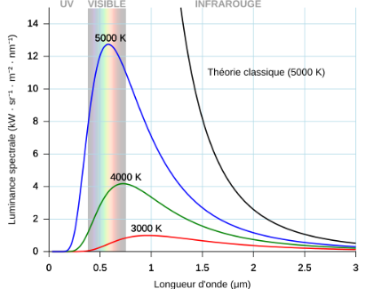{#fig-corps-noir2 fig-align="center" width="70%"}

Max Planck [@Planck1901-fc] écrit :

> "si nous appliquons la loi de déplacement de Wien sous sa dernière forme à l'expression de l'entropie S, nous nous rendons compte que l’élément d’énergie $\epsilon$ doit être proportionnel au nombre d'oscillations $\mu$ et que donc : $\epsilon=h\mu$"

puis un peu plus loin Planck donne une première estimation pour $h$ : $h=6.55.10^{-27} erg.sec$

A comparer avec la valeur réelle : $6,62607015 \times 10^{-34} J.s$

$h$ s'exprime en joules secondes : en physique il s'agit d'une action. Pour cette raison on appelle aussi $h$ le quantum d'action.

## L'effet photoélectrique :

Albert Einstein écrit : [@Einstein1905-zf]

> "Il me semble que les observations portant sur le "rayonnement noir" (...) apparaissent comme plus compréhensibles si on admet que l'energie de la lumière est distribuée de façon discontinue dans l'espace. Selon l’hypothèse envisagée ici, lors de la propagation d'un rayon lumineux émis par une source ponctuelle, l’énergie n'est pas distribuée de façon continue sur des espaces de plus en plus grands, mais est constituée d'un nombre fini de quantas d’énergie localises en des points de l'espace".

Einstein pose dans cet article daté du 09 juin 1905 (soit environ 6 mois avant son célèbre article sur la relation masse énergie) la discontinuité de l'énergie non plus comme une constatation expérimentale mais comme un fondement théorique. Cet article lui vaudra le Prix Nobel de physique en 1921.

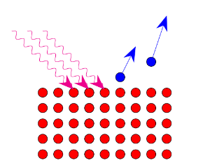{#fig-photo-elec fig-align="center" width="50%"}

\usetikzlibrary {arrows.meta}
\usetikzlibrary {decorations.pathmorphing}
\begin{figure} 
\centering
 
     
 \begin{tikzpicture}[scale=0.5]

 %   \tikzset{shift={(current page.center)},yshift=-1.5cm}
  
  \foreach \x in {-5,-4,-3,-2,-1,-2,0,1,2,3}
    \foreach \y in {-1,0,1,2,3}
      {
        \draw [fill=red] (\x,\y) circle (0.3cm);
      %  \fill (\x,\y) circle (0.1cm);
      }

 %   \draw[decorate,decoration={snake,segment length=2cm},->] (0,0) - - (10,0);
    \draw[decorate,decoration=snake,magenta,-{Stealth[length=5mm]}] (-5,7) - - (-1,3.2) ;
    \draw[decorate,decoration=snake,magenta,-{Stealth[length=5mm]}] (-6,7) - - (-2,3.2) ;
    \draw[decorate,decoration=snake,magenta,-{Stealth[length=5mm]}] (-7,7) - - (-3,3.2) ;

    
    \draw [fill=blue] (2,5) circle (0.3cm);
    \draw[blue,-{Stealth[length=5mm]}] (2,5) -- (3,8);

     \draw [fill=blue] (0,4) circle (0.3cm);
    \draw[blue,-{Stealth[length=5mm]}] (0,4) -- (1,6);
    
   % \draw[decorate,decoration=snake ] (0,0) arc (0:180:3 and 2);

   
   
\end{tikzpicture}

\caption{ L'énergie reçue par le rayonnement électromagnétique va permettre à des électrons de s'éjecter du matériau. On observe une corrélation entre l'énergie reçue (quantifiée) et celle de l'électron}
\end{figure}

L'équation d'Einstein pour l'effet photoélectrique s'écrit :

$$ \boxed{h\nu =W_{S}+{\frac {1}{2}}mv^{2}}$$ où :

$h\nu$ est l'énergie du photon ;

$W_{S}$ est l'énergie de liaison de l'électron ;

$\frac {1}{2}mv^{2}$ est l'énergie cinétique finale de l'électron. L'énergie d'un photon est caractérisée par la formule.

*On considère que l'effet photoélectrique a fait apparaître l'aspect corpusculaire de la lumière (en plus de ondulatoire). [@Greiner2009-sw]*

## Expérience des fentes d'Young :

### Fentes d'Young avec la lumière :

En optique on admet que les trous S1 et S2 se comportent comme des sources secondaires qui, issues de la même source primaire S, mettent de sondes sphériques cohérentes entre elles. C'est le principe d'Huygens-Fresnel.

En tout point P du plan d'observation la fonction d'onde $\Phi$ résulte de la superposition linéaire des fonctions d'onde $\Phi 1$ et $\Phi 2$.

$$\Phi=\Phi 1 +\Phi 2$$

### Fentes d'Young avec des électrons :

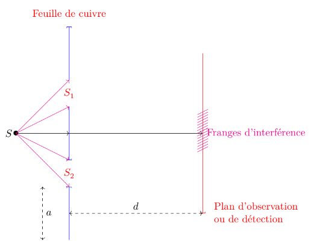{fig-align="center"}

\begin{tikzpicture}
\draw[->] (1,0) -- (3,0);
\draw[->] (3,0) -- (8,0);
\draw (1,0) node[scale=1.2]{$\bullet$} node [left]{$S$};
\draw[{-]}, blue] (3,2) -- (3,4) node[above]{};
\node [red] (A) at (3,1.5) {$S_1$};
\node [red] (B) at (3,-1.5) {$S_2$};
%\node [red] (C) at (3,-5) {Trous d'Young};
\node [red] (D) at (3,4.5) {Feuille de cuivre};
\node [red] (E) at (10,-3) {\begin{tabular}{l}Plan d'observation \\ ou de détection \end{tabular}};
\draw[{-]}, blue] (3,1) -- (3,-1);
\draw[{-]}, blue] (3,-4) -- (3,-2);
\draw[{-]}, red] (8,3) -- (8,-3);
\draw[dashed, <->] (3,-3) -- node[above]{$d$} (8,-3) ;
\draw[dashed, <->] (2,-2) -- node[above, right]{$a$} (2,-4) ;
\draw[->, magenta] (1,0) -- (3,2);
\draw[->, magenta] (1,0) -- (3,1);
\draw[->, magenta] (1,0) -- (3,-1);
\draw[->, magenta] (1,0) -- (3,-2);
%realisation des franges d'interference
\foreach \x in {0,0.1,...,0.8}
{
\draw [magenta] (7.8,\x) -- (8.2,\x+0.2); 
}
\foreach \x in {0,-0.1,...,-0.8}
{
\draw [magenta] (7.8,\x) -- (8.2,\x+0.2); 
}
\node [magenta] (F) at (10,0) {Franges d'interférence};

\end{tikzpicture}

L'expérience pionnière de Faget et Fert a été reproduite avec deux fentes et plus par le physicien allemand Claus Joösson en 1961. En envoyant des électrons d'énergie cinétique $E_{k}=50$ keV sur une feuille de cuivre percée de deux fentes de largeur $0,5\mu m$, distantes de $0,2\mu m$, Jönsson observa sur une plaque photographique placée dans le plan d'observation P, des franges d'interférence des ondes électroniques[@Perez2013-it].

Dans l’expérience précédente la source primaire S émet des électrons que l'on détecte en P dans le plan P, après traversée des trous S1 et S2. En réduisant le flux d’électrons de telle sorte qu'entre S et P, à tout instant il n'y ait qu'un seul électron, on observe des points d'impact discrets dus aux électrons collectés pendant la durée d'exposition.

Si cette durée est faible, les points d'impact semblent se répartir de manière aléatoire. En revanche, si elle est suffisante, les impacts se répartissent peu à peu selon la figure d'interférence. *Ceci est surprenant car à un électron unique on associe bien aussi une onde*.

L'onde considérée en quantique est une onde de probabilité : elle diffère donc fondamentalement d'une onde physique habituelle, mécanique ou électromagnétique, puisque elle ne représente pas la variation d'une grandeur physique.

*Nous reviendrons plus tard dans le cours sur l'approche statistique de la physique quantique.*

# Principe d'incertitude d'Heisenberg :

## Expérience courante du principe d'incertitude

### Que signifie l'incertitude en physique ?

**Exemple 1 :** Dans la vie courante, est-il possible de « faire l’expérience » du principe d'incertitude ? À Nice, sur la Promenade des Anglais, des chaises bleues bordent le front de mer. Dans le Vieux-Nice, les magasins de souvenirs vendent ces mêmes chaises en miniature. Si j'en achète une et que le vendeur l'emballe dans une boîte, quelle est l'incertitude sur la position de la chaise à l'intérieur de la boîte ?

{#fig-chaise fig-align="center" width="40%"}

**Exemple 2 :** Si je suis assis à la bibliothèque de la CIUP, je vois une table devant moi. Sa position est fixe. Toutefois, si je reviens demain, le bibliothécaire l'aura peut-être déplacée. Il y a pourtant peu de chances que la table se retrouve dehors, dans le parc. L'incertitude sur la position de la table est donc strictement bornée par la taille de la salle de lecture.

**En conclusion :** En physique, ce sont les conditions expérimentales et l'environnement (les conditions aux limites) qui fixent l'incertitude. Pour une particule élémentaire comme un électron, l'incertitude sur la position est directement liée à cette configuration (particule libre ou piégée dans un potentiel).

### Première approche du principe d'incertitude

Intuitivement, quand un objet se déplace rapidement, sa trajectoire devient plus difficile à suivre du regard : sa position semble nous échapper, comme s'il fallait choisir entre observer sa vitesse ou fixer sa position.

Cependant, cette incertitude macroscopique est uniquement liée aux limites de nos sens ou de nos instruments de mesure. À l'échelle quantique, l'impossibilité de connaître simultanément et avec une précision infinie la position et la vitesse d'une particule **n'est pas une simple contrainte expérimentale, mais une loi théorique fondamentale**.

## Le « principe d'incertitude des radioélectriciens »

Bien que l'expression *« principe d'incertitude des radioélectriciens »* ne constitue pas un usage standardisé, elle est explicitement citée par Augustin Blaquière [@alma991002711819705804]. Son intérêt pédagogique est majeur : elle dresse un pont naturel entre la physique classique et la physique quantique. En effet, dans le domaine classique, nous sommes familiers avec l'idée qu'un signal temporel (comme le son de la voix ou une tension électrique) peut être équivalemment décrit par son spectre fréquentiel.

Le principe d'incertitude est fondamentalement une **propriété mathématique de la transformation de Fourier**. Il n'est donc pas exclusif à la physique quantique. On le retrouve en électronique dès lors qu'on associe à un signal temporel $s(t)$ son spectre en fréquence $S(f)$.

Une nuance d'usage sépare toutefois les deux domaines :

- En électronique, on raisonne généralement sur l'évolution d'une amplitude (tension ou intensité) en fonction du **temps** $t$.

- En physique quantique, on manipule une amplitude de probabilité (la fonction d'onde $\psi$) le plus souvent fonction de la **position** $x$.

Pour le radioélectricien ou l'électronicien, cette contrainte spectrale prend la forme du produit temps-fréquence : $$\Delta t \cdot \Delta f \ge C \quad (\text{avec } C \approx 1 \text{ selon la définition de la largeur})$$

Lorsqu'un signal forme une impulsion très brève dans le temps ($\Delta t \to 0$), la bande de fréquences nécessaire pour le représenter s'étale indéfiniment ($\Delta f \to \infty$). Inversement, une onde purement monochromatique ($\Delta f \to 0$) exige une durée infinie ($\Delta t \to \infty$).

Ce qui distingue fondamentalement le cas quantique du cas classique, c'est l'intervention de la constante de Planck $h$. Le principe d'incertitude classique devient quantique dès lors qu'on associe aux grandeurs de la wave-packet les relations de quantification de Planck-Einstein et de de Broglie : $E = h\nu$ et $p = \hbar k$.

::: callout-tip
### Utilité spectrale et filtrage

En électronique comme en acoustique, disposer d'une bande de fréquences extrêmement large (voire infinie) n'est généralement pas souhaitable, car elle transporte du bruit inutile au message :

1.  **En électronique :** On conçoit des filtres (passe-bas, passe-haut, passe-bande) afin d'éliminer les fréquences excentrées hors de la bande utile.
2.  **En acoustique :** Le timbre d'une voix humaine est un mélange complexe de fréquences (personne ne parle de manière strictement « monocorde »). La compréhension du message repose pourtant sur une bande spectrale limitée.

En cas de environnement bruyant (ex. *l'effet cocktail party* dans un restaurant), le cerveau humain est capable d'un filtrage sélectif remarquable pour isoler une conversation ou déceler un événement acoustique bref (comme la chute d'une cuillère) au milieu du fond sonore.
:::

## Du paquet d'ondes électromagnétique au principe d'incertitude : l'analyse de Bohr

On peut naturellement se demander si un principe équivalent au principe d'incertitude des radioélectriciens existe pour les ondes électromagnétiques, c'est-à-dire pour la lumière.

En physique quantique, l'énergie est quantifiée selon la relation d'Einstein-Planck ($E = h\nu$), une contrainte dont l'expérience du corps noir a montré l'application aux ondes lumineuses. Mais que se passe-t-il si l'on n'applique pas encore cette condition de quantification et que l'on conserve uniquement les grandeurs ondulatoires classiques ($\nu$ et $\sigma$) sans passer par l'énergie $E$ et la quantité de mouvement $p$ ?

Niels Bohr, remarquable pédagogue, en propose une synthèse aboutie dès 1928 [@BOHR1928], dans la foulée des débats du 5ᵉ Congrès Solvay de 1927 (représenté sur la photographie de la page 5) qui jetèrent les bases de ce qu'on appelle communément l'« interprétation de Copenhague ».

Bohr y décrit la forme originelle du principe d'incertitude — avant toute quantification — en s'appuyant sur la superposition d'ondes planes élémentaires de la forme : $$A \cos\left(2\pi(\nu t - \sigma_x x - \sigma_y y - \sigma_z z) + \delta\right)$$

où $A$ et $\delta$ représentent respectivement l'amplitude et la phase initiale, $\nu$ désigne la fréquence temporelle, et $(\sigma_x, \sigma_y, \sigma_z)$ sont les nombres d'onde (avec $\sigma = 1/\lambda$) associés aux axes spatiaux.

Selon Bohr, la représentation exacte d'un paquet d'ondes délimité dans l'espace et le temps exige la superposition d'une multiplicité d'ondes élémentaires s'étendant sur un éventail de valeurs de $\nu$ et de $\sigma$. *Dans les cas les plus favorables*, les étalements spectraux et spatiaux vérifient la relation :

$$\Delta t \cdot \Delta \nu \approx \Delta x \cdot \Delta \sigma_x \approx \Delta y \cdot \Delta \sigma_y \approx \Delta z \cdot \Delta \sigma_z \approx 1$$

## La publication de 1925 d'Heisenberg : vers un nouveau formalisme

Revenons un peu en arrière. En 1925, alors qu'il n'a que 23 ans et qu'il travaille comme assistant de Max Born à Göttingen, Werner Heisenberg publie un article fondateur [@Heisenberg1925] dans lequel il rompt radicalement avec le modèle atomique de Bohr-Sommerfeld :

> « Dans cette situation, il paraît judicieux d'abandonner tout espoir d'observer des grandeurs jusqu'ici inobservables, comme la position et la période d'un électron, et d'admettre que l'accord partiel entre les règles quantiques et l'expérience est plus ou moins fortuit. Au lieu de cela, il semble plus raisonnable de tenter d'établir une mécanique quantique analogue à la mécanique classique, mais dans laquelle apparaissent exclusivement des relations entre des grandeurs observables. »

L'objectif d'Heisenberg est clair : fonder la physique sur les seules grandeurs directement mesurables (comme les fréquences et les intensités des raies spectrales émises) et renoncer délibérément à représenter des trajectoires électroniques inaccessibles à l'expérience.

Cet article pose les bases d'un formalisme mathématique inédit reposant sur des tableaux de nombres. C'est son directeur Max Born, épaulé par Pascual Jordan, qui identifiera rapidement ces tableaux comme étant des **matrices**, donnant naissance à la *mécanique matricielle*. Heisenberg n'énoncera le principe d'incertitude (ou d'indétermination) qui porte son nom que deux ans plus tard, en 1927.

Comme le souligne André Coret [@PHSC_2001__5_1_105_0] : \> « En s'appuyant sur l'expérience, c'est-à-dire sur la nécessité de considérer l'émission lumineuse comme issue d'un changement d'état de l'électron et non de son mouvement, Heisenberg se permet une opération qu'il qualifie lui-même d'arbitraire (*willkürlich*). »

Cette année 1925 marque le début d'un formidable « âge d'or » de la physique quantique. Pendant quatre ou cinq ans, une poignée de pionniers visionnaires va poser les fondations de la physique moderne. Nous verrons plus tard dans ce document qu'il faudra attendre 1939 et la publication magistrale de Fritz London et Edmond Bauer pour voir le problème de la mesure quantique formalisé au travers de l'opérateur densité (ou matrice statistique, concept introduit par Landau et von Neumann en 1927). Mais en 1939, la discipline aura déjà changé de siècle : l'ère des pionniers aura laissé place à celle d'une théorie accomplie.

## Apport du formalisme hamiltonien :

Sir William Rowan Hamilton était un physicien irlandais du 19 eme siècle.

Dans le formalisme hamiltonien, on abandonne les représentations temporelles directes $x(t)$ ou $v(t)$ au profit de l'espace des phases $(q, p)$.En traçant $p$ en fonction de $q$ (par exemple les ellipses d'un oscillateur harmonique), le temps $t$ s'efface de l'axe des représentations : il devient un paramètre sous-jacent qui régit le parcours du système le long de sa courbe d'énergie.Ce changement de regard habitue progressivement l'esprit à lier indissociablement la position $q$ et la quantité de mouvement $p$, préparant le terrain pour la mécanique quantique où $p$ deviendra un opérateur différentiel agissant directement sur $q$

Comme le rappellent Fritz London et Edmond Bauer (1939) [@london1939theorie], cités par Leite Lopes et Escoubès [@leitelopes1994sources] :

> L’évolution du système dans le temps est réglée en mécanique classique par une "fonction hamiltonienne" H(p,q) caractéristique du système en question. Cette fonction de coordonnées q1,q2,...,qf et des impulsions p1,p2,pf (..) permet d’écrire les fonctions hamiltoniennes du mouvement. C'est cette même fonction H(q,p) qui en mécanique quantique aussi donne la loi d’évolution du représentant \phi de l’état du système : on forme l’opérateur $H(q,\frac{h}{2\pi i\frac{\delta}{\delta q}})$ en remplaçant p dans l'hamiltonien par l’opérateur de différentiation : $\frac{h}{2\pi i\frac{\delta}{\delta q}}$

Ce que montre cette citation : La transition vers le quantique ne rejette pas l'Hamiltonien classique $H(q,p)$, elle transforme la variable $p$ en un opérateur différentiel $\frac{\partial}{\partial q}$. C'est cette opération de dérivation spatiale qui détruit la commutativité entre position et impulsion, et qui donne naissance au principe d'incertitude.

## Approche intuitive de la non-commutation des fonctions

Comme le souligne Austin Blaquière [@alma991002711779705804], le concept de non-commutation peut être introduit par des opérations mathématiques simples appliquées à une fonction d'onde $\Psi(x)$ (que nous noterons ici $f(x)$).

Considérons les deux opérateurs mathématiques suivants :

- **L'opérateur de position :** $\hat{x}$ (multiplication par $x$).
- **L'opérateur de dérivation :** $\hat{D} = \frac{d}{dx}$.

Appliquons ces opérateurs à la fonction $f(x)$ selon les deux ordres possibles pour évaluer leur différence (le commutateur).

#### Ordre 1 ($\hat{D}\hat{x}$) : Multiplier par $x$, puis dériver

$$\hat{D} \left[ x f(x) \right] = \frac{d}{dx} \left[ x f(x) \right]$$

En utilisant la règle de dérivation d'un produit $(uv)' = u'v + uv'$ : $$\frac{d}{dx} \left[ x f(x) \right] = \left(\frac{dx}{dx}\right) f(x) + x \frac{df(x)}{dx} = f(x) + x \frac{df(x)}{dx}$$

#### Ordre 2 ($\hat{x}\hat{D}$) : Dériver, puis multiplier par $x$

$$\hat{x} \left[ \frac{d}{dx} f(x) \right] = x \frac{df(x)}{dx}$$

#### Le Commutateur $[\hat{D}, \hat{x}]$

Calculons la différence des deux opérations appliquées à $f(x)$ : $$\left( \frac{d}{dx} x - x \frac{d}{dx} \right) f(x) = \left( f(x) + x \frac{df(x)}{dx} \right) - x \frac{df(x)}{dx} = f(x)$$

En isolant l'action de l'opérateur, nous obtenons la relation algébrique pure : $$\left[\frac{d}{dx}, x\right] = \frac{d}{dx} x - x \frac{d}{dx} = 1$$

#### Le passage à la mécanique quantique

Cette propriété algébrique acquiert un sens physique fondamental via le **postulat de quantification**, qui définit l'opérateur d'impulsion $\hat{p}_x$ : $$\hat{p}_x = -i \hbar \frac{d}{dx} \implies \frac{d}{dx} = \frac{i}{\hbar} \hat{p}_x$$

En remplaçant $\frac{d}{dx}$ dans notre relation de commutation mathématique : $$\left[ \frac{i}{\hbar} \hat{p}_x, x \right] = 1 \implies \frac{i}{\hbar} \left[ \hat{p}_x, x \right] = 1 \implies \left[ \hat{p}_x, x \right] = -i\hbar$$

Par antisymétrie du commutateur ($[\hat{x}, \hat{p}] = -[\hat{p}, \hat{x}]$), on obtient la **relation de commutation fondamentale d'Heisenberg** : $$[\hat{x}, \hat{p}_x] = \hat{x}\hat{p}_x - \hat{p}_x\hat{x} = i\hbar$$

## Conclusion : formulation du principe d'incertitude d'Heisenberg (position-impulsion)

La relation d'incertitude fondamentale limite la précision avec laquelle on peut connaître simultanément la position et la quantité de mouvement d'une particule :

$$\boxed{\Delta x \cdot \Delta p \geq \frac{\hbar}{2}}$$

Avec :

- $\Delta x$ : l'incertitude (écart-type statistique) sur la mesure de la position.
- $\Delta p$ : l'incertitude (écart-type statistique) sur la mesure de l'impulsion (quantité de mouvement).
- $\hbar$ : la constante de Planck réduite (notée $\hbar = \frac{h}{2\pi} \approx 1{,}054 \times 10^{-34} \text{ J}\cdot\text{s}$).

**Portée fondamentale du principe :**

Il est essentiel de bien saisir la portée théorique de cette inégalité : **il ne s'agit pas d'une simple contrainte expérimentale** liée aux imperfections de nos instruments de mesure.

Même avec des appareils théoriquement parfaits, cette limite subsiste. C'est un **principe physique et ondulatoire intrinsèque** : une particule n'a pas simultanément une position et une vitesse parfaitement définies. La précision sur l'une floute inévitablement l'autre.

## Cas caractéristiques du principe d'incertitude position-impulsion

Le principe d'incertitude s'exprime sous forme d'une inégalité : $\Delta x \cdot \Delta p \geq \frac{\hbar}{2}$.

On appelle **états d'incertitude minimale** les paquets d'ondes (généralement de forme gaussienne) pour lesquels le produit des incertitudes atteint exactement le seuil théorique :

$$\Delta x \cdot \Delta p = \frac{\hbar}{2}$$

Pour illustrer l'impact de la forme de l'onde sur la précision (comme le présente le cours de physique de Berkeley, [@alma991013035899705804]), examinons trois configurations :

### 1. L'onde plane (Incertitude maximale sur la position)

Une particule dont l'impulsion (la fréquence) est parfaitement connue possède une onde purement sinusoïdale.

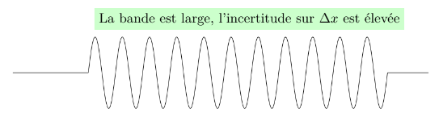{#fig-incert1 fig-align="center" width="80%"}

- **Physique quantique :** $\Delta p$ est très faible (longueur d'onde $\lambda$ unique), mais $\Delta x$ tend vers l'infini. La particule peut se trouver n'importe où.

### 2. La superposition d'ondes (Battement)

En superposant deux fréquences distinctes, on observe un phénomène de battement.

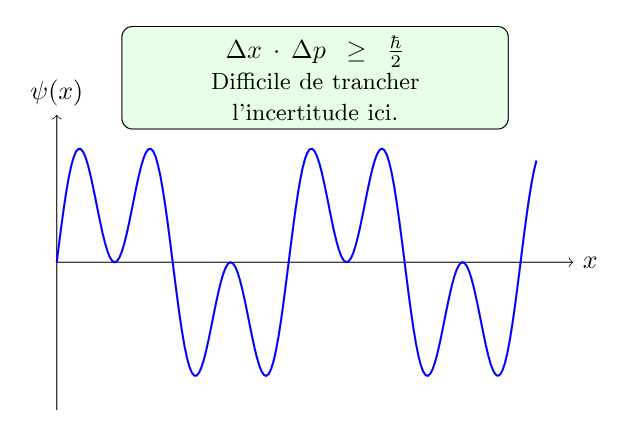{#fig-incert2 fig-align="center" width="70%"}

- **Physique quantique :** L'addition de fréquences commence à créer des zones de présence plus marquées, mais la position reste encore floue.

### 3. Le paquet d'ondes localisé (Confinement spatio-temporel)

En pratique, les particules se déplacent sous forme de **paquets d'ondes** (obtenus par la somme d'une infinité de fréquences via la transformée de Fourier).

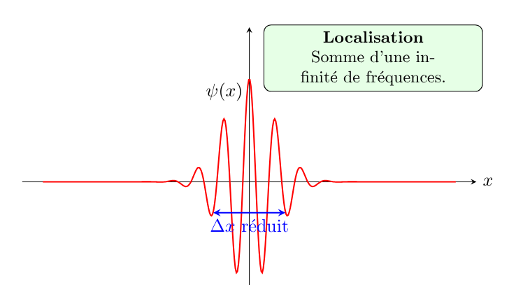{#fig-incert3 fig-align="center" width="80%"}

- **Physique quantique :** Le paquet est bien localisé dans l'espace ($\Delta x$ est très réduit), mais cette localisation exige un large spectre de fréquences, ce qui augmente l'incertitude sur l'impulsion ($\Delta p$ élevé).

------------------------------------------------------------------------

### Synthèse : Analogie avec le traitement du signal et les réseaux

+-----------------------------------+----------------------+-----------------------------------------------------------------------------------------------------------+
| Configuration                     | État physique        | Traduction "Signal / Réseau"                                                                              |
+:==================================+:=====================+:==========================================================================================================+
| **Onde plane** (@fig-incert1)     | Onde pure monochrome | **Porteuse continue (CW)** : fréquence parfaitement connue, mais impossible de dater un événement.        |
+-----------------------------------+----------------------+-----------------------------------------------------------------------------------------------------------+
| **Battement** (@fig-incert2)      | Superposition modale | **Signal multi-porteuse** : début de structuration de l'information.                                      |
+-----------------------------------+----------------------+-----------------------------------------------------------------------------------------------------------+
| **Paquet d'ondes** (@fig-incert3) | Pulse localisé       | **Impulsion / Qubit transmis** : résolution temporelle/spatiale précise, mais occupation spectrale large. |
+-----------------------------------+----------------------+-----------------------------------------------------------------------------------------------------------+

## Principe d'incertitude temps-énergie

On l'appelle parfois le second principe d'incertitude d'Heisenberg. Il ne s'agit pas d'une simple réécriture du premier principe (position-impulsion), mais d'une relation de nature différente.

### 1. Du principe des radioélectriciens au monde quantique

En traitement du signal et en acoustique, il existe une limite fondamentale appelée « principe d'incertitude des radioélectriciens » (ou limite de Gabor) qui lie la durée d'une impulsion $\Delta t$ à sa largeur spectrale en fréquence $\Delta f$ :

$$\Delta t \cdot \Delta f \approx 1$$

Appliquons à cette relation la **condition de quantification de Planck-Einstein** ($E = h\nu$, où $\nu$ est la fréquence) :

$$f = \frac{E}{h}$$

En injectant cette relation dans l'inégalité spectrale :

$$\Delta t \cdot \Delta\left(\frac{E}{h}\right) \approx 1 \implies \Delta E \cdot \Delta t \approx h$$

En formalisant cette approche par la mécanique ondulatoire rigoureuse, on obtient la borne minimale exacte :

$$\boxed{\Delta E \cdot \Delta t \geq \frac{\hbar}{2}}$$

------------------------------------------------------------------------

### 2. Interprétation et portée physique

Dans cette inégalité :

- $\Delta E$ représente l'incertitude sur l'énergie du système (la largeur de l'état énergétique).
- $\Delta t$ représente la durée de vie de cet état quantique (ou le temps nécessaire pour que le système évolue de manière significative).

> **Exemple physique :** Plus la durée de vie d'un état excité est courte ($\Delta t$ petit), plus la largeur en énergie de cet état est grande ($\Delta E$ élevé), ce qui se traduit directement par un élargissement des raies spectrales en spectroscopie.

## Application aux reseaux :

# L'onde de Louis de Broglie : la physique ondulatoire

## Représentation temporelle et spatiale : de la fonction porte à la distribution de Dirac

Après avoir abordé le principe d'incertitude d'Heisenberg à travers le formalisme matriciel, nous nous intéressons désormais à la description ondulatoire. Paradoxalement, nous allons débuter par une contrainte expérimentale fondamentale.

Une onde quantique peut être représentée aussi bien dans la **base des positions** (la position $x$ en abscisse, l'amplitude de la fonction d'onde en ordonnée) que dans la **base des impulsions** (la quantité de mouvement $p$ en abscisse). Allons-nous choisir la représentation la plus simple sur le plan mathématique ?

En laboratoire, il est bien plus aisé de faire dériver ou impacter des particules sur un écran pour mesurer directement leur position $x$, plutôt que d'évaluer une vitesse ou une impulsion $p$ qui exige au moins deux mesures spatiales distinctes dans le temps.

Ainsi, par pragmatisme expérimental, nous poserons comme point de départ que **l'étude d'une onde quantique s'effectue prioritairement dans la base en** $x$.

### Du monde matriciel au continu spatial

Dans les annexes mathématiques de ce document, nous avons étudié des matrices construites sur une base discrète d'énergie ou d'impulsion, dont les harmoniques de Fourier constituent les éléments de base.

Dans le cas de la base en $x$, la situation devient continue : **chaque point de l'espace constitue un vecteur de la base** repérant une position précise. Ainsi, de manière idéale, l'espace continu des positions s'apparente à une somme infinie d'impulsions de Dirac $\delta(x - x_0)$ réparties sur tout le domaine spatial.

### Synthèse des acquis avant d'aborder de Broglie

Cette introduction permet d'établir clairement le cadre physique et conceptuel :

1.  **Le principe d'incertitude est posé :** la position et l'impulsion sont liées par la transformée de Fourier.
2.  **L'onde plane théorique :** une onde monochromatique possède une fréquence parfaitement définie (donc $\Delta p = 0$).
3.  **L'indétermination spatiale :** en vertu du principe d'incertitude, une onde de fréquence pure implique une ignorance totale quant à la position exacte de la particule ($\Delta x \to \infty$).
4.  **La structure de la base en** $x$ : l'état spatial idéal est perçu comme une superposition continue d'impulsions de Dirac.

Dans la théorie des systèmes et du traitement du signal (telle que développée par Austin Blaquière [@alma991002711779705804]), l'étude de l'état d'un système nécessite cette même rigueur dans le choix de la **base de représentation** (temporelle $t$ ou spatiale $x$).

### 1. Filtrage temporel et impulsion de Dirac

Pour échantillonner un état à un instant précis $t_0$, on utilise un intervalle temporel très court. Physiquement, une impulsion très brève s'assimile au coup d'une timbale (un signal court mais d'amplitude importante).

Mathématiquement, lorsque cet intervalle tend vers zéro, on tend vers la **distribution de Dirac** $\delta(t - t_0)$.

> **Rappel mathématique — La distribution de Dirac [@Najib2022-qq] :** La distribution $\delta$ de Dirac est définie informellement comme la limite d'un créneau $\delta^{\epsilon}(x-x_{0})$ de largeur $\epsilon$ et de hauteur $\frac{1}{\epsilon}$ lorsque $\epsilon \to 0$ : $$\int_{-\infty}^{+\infty}\delta(x-x_{0}) \, dx = 1 \quad \text{avec} \quad \delta(x-x_0) = \begin{cases} +\infty & \text{en } x = x_0 \\ 0 & \text{ailleurs} \end{cases}$$

Bien que nous raisonnions ici sur le temps $t$, le même formalisme s'applique à la position $x$ pour définir un état parfaitement localisé en un point de l'espace.

------------------------------------------------------------------------

### 2. Utilité de la fonction porte et spectre en Sinus Cardinal

L'impulsion de Dirac est une vue théorique idéale ($\Delta x = 0$). En pratique, toute mesure ou confinement s'effectue sur une largeur finie $\epsilon$ via une **fonction porte** (ou fonction créneau).

Lorsqu'on passe du domaine spatial (ou temporel) au domaine fréquentiel par **Transformée de Fourier**, la réponse spectrale d'une fonction porte n'est plus un point unique, mais une fonction **Sinus Cardinal** ($\text{sinc}$) :

$$\mathcal{F}\{\text{Porte}(x)\} \propto \frac{\sin(k)}{k} = \text{sinc}(k)$$

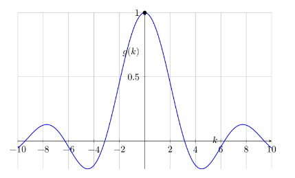{#fig-sinc fig-align="center" width="75%"}

------------------------------------------------------------------------

### 3. Remarques physiques fondamentales

Ici encore, ce sont les **conditions expérimentales** qui dictent le formalisme à retenir. L'utilisation de fentes et de diaphragmes en laboratoire rend naturelle l'utilisation de fonctions portes, qui constituent l'approximation pratique la plus directe de l'impulsion de Dirac.

- **La limite de l'onde plane :** Si l'on souhaite représenter une onde plane idéale (dont l'incertitude sur la position est infinie, $\Delta x \to \infty$), la fonction porte permet d'écrire une onde extrêmement étalée dans l'espace. Par transformée de Fourier, cette porte très large se resserre dans l'espace des impulsions $p$ pour tendre vers un pic (une impulsion de Dirac en $p$), traduisant une fréquence et une quantité de mouvement parfaitement définies ($\Delta p \to 0$).

- **Du Sinus Cardinal à la Gaussienne :** Le sinus cardinal est la réponse spectrale naturelle d'une fonction porte aux bords tranchants. En pratique, lorsqu'une particule libre n'est pas tronquée artificiellement par une fente rigide, son profil spatial réel s'exprime sous la forme d'un **paquet d'ondes gaussien**.

- **La propriété remarquable de la Gaussienne :** La transformée de Fourier d'une gaussienne étant elle-même une gaussienne, ce formalisme permet de décrire élégamment un paquet formé d'une superposition d'ondes de fréquences très proches. Ce concept sera essentiel pour introduire plus loin les notions de **vitesse de phase** et de **vitesse de groupe**.

> **Note épistémologique — L'élégance de Fourier vs le pragmatisme de la base en** $x$ :\
> La représentation fréquentielle (issue des séries de Fourier) offre une base d'états propre, orthonormée et mathématiquement idéale. À l'inverse, la base en position $x$ peut sembler artificielle : elle associe à chaque point de l'espace un vecteur représenté par une distribution de Dirac $\delta(x - x_0)$, un objet qui n'est pas une fonction usuelle. C'est pourtant le prix mathématique à payer pour décrire la localisation spatiale et l'acte de mesure expérimentale.

## La thèse de Louis de Broglie (1924) : l'acte de naissance de la mécanique ondulatoire

Cette intuition d'un objet étalé dans l'espace auquel on associe une fréquence propre trouve son origine fondamentale dans la thèse de doctorat de Louis de Broglie [@debroglie:tel-00006807]. Il y écrit :

> « L’électron est pour nous le type du morceau d'énergie isolé, celui que nous croyons, peut-être à tort, le mieux connaître ; or d’après les conceptions reçues, l’énergie de l’électron est répandue dans tout l’espace avec une très forte condensation dans une région de très petites dimensions dont les propriétés nous sont d’ailleurs fort mal connues. Ce qui caractérise l’électron comme atome d’énergie, ce n’est pas la petite place qu’il occupe dans l’espace, je répète qu’il l’occupe tout entier, c’est le fait qu’il est insécable, qu’il forme une unité. Ayant admis l’existence d’une fréquence liée au morceau d’énergie, cherchons comment cette fréquence se manifeste à l’observateur fixe dont il fut question plus haut. »

### La relation de de Broglie

En postulant qu'à toute particule matérielle possédant une énergie est associée une fréquence interne $\nu$ (puis une longueur d'onde $\lambda$), de Broglie réalise la synthèse fondamentale entre la vision corpusculaire et l'approche ondulatoire.

Il en déduit la relation fondamentale reliant la longueur d'onde de la matière à sa quantité de mouvement $p$ :

$$\lambda = \frac{h}{p}$$

Où $h$ est la constante de Planck.

Cette équation constitue la pierre angulaire de la mécanique ondulatoire : \* Une particule dotée d'une impulsion $p$ parfaitement définie ($\Delta p = 0$) correspond à une **onde plane pure** de longueur d'onde $\lambda$. \* Comme nous l'avons vu précédemment, dans la base des positions $x$, cette onde s'étend sur tout l'espace ($\Delta x \to \infty$), illustrant parfaitement le fait que l'électron « occupe tout l'espace ».

## Concept d'onde de matière

L’électron étant une particule massive, on nomme **onde de matière** (ou onde matérielle) l'onde associée à son déplacement.

### Forme de la fonction d'onde complexe

Par analogie avec l'optique ondulatoire, cette onde plane monochromatique idéale s'exprime sous forme complexe :

$$\boxed{\Psi(\vec{r},t) = a \, e^{-i(\omega t - \vec{k} \cdot \vec{r})}}$$

Avec :

- $a$ : l'amplitude de l'onde,
- $\vec{k}$ : le vecteur d'onde (avec $k = \|\vec{k}\| = \frac{2\pi}{\lambda}$),
- $\omega$ : la pulsation ($\omega = 2\pi\nu$, où $\nu$ est la fréquence),
- $\vec{p} = \hbar \vec{k}$ : le vecteur quantité de mouvement (impulsion).

En substituant les relations quantiques $E = \hbar\omega$ et $\vec{p} = \hbar\vec{k}$, la fonction d'onde prend la forme fondamentale :

$$\Psi(\vec{r},t) = a \, e^{-\frac{i}{\hbar}(E t - \vec{p} \cdot \vec{r})}$$

------------------------------------------------------------------------

### La relation de de Broglie et la dualité

La relation de de Broglie relie directement la grandeur ondulatoire $\lambda$ à la grandeur corpusculaire $p$ :

$$\boxed{p = \frac{h}{\lambda}}$$

Cette formule — valable aussi bien pour les particules matérielles (électrons, neutrons) que pour les photons — constitue le pont formel de la **dualité onde-corpuscule**.

------------------------------------------------------------------------

### De l'onde plane au paquet d'ondes physique

Une difficulté majeure apparaît rapidement : la **vitesse de phase** $v_{\phi} = \frac{\omega}{k}$ d'une onde plane pure ne correspond pas à la vitesse physique de la particule ($v_{\text{particule}} \neq v_{\phi}$).

Pour résoudre ce paradoxe, de Broglie envisage qu'une particule réelle ne peut pas être représentée par une onde sinusoïdale pure et infinie (qui impliquerait une localisation totalement inconnue, $\Delta x \to \infty$). Elle doit être décrite par une **superposition d'ondes sinusoïdales de fréquences très proches : un paquet d'ondes**.

> **Portée conceptuelle :**\
> La relation $\lambda = \frac{h}{p}$ n'est pas un simple postulat isolé. Elle a permis de comprendre qu'il existe un lien étroit entre la **position physique de la particule** et l'**amplitude (l'enveloppe) du paquet d'ondes**, ouvrant la voie à l'interprétation probabiliste de la mécanique quantique.

## Vitesse de phase et vitesse de groupe

Dans toute cette analyse, nous continuons de considérer le cas d'une **particule libre**, c'est-à-dire affranchie de tout potentiel extérieur ($V = 0$).

On pourrait naïvement s'attendre à ce que la vitesse réelle de la particule corresponde à la vitesse de l'onde sinusoïdale pure de de Broglie. Cette vitesse ondulatoire individuelle est appelée **vitesse de phase**. En réalité, la vitesse de phase ne correspond pas à la vitesse de déplacement physique de la particule. C'est la **vitesse de groupe** de l'enveloppe du paquet d'ondes qui incarne la véritable vitesse de la particule.

### Définitions mathématiques

- **Vitesse de phase :** $$v_{\phi} = \frac{\omega}{k}$$
- **Vitesse de groupe :** $$v_{g} = \left. \frac{d\omega}{dk} \right|_{k=k_{0}}$$

------------------------------------------------------------------------

### Conclusion fondamentale

La vitesse de groupe $v_{g}$ est **rigoureusement égale** à la vitesse classique de la particule ($v_{\text{classique}} = \frac{p}{m}$).

En mécanique quantique, la vitesse physique observée d'une particule est la vitesse de groupe de son paquet d'ondes. Le **paquet d'ondes gaussien** constitue ainsi la contrepartie quantique naturelle d'une particule localisée en mouvement.

# Équation de Schrödinger :

## Rappels de physique des ondes

Avant d'aborder le formalisme de Schrödinger, il est utile de fixer quelques définitions terminologiques fondamentales :

- **Onde progressive :** Une onde qui se propage dans l'espace (comme le son dans l'air ou la lumière dans le vide). Elle transporte de l'énergie sans transport global de matière.
- **Onde stationnaire :** Une onde dont le profil ne se déplace pas mais oscille sur place. Elle résulte de l'interférence de deux ondes progressives identiques se déplaçant en sens inverses (par exemple, la corde d'une guitare pincée ou une onde électromagnétique piégée dans une cavité).
- **Onde plane :** Une modélisation idéale où le front d'onde est un plan infini orthogonal à la direction de propagation. L'onde ne dépend que d'une seule coordonnée spatiale. C'est une abstraction pratique, irréalisable au sens strict dans la nature.
- **Équation de d'Alembert (1746) :** L'équation différentielle fondamentale qui régit la propagation de toute onde classique en 3D (mécanique ou électromagnétique) :

$$\nabla^2 \vec{E} = \frac{\partial^2 \vec{E}}{\partial x^2} + \frac{\partial^2 \vec{E}}{\partial y^2} + \frac{\partial^2 \vec{E}}{\partial z^2} = \frac{1}{c^2} \frac{\partial^2 \vec{E}}{\partial t^2}$$

On remarque que contrairement à l'équation de d'Alembert qui est du **second ordre en temps**, la future équation de Schrödinger sera du **premier ordre en temps**, marquant une rupture majeure avec la physique classique.

### Le saut conceptuel : de l'onde progressive à l'onde stationnaire

En 1926, lorsqu'Erwin Schrödinger dérive son équation différentielle, il reconnaît explicitement sa dette envers de Broglie tout en soulignant sa propre contribution majeure :

> « Je ne saurais passer sous silence que je dois l’impulsion première qui a fait éclore ce travail pour la plus grande part à la remarquable thèse de Louis de Broglie. (…) La principale différence entre ses résultats et les nôtres consiste en ce que M. de Broglie imagine des ondes progressives, tandis que si on interprète nos formules au moyen d’une hypothèse ondulatoire, on est conduit à des vibrations d’ondes stationnaires. »\
> — **Erwin Schrödinger (1926)**

Cette remarque éclaire parfaitement notre démarche : \* **L'approche de de Broglie** décrit une onde de matière *progressive* associant impulsion et propagation ($\lambda = h/p$). \* **L'approche de Schrödinger** applique des conditions aux limites à cette onde. Le confinement transforme l'onde progressive en **onde stationnaire**, faisant émerger naturellement la **quantification de l'énergie**.

### 4. La physique réelle : le règne des approximations

En mécanique quantique théorique, nous manipulons trois idéalisations mathématiques strictes :

1.  **L'onde plane** (qui exigerait une extension spatiale et une énergie infinies),
2.  **L'équation de Schrödinger** (qui exigerait un système parfaitement isolé de l'Univers),
3.  **L'état pur** (qui exigerait l'absence totale d'interaction ou de bruit thermique).

En pratique, l'expérimentateur ne manipule jamais ces objets idéaux : il travaille avec des **paquets d'ondes gaussiens**, des **systèmes ouverts** et des **états mixtes** régis par la décohérence. Les concepts d'ondes planes ou d'états purs ne sont que des **asymptotes d'étude** indispensables pour construire les bases du calcul.

## Exemple tiré de l'électronique : de la représentation d'état à la physique quantique

Pour comprendre le formalisme quantique, on peut établir une analogie directe avec le traitement du signal et la théorie des systèmes.

Considérons un circuit RLC série (un filtre passe-bande classique) composé d'une résistance $R$, d'une inductance $L$ et d'une capacité $C$.

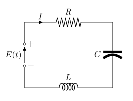{fig-align="center" width="60%"}

La tension d'entrée $e(t)$ et le courant $i(t)$ sont des grandeurs électriques dépendant du temps. La loi des mailles et la relation de charge du condensateur régissent le système :

$$ \left\{
    \begin{array}{ll}
        L\dfrac{di(t)}{dt} = -R\,i(t) - v_c(t) + e(t) \\[6pt]
        i(t) = C\dfrac{dv_c(t)}{dt}
    \end{array}
\right.$$

### Le passage à la représentation d'état

En électronique moderne et en automatique, au lieu de manipuler cette équation sous forme fonctionnelle scalaire, on introduit la **notion d'état**. On regroupe les variables du système dans un **vecteur d'état** $X(t)$ :

$$\frac{dX(t)}{dt} = \begin{bmatrix}
-R/L & -1/L \\
1/C & 0 
\end{bmatrix} X(t) + \begin{bmatrix}
1/L \\
0 
\end{bmatrix} e(t) \quad \text{avec} \quad X(t) = \begin{bmatrix} i(t) \\ v_c(t) \end{bmatrix}$$ [@Dixneuf2007-oc]

------------------------------------------------------------------------

### Le parallèle direct avec l'équation de Schrödinger

Cette approche matricielle des systèmes dynamiques classiques est l'exact pendant du formalisme de la mécanique quantique :

+-----------------------------------------------------+-------------------------------------------------------------------------------------+
| Électronique / Automatique (RLC)                    | Physique quantique                                                                  |
+:====================================================+:====================================================================================+
| **Vecteur d'état** $X(t)$ (courant, tension)        | **Fonction / Vector d'état** $\Psi(x,t)$                                            |
+-----------------------------------------------------+-------------------------------------------------------------------------------------+
| **Matrice de dynamique** $A$ (composants $R, L, C$) | **Opérateur Hamiltonien** $\hat{H}$ (énergie $T + V$)                               |
+-----------------------------------------------------+-------------------------------------------------------------------------------------+
| **Équation d'état** $\frac{dX}{dt} = AX + Bu$       | **Équation de Schrödinger** $i\hbar \frac{\partial \Psi}{\partial t} = \hat{H}\Psi$ |
+-----------------------------------------------------+-------------------------------------------------------------------------------------+

En mécanique quantique, l'état d'une particule évolue ainsi sous l'action d'un **opérateur** ($\hat{H}$), de la même façon que l'état d'un circuit électrique évolue sous l'action de la matrice des propriétés physiques de ses composants.

## Les multiples voies d'accès à l'équation de Schrödinger

L'équation de Schrödinger est un postulat. Elle ne se « démontre » pas, mais elle s'introduit selon plusieurs perspectives :

- **L'approche hamiltonienne (Austin Blaquière) :** On part de la conservation classique de l'énergie $E = \frac{p^2}{2m} + V$ et l'on substitue les grandeurs dynamiques par leurs opérateurs ($E \to i\hbar \partial_t$ et $p \to -i\hbar \partial_x$).
- **L'approche ondulatoire (Schrödinger) :** On adapte l'équation des ondes de d'Alembert en y injectant la relation de de Broglie $\lambda = h/p$.
- **L'analogie thermodynamique :** Pour une particule libre, l'équation de Schrödinger s'apparente à une **équation de la chaleur** à coefficient de diffusion réel $D = \frac{\hbar}{2m}$, mais appliquée à un temps imaginaire ($t \to i\tau$). Ce saut dans le domaine complexe transforme la diffusion irréversible en une propagation ondulatoire réversible.
- **L'approche newtonienne (Potentiel quantique) :** En écrivant $\Psi = R \, e^{iS/\hbar}$, on retrouve l'équation de Newton $m\vec{a} = -\vec{\nabla}(V + Q)$, où $Q$ est un « potentiel quantique » d'origine purement ondulatoire.

## Équation de Schrödinger à partir de l'équation de la chaleur

Plutôt que d'utiliser le traditionnel principe de correspondance, il est particulièrement instructif de partir de l'équation de la chaleur. Cette approche met en lumière les affinités profondes entre la mécanique quantique et la thermodynamique.

Posons l'équation de la chaleur classique à une dimension :

$$\frac{\partial u(x,t)}{\partial t} = D \frac{\partial^2 u(x,t)}{\partial x^2}$$

où $D > 0$ représente le coefficient de diffusion.

Contrairement à l'équation des ondes de d'Alembert (qui comporte une dérivée seconde en temps $\frac{\partial^2}{\partial t^2}$), l'équation de la chaleur présente une **dérivée première en temps**, tout comme l'équation de Schrödinger.

En appliquant la **rotation de Wick**, nous faisons passer le temps du domaine réel au domaine imaginaire ($t \to i\tau$) :

$$\frac{\partial u(x,\tau)}{\partial (i\tau)} = D \frac{\partial^2 u(x,\tau)}{\partial x^2} \implies -i \frac{\partial u(x,\tau)}{\partial \tau} = D \frac{\partial^2 u(x,\tau)}{\partial x^2}$$

En multipliant l'ensemble par $-i\hbar$, l'équation devient :

$$i\hbar \frac{\partial u(x,\tau)}{\partial \tau} = -\hbar D \frac{\partial^2 u(x,\tau)}{\partial x^2}$$

------------------------------------------------------------------------

### Interprétation physique : du dissipatif au réversible

En identifiant cette forme avec l'équation de Schrödinger pour une particule libre :

$$\boxed{i\hbar \frac{\partial \Psi(x,t)}{\partial t} = -\frac{\hbar^2}{2m} \frac{\partial^2 \Psi(x,t)}{\partial x^2}}$$

nous constatons qu'il suffit de fixer le coefficient de diffusion quantique à :

$$D = \frac{\hbar}{2m}$$

**Portée conceptuelle :**\
Fixer une valeur exacte au coefficient de diffusion revient à **forcer le phénomène à basculer d'un processus irréversible amorti (la diffusion thermique) vers un processus réversible sans perte d'énergie (la propagation de la fonction d'onde)**. L'unité imaginaire $i$ transforme l'étalement irréversible de la chaleur en une oscillation de phase qui conserve la probabilité.

Comme le rappelle J.-P. Ansermet dans son traité de thermodynamique [@Ansermet2016], l'équation de la chaleur s'impose comme un modèle phénoménologique dont le coefficient de transport ($\lambda$ ou $D$) peut *a priori* adopter toute valeur adaptée au système étudié.

En physique quantique, le choix $D = \frac{\hbar}{2m}$ n'est donc pas une hypothèse arbitraire, mais l'injection des constantes fondamentales du système (la constante de Planck réduite $\hbar$ et la masse $m$ de la particule) dans une structure de bilan de flux.

## L'équation de Schrödinger dans son cadre général

Plutôt que de chercher à résoudre cette équation sur des cas d'école idéalisés (puits de potentiel infini, oscillateur harmonique), ce qui relève de la simple technique mathématique, il importe d'en saisir la structure formelle et la portée conceptuelle.

L'état d'un système quantique est représenté par un vecteur d'état $|\Psi(t)\rangle$ dans un espace de Hilbert. Son évolution temporelle est régie par l'**équation de Schrödinger dépendant du temps** :

$$\boxed{i\hbar \frac{\mathrm{d}}{\mathrm{d}t}|\Psi(t)\rangle = \hat{H} |\Psi(t)\rangle}$$

où $\hat{H}$ est l'opérateur **Hamiltonien**, générateur des translations temporelles et observable associée à l'énergie totale du système.

### Propriétés fondamentales de la dynamique :

- **Linearité :** Si $|\Psi_1\rangle$ et $|\Psi_2\rangle$ sont des solutions, toute superposition linéaire $\alpha|\Psi_1\rangle + \beta|\Psi_2\rangle$ est également une solution. C'est le principe de superposition d'états.
- **Unitarité et conservation :** L'opérateur d'évolution $U(t, t_0) = \exp\left(-\frac{i}{\hbar}\hat{H}(t - t_0)\right)$ est hermitien/unitaire. Il garantit la conservation stricte de la norme du vecteur d'état dans le temps ($\langle \Psi(t)|\Psi(t)\rangle = 1$), signifiant que la probabilité totale de présence reste constamment égale à $1$.
- **Déterminisme de l'amplitude :** Bien que la mesure quantique soit probabiliste, l'évolution temporelle du vecteur d'état $|\Psi(t)\rangle$ avant la mesure est **rigoureusement déterministe**.

------------------------------------------------------------------------

### Pourquoi la résolution exacte s'arrête ici

L'équation sous cette forme suppose un **système totalement isolé** décrivant un **état pur** parfait.

Dans un contexte applicatif réel (canaux de transmission, processeurs quantiques, capteurs ou réseaux), un système n'est jamais isolé : il interagit en permanence avec son environnement (bruit, déphasage, dissipation). Poursuivre sur la résolution analytique d'états purs isolés est une modélisation incomplète.

Pour décrire la réalité expérimentale et la perte d'information, il est nécessaire de passer du vecteur d'état $|\Psi\rangle$ à l'**opérateur densité** $\hat{\rho}$.

# L'état de superposition

Cette approche s'inscrit dans les modèles récents d'application de l'information quantique aux systèmes distribués [@Caporali2026].

### Peut-on parler du destin géométrique d'un point ?

**Structure d'une matrice** $2 \times 2$ :

Prenons deux points $P_1(x_1, y_1)$ et $P_2(x_2, y_2)$. Nous allons considérer l'application linéaire suivante :

$$\begin{cases}
x_2 = a x_1 + b y_1 \\
y_2 = c x_1 + d y_1
\end{cases}$$

Cela se représente par une matrice carrée :

$$\begin{pmatrix}
a & b \\
c & d
\end{pmatrix}$$

L'information présente dans la matrice décrit l'état de $P_1$ dans son cheminement géométrique vers $P_2$. Les coefficients $a$ et $d$ sont les éléments diagonaux, tandis que $b$ et $c$ sont les éléments non diagonaux.

Voici quelques configurations fondamentales :

- **Matrice de rotation (**$\pi/2$) : $\begin{pmatrix} 0 & -1 \\ 1 & 0 \end{pmatrix}$
- **Matrice de symétrie :** $\begin{pmatrix} 0 & 1 \\ 1 & 0 \end{pmatrix}$
- **Matrice de projection :** $\begin{pmatrix} 1 & 0 \\ 0 & 0 \end{pmatrix}$
- **Matrice dégénérée :** $\begin{pmatrix} 1 & 1 \\ 1 & 1 \end{pmatrix}$

Ce sont les éléments non diagonaux qui dictent la géométrie de la transformation (par exemple, la rotation d'un angle $\pi/2$). Les éléments diagonaux, quant à eux, correspondent géométriquement à des homothéties.

### Loi dans le plan géométrique

Comme le rappelle Austin Blaquière dans son traité de mécanique [@Blaquiere1966_t1, p. 9] :

> Étant donné un point $P_1$ du plan, on lui fait correspondre un point $P_2$ par une loi donnée.

Une application linéaire possède une interprétation géométrique immédiate : il est tentant de remplacer un algorithme par le destin géométrique d'un point, comme si l'espace illustrait directement les mécanismes mathématiques sous-jacents.

L'utilisation du produit extérieur $|v_1\rangle \langle v_2|$ permet de modéliser la **corrélation** entre deux entités du réseau. La matrice résultante :

$$|v_1\rangle \langle v_2| = \begin{pmatrix} X_1 X_2 & X_1 Y_2 \\ Y_1 X_2 & Y_1 Y_2 \end{pmatrix}$$

montre que chaque cellule est une hybridation des deux points. On a ainsi créé un opérateur.

Bien que mathématiquement cohérent, ce niveau d'abstraction nécessite d'être complété par un outil interprétable physiquement, afin de traduire les états du consensus en grandeurs observables. Austin Blaquière souligne cette nécessité fondamentale dans le second tome de son ouvrage [@Blaquiere1966_t2, p. 39] :

> Il faut remarquer que pour toute onde classique — onde acoustique, onde lumineuse... — nos sens sont impressionnés par le carré de l'amplitude $a^2$ et non pas par l'amplitude elle-même. Ceci résulte du fait que nos organismes ne peuvent percevoir que des énergies. Or l'énergie transportée par une onde classique dans un temps donné, ou sa puissance, est proportionnelle au carré de son amplitude.

On chercherait ainsi une matrice plus directement interprétable, de la forme :

$$\begin{pmatrix} X_1^2 & b \\ c & X_2^2 \end{pmatrix}$$

où $X_1^2$ et $X_2^2$ représentent les intensités physiques issues de $P_1$ et $P_2$.

Cependant, le produit simple $|v_1\rangle \langle v_2|$ ne peut jamais fournir une structure du type $\begin{pmatrix} X_1^2 & a \\ a^* & X_2^2 \end{pmatrix}$. Nous nous heurtons ici à une **impasse conceptuelle**.

### Le saut dans le vide

Une démarche similaire à la rupture épistémologique initiée par Heisenberg (1925) [@heisenberg1925] devient alors nécessaire : abandonner les représentations cinématiques classiques au profit d'observables matricielles.

Pour exprimer la position $x$ d'une particule à un instant donné, Heisenberg renonce à une valeur unique et choisit de manipuler un tableau — l'ancêtre de la matrice position $\hat{X}$ — réunissant l'ensemble des positions possibles.

La clé consiste à raisonner non plus en coordonnées spatiales définies, mais en **potentialités de coordonnées**. Ce n'est plus une position $x_1$ **OU** une position $x_2$, mais une potentialité de position $x_1$ **ET** une potentialité de position $x_2$.

### Le qubit et la superposition d'états

Le saut conceptuel du bit (information classique) au qubit (information quantique) traduit cette bascule. La superposition d'états — le fait d'habiter simultanément plusieurs états — s'interprète en posant une superposition de $P_1$ et $P_2$.

On définit le vecteur d'état :

$$|v_{\text{mixte}}\rangle = \alpha |v_1\rangle + \beta |v_2\rangle$$

Cette écriture s'interprète géométriquement comme une combinaison linéaire dans un espace de Hilbert. Son lien avec la mesure physique impose le passage au carré du module : $|\alpha|^2$ et $|\beta|^2$ représentent les probabilités de trouver le système respectivement dans l'état 1 ou 2.

Les coefficients $\alpha$ et $\beta$ sont les **amplitudes de probabilité**. Exprimés sous forme complexe (cartésienne $\alpha = a + ib$ ou polaire $\alpha = r e^{i\phi}$), le module $r$ fixe le niveau de présence ($P = r^2$), tandis que la phase $\phi$ englobe l'information de structure et de cohérence.

# L'opérateur densité $\hat{\rho}$

::: {.callout-note title="Contexte historique : De la matrice statistique à la matrice densité"}
On a souvent l'impression que la matrice densité est un outil récent en physique quantique. Pourtant, dans leur ouvrage fondateur, Fritz London et Edmond Bauer (1939) [@london1939theorie], cités par Leite Lopes et Escoubès [@leitelopes1994sources], introduisent déjà l'« opérateur statistique » et la « matrice statistique », que l'on nomme aujourd'hui **matrice densité**.

En lisant ce texte rédigé en 1939, on est frappé par le chemin parcouru depuis les travaux pionniers des années 1925-1930. En appliquant le formalisme aux ensembles statistiques, London et Bauer écrivent :

> Appelons la matrice statistique d'un cas pur une « matrice élémentaire ». La matrice d'un mélange général $P$ peut alors être considérée comme une superposition linéaire de matrices élémentaires : $$P = \sum_n p_n P^{(n)}$$
:::

------------------------------------------------------------------------

### Rappel : le produit externe (*outer product*)

Celui-ci est à ne pas confondre avec le produit extérieur (au sens de l'algèbre extérieure) ni avec le produit tensoriel.

Si l'on pose :

$$C = \begin{pmatrix} a \\ b \end{pmatrix} \quad \text{et} \quad L = \begin{pmatrix} c & d \end{pmatrix}$$

Le produit $M = C \times L$ s'obtient en multipliant chaque élément de la colonne par chaque élément de la ligne :

$$M = \begin{pmatrix} 
a \times c & a \times d \\
b \times c & b \times d 
\end{pmatrix}$$

Contrairement au produit scalaire (matrice ligne multipliée par une matrice colonne), on réalise l'opération inverse : une matrice colonne multipliée par une matrice ligne. C'est le **produit externe**. Au lieu de donner un scalaire, le résultat fournit une matrice carrée d'opérateur.

### Utilisation de la notation bra-ket $\langle \cdot | \cdot \rangle$

Dans le formalisme de Dirac :

- $| v \rangle = \begin{pmatrix} x \\ y \end{pmatrix}$ représente un vecteur colonne (**ket**).
- $\langle v' | = \begin{pmatrix} x'^* & y'^* \end{pmatrix}$ représente un vecteur ligne (**bra**), obtenu par transproposition conjuguée.

Le **produit scalaire** de deux vecteurs d'état s'écrit :

$$\langle v_1 | v_2 \rangle = X_1^* X_2 + Y_1^* Y_2 \in \mathbb{C}$$

Le **produit externe** d'un vecteur $|v_1\rangle$ par un vecteur $|v_2\rangle$ s'écrit $|v_1 \rangle \langle v_2 |$.

+-----------------------+-----------------------------------+-------------------------+------------------------+
| Opération             | Notation                          | Type de résultat        | Analogie               |
+:======================+:==================================+:========================+:=======================+
| **PRODUIT SCALAIRE**  | $\langle v_1 \mid v_2 \rangle$    | Scalaire ($\mathbb{C}$) | Ligne $\times$ Colonne |
+-----------------------+-----------------------------------+-------------------------+------------------------+
| **PRODUIT TENSORIEL** | $|v_1\rangle \otimes |v_2\rangle$ | Vecteur d'espace étendu | Expansion d'espace     |
+-----------------------+-----------------------------------+-------------------------+------------------------+
| **PRODUIT EXTERNE**   | $|v_1\rangle\langle v_2|$         | Opérateur (Matrice)     | Colonne $\times$ Ligne |
+-----------------------+-----------------------------------+-------------------------+------------------------+

### La matrice densité : formulation

Si un système est dans l'état $|\psi\rangle = \begin{pmatrix} X_1 \\ Y_1 \end{pmatrix}$, la matrice densité $\rho$ est définie par le produit externe de l'état avec lui-même :

$$\rho = |\psi\rangle \langle \psi| = \begin{pmatrix} X_1 \\ Y_1 \end{pmatrix} \begin{pmatrix} X_1^* & Y_1^* \end{pmatrix} = \begin{pmatrix} |X_1|^2 & X_1 Y_1^* \\ Y_1 X_1^* & |Y_1|^2 \end{pmatrix}$$

Cette matrice décrit les probabilités d'états : le dégradé des états possibles s'étend de l'**état pur** aux **états mixtes**. On retrouve bien sur la diagonale les intensités physiques $|X_1|^2$ et $|Y_1|^2$ (qui résolvent l'impasse conceptuelle soulevée précédemment), tandis que les termes hors-diagonaux $X_1 Y_1^*$ codent les **cohérences quantiques**.

*(Note : Dans le cas particulier d'un système intriqué, le sous-système peut se retrouver dans un état mixte alors que le système global reste dans un état pur).*

Pour une introduction progressive à ces principes, on pourra consulter l'ouvrage de Michel Le Bellac [@le_bellac_2005], ainsi que les manuels de référence de Benenti et al. [@Benenti2004; @Benenti2007] pour les applications à l'information quantique.

## Du vecteur d'état à l'opérateur densité

Cette formulation répond exactement à l'impasse conceptuelle rencontrée précédemment : le simple vecteur d'état $|\Psi\rangle$ ne sait décrire qu'un **état pur** (une superposition cohérente quantique). Dès qu'un système interagit avec son environnement ou que l'observateur subit une ignorance statistique classique, il faut passer à l'opérateur densité $\hat{\rho}$.

### 1. Définition de la matrice densite

- **État pur (Cohérence quantique) :** Le système est parfaitement isolé et décrit par un unique ket $|\Psi\rangle$. Son opérateur densité est le projecteur direct : $$\hat{\rho} = |\Psi\rangle\langle\Psi|$$

- **Mélange statistique (Incertitude classique) :** Le système a une probabilité classique $p_k$ d'être dans l'état pur $|\Psi_k\rangle$ (avec $\sum_k p_k = 1$). Son opérateur densité s'écrit alors selon la formule de London et Bauer : $$\hat{\rho} = \sum_k p_k |\Psi_k\rangle\langle\Psi_k|$$

### 2. Propriétés fondamentales de l'opérateur densité

Tout opérateur densité $\hat{\rho}$ vérifie trois propriétés mathématiques strictes :

1.  **Hermiticité :** $\hat{\rho}^\dagger = \hat{\rho}$ (ses valeurs propres sont réelles).
2.  **Conservation de la probabilité (Trace égale à 1) :** $$\mathrm{Tr}(\hat{\rho}) = 1$$
3.  **Positivité :** Pour tout ket $|\phi\rangle$, $\langle\phi|\hat{\rho}|\phi\rangle \ge 0$ (les probabilités de présence sont toujours positives).

### 3. Critère de pureté et entropie de von Neumann

Pour savoir si un système est dans un état pur ou un mélange statistique, on utilise deux indicateurs majeurs :

- **La pureté** $\gamma = \mathrm{Tr}(\hat{\rho}^2)$ :
  - Pour un **état pur** : $\mathrm{Tr}(\hat{\rho}^2) = 1$
  - Pour un **mélange statistique** : $\mathrm{Tr}(\hat{\rho}^2) < 1$
- **L'entropie de von Neumann** $S$ : Elle généralise l'entropie de Gibbs-Boltzmann au cas quantique : $$S = -k_\mathrm{B} \, \mathrm{Tr}(\hat{\rho} \ln \hat{\rho})$$ L'entropie est strictement nulle ($S = 0$) pour un état pur (information maximale) et maximale pour un mélange complètement désordonné (ignorance maximale).

::: {.callout-note title="Escale historique : Le lien thermodynamique chez London et Bauer"}
Cette irruption de l'entropie peut sembler abrupte. Pourtant, il ne s'agit pas d'une notion récente : dès 1939, London et Bauer [@london1939theorie] exposent clairement cette connexion fondatrice :

> L'opérateur $P$ caractérise un ensemble de systèmes identiques qui sont distribués d'une manière quelconque sur des états différents. Il joue un rôle analogue à celui de la fonction de répartition en mécanique statistique ordinaire. Il doit donc y avoir une connexion entre l'opérateur $P$ et les grandeurs macroscopiques de la thermodynamique. \[...\] Tout est contenu dans la définition de l'entropie $S$ : $$S = -k N \, \mathrm{Trace}(P \ln P)$$

Ce saut conceptuel montre que l'opérateur densité n'est pas seulement un outil de calcul pour la mesure, mais la véritable passerelle entre la mécanique quantique et la physique statistique.
:::

### Importance de la matrice densité et de l'analogie avec le qubit pour les réseaux distribués

Un qubit n'est pas intriqué avec lui-même : il ne peut être intriqué qu'avec un autre qubit. En revanche, un qubit individuel peut se trouver dans un **état de superposition**, ce qui signifie qu'il habite simultanément l'état $|0\rangle$ et l'état $|1\rangle$.

Nous ne dirons pas que le qubit est « en consensus avec lui-même », mais plutôt qu'il est en superposition : il vaut $0$ et $1$ en même temps.

Si, dans le domaine des réseaux distribués, nous considérons un nœud du réseau comme une entité élémentaire, nous pouvons modéliser ce nœud par analogie avec un qubit.

Prenons l'exemple d'un nœud du réseau Bitcoin qui participe au minage : \* Il cherche à résoudre le puzzle cryptographique. S'il est le premier à réussir, il devient le nœud gagnant et son état vaut $1$. \* S'il échoue, son état vaut $0$. \* Pendant la phase de recherche (environ 10 minutes), son état ne réside ni exclusivement en $0$ ni en $1$ : il se trouve dans une superposition des deux potentialités.

Au bout de 10 minutes, la mesure (la découverte du bloc) réduit l'état à $0$ ou $1$. Mais pendant cet intervalle, l'état s'étire entre ces deux possibles.

C'est le concept de **temps étiré** (*Proof of Stretching Time* - PoST) proposé dans l'étude sur le consensus [@Caporali2026] :

::: {.callout-note icon="false" title="Extrait de : La matrice densité appliquée au consensus pour la blockchain [@Caporali2026]"}
C'est cette attente des agents (le possible) qui constitue l'intermédiaire de confiance (le temps). Elle crée la concession du groupe. On peut appeler cette preuve : **preuve de temps étiré** car la structure du système s'étire entre présent et possible.

#### Matrice densité individuelle

Cette notion est commune aux agents et aux intermédiaires, mais chacun possède sa propre matrice densité.

#### Matrice densité du système

C'est la notion d'intrication.
:::

# Mesure quantique :

## Mesure quantique : interaction et irréversibilité :

Dans certaines sciences, comme l’électronique, effectuer une mesure d’un système influe sur ce dernier. Il est possible de dire que : « j’observe donc je perturbe. ». En effet, lorsque l’on effectue une mesure sur un circuit électronique, il faut prendre en compte le fait que l’appareil de mesure est également un élément du circuit. Il peut disposer de sa propre résistance par exemple. Ainsi, effectuer une mesure revient à interagir avec le système [@cluzel:hal-04052636].

Ce principe de perturbation est amplifié en mécanique quantique. L'acte de mesure est l'interaction la plus violente que l'on puisse appliquer à un système quantique, car elle entraîne la perte irréversible de l'information sur l'état de superposition initial (via la réduction du paquet d'ondes). Cette notion d'irréversibilité est parfois mise en parallèle avec des concepts comme celui de la \textit{blockchain}, où un état est validé et ne peut pas être annulé.

Niels Bohr [@BOHR1928] écrit à propos de la nature des transitions atomiques :

> Des lignes spectrales qui selon la théorie classique devraient provenir d'un même état de l'atome sont attribuées, d’après le postulat quantique, à différents processus de transition entre lesquels l'atome a le choix.

En d'autres termes, là où la théorie classique permet une somme continue de possibilités (comme la décomposition continue d'une voix en fréquences), la théorie quantique force l'état à choisir un niveau parmi un ensemble discret et possible.

**Les postulats de la mesure (Règles de Born) :**

Les trois "règles" ou postulats fondamentaux de la mesure, formalisées par Max Born en 1926 dans son article Zur Quantenmechanik der Stoßvorgänge, sont essentiels pour relier le formalisme mathématique à l'expérience physique.

Selon [@Wiggins2024] page 67, ces règles sont :

### Description de l'état et de l'observable

L'état d'un système physique est décrit par un ket normalisé $|\Psi \rangle$ dans un espace de Hilbert $\mathcal{H}$.

Chaque grandeur physique mesurable (observable) d'un système est décrite par un opérateur auto-adjoint $\hat{A}$ agissant sur l'espace de Hilbert $\mathcal{H}$.

### Résultat de la mesure (postulat sur les valeurs)

Le seul résultat possible de la mesure d'une observable physique $\hat{A}$ est une valeur propre de $\hat{A}$, notée $\lambda$.

### Probabilité d'un résultat (Règle de Born)

Supposons le système dans l'état $|\Psi \rangle$. La probabilité que la mesure d'une observable $\hat{A}$ donne la valeur propre $\lambda$ s'écrit :

$$\boxed{\mathrm{Prob}_{\Psi}(\lambda) \equiv \langle\Psi|\hat{P}_{\lambda}|\Psi\rangle = \|\hat{P}_{\lambda}|\Psi\rangle\|^2}$$

où $\hat{P}_{\lambda}$ est l'opérateur de projection orthogonal sur le sous-espace propre associé à $\lambda$.

*Remarque intuitive :* Dans le cas simple où la valeur propre est associée à un unique état propre $|u_\lambda\rangle$, le projecteur vaut $\hat{P}_\lambda = |u_\lambda\rangle\langle u_\lambda|$. La formule redonne exactement la règle de Born classique : $\mathrm{Prob}(\lambda) = |\langle u_\lambda | \Psi \rangle|^2$.

### État du système après la mesure (Postulat de réduction)

Si la mesure donne le résultat $\lambda$, l'état du système immédiatement après la mesure s'effondre dans le vecteur projeté et renormalisé :

$$\boxed{|\Psi'\rangle = \frac{\hat{P}_{\lambda}|\Psi\rangle}{\sqrt{\langle{\Psi|\hat{P}_{\lambda}|\Psi\rangle}}}}$$

*Remarque intuitive :* Le numérateur $\hat{P}_{\lambda}|\Psi\rangle$ représente l'écrasement (la projection) de l'état initial sur le sous-espace mesuré. Le dénominateur divise simplement ce vecteur par sa norme $\sqrt{\mathrm{Prob}(\lambda)}$ pour garantir que l'état final reste de norme 1 ($\langle \Psi' | \Psi' \rangle = 1$).

## Le Pari sur l'aléatoire :

L’interprétation statistique de la mécanique quantique, qui confère une nature intrinsèquement probabiliste aux mesures, fut un point de friction majeur lors de l'établissement de la théorie. Albert Einstein, notamment, s'opposait à cette indétermination fondamentale, résumée par sa célèbre phrase : « Dieu ne joue pas aux dés ».

En 1939, les physiciens Fritz London et Edmond Bauer ont formalisé cette approche dans leur ouvrage pionnier, en écrivant : [@london1939theorie]

> L’interprétation statistique de la mécanique ondulatoire peut être considérée comme une tentative particulièrement conservatrice pour maintenir l'image de Bohr et d'Einstein et l'encadrer en un système théorique cohérent.

Malgré les réserves d'Einstein et d'autres sur le fait que les lois de la physique "se jouent aux dés", le formalisme mathématique statistique appliqué à la physique quantique a formé un cadre théorique cohérent et expérimentalement validé, qui est aujourd'hui la base de l'Interprétation de Copenhague.

Il est important de noter que l'utilisation des outils de la physique statistique ne se limite pas à la physique quantique. Elle est également fondamentale dans des domaines macroscopiques, comme la thermodynamique.

Comme le présente le cours de François Chevoir [@Chevoir2013-fq], la physique statistique est l'outil qui permet de faire le pont entre le comportement microscopique d'un grand nombre de particules (atomes, molécules) et les propriétés macroscopiques d'un système, telles que la température, la pression ou l'entropie. En thermodynamique, elle permet de déduire des lois déterministes à partir de l'étude des probabilités d'états d'une collection immense d'éléments.

# Intrication quantique :

## Systèmes composés et influence locale :

La notion de système composé suppose que l'on peut séparer le système complet en deux sous-systèmes, sur lesquels il est possible de faire des mesures sans que les appareils puissent mutuellement s'influencer [@Degiovanni2020-yq, p. 168].

C'est cette condition d'indépendance physique et spatiale qui fut cruciale dans les expériences d'Alain Aspect à l'Université d'Orsay sur les paires de photons intriqués : il veilla à ce que les mesures effectuées sur un photon ne puissent pas influencer celles effectuées sur l'autre.

## Espaces de hilbert et produit tensoriel :

Pour décrire un système quantique composé de deux sous-systèmes $A$ et $B$, on utilise le produit tensoriel de leurs espaces de Hilbert respectifs.

Produit Tensoriel : Soient $\mathcal{H}_{A}$ et $\mathcal{H}_{B}$ des espaces vectoriels linéaires complexes de dimension finie munis d'un produit scalaire (espaces de Hilbert de dimension finie). Leur produit tensoriel, noté $\mathcal{H}_{A} \otimes \mathcal{H}_{B}$, est un espace vectoriel linéaire complexe de dimension finie, également muni d'un produit scalaire [@Wiggins2024, p. 146].

Base Orthonormale pour l'Espace Produit Tensoriel : Soit $\left\{|a_{i}\rangle\right\}, i=1,\dots,N_{A}$ une base orthonormale dans $\mathcal{H}_{A}$ et $\left\{|b_{j}\rangle\right\}, j=1,\dots,N_{B}$ une base orthonormale dans $\mathcal{H}_{B}$. Alors l'ensemble des vecteurs $|a_{i}\rangle \otimes |b_{j}\rangle, i=1,\dots,N_{A}, j=1,\dots,N_{B}$ forme une base orthonormale dans $\mathcal{H}_{A} \otimes \mathcal{H}_{B}$.

## États produit et états intriqués :

Un état quelconque $|\Psi\rangle$ de l'espace composé $\mathcal{H}_{A} \otimes \mathcal{H}_{B}$ peut être décomposé sur la base de produit tensoriel comme :

$$|\Psi\rangle=\sum_{i,j\in I_{A} \times I_{B}} a_{ij} |\phi^{A}_{i}\rangle \otimes |\phi^{B}_{j}\rangle$$

où $a_{ij}$ sont des amplitudes complexes.

*État Produit (Séparable) :* Tout état $|\Phi\rangle \in \mathcal{H}_{A} \otimes \mathcal{H}_{B}$ qui peut être écrit sous la forme :

$$|\Phi\rangle=|\phi_{A}\rangle \otimes |\phi_{B}\rangle$$

pour des états $|\phi_{A} \rangle \in \mathcal{H}_{A}$ et $|\phi_{B} \rangle \in \mathcal{H}_{B}$ est dit être un état produit (ou séparable) [@Wiggins2024, p. 146].

*État Intriqué (Non-Séparable) :* Tout état $|\Psi\rangle \in \mathcal{H}_{A} \otimes \mathcal{H}_{B}$ qui ne peut pas être écrit sous la forme simple de produit $|\phi_{A}\rangle \otimes |\phi_{B}\rangle$ est dit être un état intriqué (ou non-séparable) [@Wiggins2024, p. 146].

Dans le cas général où plusieurs amplitudes $a_{ij}$ sont non nulles dans la décomposition ci-dessus, l’état est dit intriqué.

## Opérateurs linéaires sur les espaces de produit tensoriel :

Soient $\hat{A} : \mathcal{H}_{A} \to \mathcal{H}_{A}$ et $\hat{B} : \mathcal{H}_{B} \to \mathcal{H}_{B}$ des opérateurs linéaires. On construit un opérateur linéaire sur $\mathcal{H}_{A} \otimes \mathcal{H}_{B}$ en utilisant $\hat{A}$ et $\hat{B}$. Si $\hat{A}$ a les valeurs propres $\lambda_i$ et les vecteurs propres $|a_i\rangle$, et si $\hat{B}$ a les valeurs propres $\mu_j$ et les vecteurs propres $|b_j\rangle$, alors l'opérateur produit $\hat{A} \otimes \hat{B}$ a les valeurs propres $\lambda_{i}\mu_{j}$ et les vecteurs propres $|a_{i}\rangle|b_{j}\rangle$ [@Wiggins2024, p. 148].

Un état quelconque $|\Phi\rangle$ peut être décompose sur une base de $\mathcal{H}$ = $\mathcal{H}_{A} \otimes \mathcal{H}_{B}$ comme :

$$|\Psi\rangle=\Large{\sum}_{i,j\in I_{A} \times I_{B}}^{} a_{ij} |\phi^{A}_{i}\rangle \otimes |\phi^{B}_{j}\rangle $$

ou les amplitudes a\_{ij} sont des nombres complexes.

Dans le cas général où plusieurs amplitudes sont non nulles l’état est dit intriqué.

## L'expérience de mesure sur un état intriqué :

Le processus de mesure sur un système intriqué illustre la non-localité quantique :

Une source émet un état intriqué $|\Psi\rangle = \sum_{i,j} a_{ij} |\phi^{A}_{i}\rangle \otimes |\phi^{B}_{j}\rangle$ de deux systèmes, l'un envoyé à Alice ($A$) et l'autre à Bob ($B$).

Si Bob effectue une mesure et trouve le résultat correspondant à l'état $|\phi_{j}^B\rangle$, l'état global se projette instantanément. Le système d'Alice se retrouve alors dans l'état relatif $|\psi(A|j)\rangle$, projeté par la mesure de Bob.

Ainsi selon Selon [@Degiovanni2020-yq] on a la figure suivante :

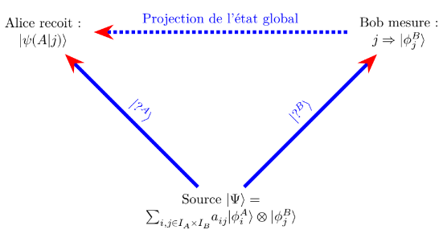{fig-align="center"}

\usetikzlibrary {arrows.meta}
\begin{figure}
\centering
\begin{tikzpicture}
 
 \node (A) at (0,0) {\begin{tabular}{c} Source $|\Psi\rangle=$ \\ $\Large{\sum}_{i,j\in I_{A} \times I_{B}}^{} a_{ij} |\phi^{A}_{i}\rangle \otimes |\phi^{B}_{j}\rangle $ \end{tabular}};
 \node (B) at (-5,5) {\begin{tabular}{c} Alice recoit : \\ $ |\psi(A|j)\rangle$ \end{tabular}};
 \node (C) at (5,5) {\begin{tabular}{c} Bob mesure : \\ $ j \Rightarrow |\phi_{j}^{B}\rangle$ \end{tabular}};
    \draw[-{Stealth[red]},line width=1mm,blue] (A) -- (C) node[midway,sloped,above] {$|?^B\rangle$};
     \draw[-{Stealth[red]},line width=1mm,blue] (A) -- (B) node[midway,sloped,above] {$|?^A\rangle$};
      \draw[-{Stealth[red]}, dotted,line width=1mm,blue] (C) -- (B) node[midway,sloped,above] {Projection de l'état global};
\end{tikzpicture}
\caption{Une source émet un état intriqué de deux systèmes dont l'un est envoyé à Alice et l'autre a Bob. Si on considère les expériences dans lesquelles bob effectue une mesure et qu'il trouve le résultat correspondant à l'état $|\phi_{j}^B\rangle$ alors le système d'Alice est dans l'état relatif $|\psi(A|j)\rangle$.}
\end{figure}

- Source : Émet l'état intriqué $|\Psi\rangle$ à Alice et Bob.

- Bob mesure : Bob effectue une mesure et obtient le résultat $j$, l'état de Bob est projeté sur $|\phi_{j}^{B}\rangle$.

- Alice reçoit : En conséquence, le système d'Alice est instantanément projeté dans l'état relatif $|\psi(A|j)\rangle$.

## Le paradoxe Einstein-Podolsky-Rosen (EPR) :

Le paradoxe EPR, publié en 1935, est l'un des plus célèbres défis à l'interprétation de la mécanique quantique.

Il considère le cas d'une source créant deux particules de spin $\frac{1}{2}$ intriquées, l'une envoyée à Alice et l'autre à Bob [@Wiggins2024, p. 153].

Conséquence du Postulat de Mesure : Le postulat de mesure en mécanique quantique stipule que si Alice mesure une quantité (par exemple, le spin suivant l'axe $z$), l'état quantique global "s'effondre" dans l'état propre correspondant au résultat de la mesure d'Alice. Par conséquent, si Bob mesure la même quantité, il obtiendra exactement la même valeur que Alice.

Le résultat de cette expérience semble contraire à l'expérience commune de deux manières [@Wiggins2024, p. 156] :

Non-localité : La corrélation semble se produire instantanément, indépendamment de la distance entre Alice et Bob.

Non-réalité : La mécanique quantique implique que les propriétés n'existent pas avant la mesure, défiant la notion de réalité locale.

# L'écosystème français et européen de la quantique (2025-2026)

À l'occasion de la 4ᵉ édition de la conférence *France Quantum* (juin 2025 à Station F) [@FranceQuantum2025], cinq priorités technologiques majeures ont été mises en avant par l'écosystème :

1. **L'intégration HPC-Quantique :** Le couplage des processeurs quantiques aux supercalculateurs classiques (ex. Pasqal fournissant un processeur de 100 qubits au CEA).
2. **Le calcul quantique tolérant aux fautes (*FTQC*) :** Piloté notamment par le CEA et l'Inria à Grenoble, soutenu par le Ministère des Armées via un engagement sur 15 ans auprès de cinq startups clés (*Alice & Bob*, *C12*, *Pasqal*, *Quandela*, et *Quobly*).
3. **Les capteurs quantiques (*Quantum Sensing*) :** Pour la métrologie et l'imagerie de haute précision.
4. **La cryptographie post-quantique (*PQC*) :** La sécurisation des algorithmes contre les attaques quantiques futures.
5. **Les réseaux de communication quantique sécurisés :** La distribution quantique de clés (*QKD*) et l'Internet quantique.

{fig-align="center" width="400"}

## Paysage industriel et académique

Si l'Europe ne compte pas encore de géant intégré comparables aux acteurs américains (*IBM*, *Google*, *Microsoft*) ou aux initiatives d'État chinoises, la dynamique repose sur un tissu dense de startups et d'grands groupes industriels (tels qu'Atos, Thales ou EDF en France).

Sur le plan académique, la région Île-de-France constitue un pôle d'excellence historique (avec Sorbonne Université, Paris-Saclay, Télécom Paris) combinant recherche fondamentale et formations spécialisées.

Au niveau communautaire, la *Stratégie Quantique Européenne* officialisée à l'été 2025 fixe le cap d'une souveraineté technologique d'ici 2030, renforcée par la préparation du *Quantum Act* européen.

# Application aux réseaux distribués {#application-reseaux}

### Rappel : principe d'incertitude temps-énergie

Dans le cadre du principe d'incertitude temps-énergie, le temps $t$ n'est pas un opérateur d'observable classique (comme l'est la position $x$), mais un paramètre continu d'évolution. L'interprétation rigoureuse de $$\vert\psi(t)\rangle = \alpha(t) \vert 0\rangle + \beta(t) \vert 1\rangle$$ s'appuie sur le théorème de Mandelstam-Tamm, qui donne un sens mathématique et physique précis à la relation : $$\Delta E \cdot \Delta t \ge \frac{\hbar}{2}$$

#### 1. La vitesse d'évolution selon Mandelstam-Tamm

Dans la formulation quantique rigoureuse, la relation de Mandelstam-Tamm s'écrit : $$\Delta t \ge \frac{\hbar}{2 \Delta E}$$ où $\Delta t$ représente le temps caractéristique minimal requis pour que l'état $\vert\psi(t)\rangle$ évolue vers un état orthogonal (physiquement distinguable ou mesurable), et $\Delta E$ est l'incertitude (l'écart-type) sur le Hamiltonien $\hat{H}$ du système.

- **Signification de** $\alpha(t)$ et $\beta(t)$ : La variation temporelle des amplitudes de probabilité $\frac{d\alpha}{dt}$ et $\frac{d\beta}{dt}$ mesure la vitesse à laquelle le système transite de l'état initial $\vert 0\rangle$ (« bloc non trouvé / effort en cours ») vers l'état final $\vert 1\rangle$ (« bloc trouvé / preuve validée »).

- **Le rôle de** $\Delta E$ : La quantité d'énergie (ou de travail) disponible borne la vitesse de transformation de l'état. Si $\Delta E \to 0$, le système se trouve dans un état propre d'énergie statique : $\vert\alpha(t)\vert$ et $\vert\beta(t)\vert$ ne varient plus, le temps dynamique du système est « gelé ».

#### 2. Transposition thermodynamique au nœud minier

En transposant ce formalisme au modèle stochastique du minage (processus de Poisson sans mémoire) :

**A. Trajectoire des amplitudes** $\alpha(t)$ et $\beta(t)$\

Au fur et à mesure que le temps $t$ s'écoule au sein de la fenêtre de minage : \* 

**Amplitude de statu quo :** $\alpha(t) = e^{-\frac{\lambda t}{2}}$ (l'amplitude de rester dans l'état sans bloc décline). \* 

**Amplitude de découverte :** $\beta(t) = \sqrt{1 - e^{-\lambda t}}$ (le module au carré $\vert\beta(t)\vert^2 = 1 - e^{-\lambda t}$ retrouve exactement la fonction de distribution cumulée de la loi de Poisson).

Le paramètre $\lambda$ représente le taux de hachage effectif du nœud rapporté à la difficulté globale du réseau.

**B. La borne** $\Delta E \cdot \Delta t$ comme arbitrage architectural\

\* $\Delta E$ **(Le débit d'énergie / Hashrate) :** Représente l'intensité de la puissance thermodynamique (joules par seconde) injectée par le nœud pour alimenter ses puces ASIC et explorer l'espace des nonces. \* 

$\Delta t$ **(La résolution temporelle du consensus) :** Représente l'incertitude sur l'instant exact de validation.

Pour réduire l'incertitude sur la fenêtre de résolution $\Delta t$ (découvrir un bloc plus vite et resserrer le temps de consensus), le réseau ou le mineur est contraint d'augmenter $\Delta E$. Il est physiquement et thermodynamiquement impossible d'obtenir une certitude temporelle immédiate ($\Delta t \to 0$) sans injecter une puissance infinie ($\Delta E \to \infty$).

#### 3. Formulation synthétique

L'équation d'état $\vert\psi(t)\rangle = \alpha(t) \vert 0\rangle + \beta(t) \vert 1\rangle$ décrit le taux de conversion de l'énergie $\Delta E$ en résolution temporelle $\Delta t$. Tant que la mesure (diffusion du bloc sur le réseau P2P) n'a pas eu lieu, le système accumule du travail sous forme d'amplitude de phase $\beta(t)$. Le principe d'incertitude temps-énergie garantit qu'un registre distribué ne peut pas acheter de certitude sur son état temporel sans payer un coût d'incertitude énergétique équivalent.

------------------------------------------------------------------------

En inversant la polarité classique pour faire de $\vert 0\rangle$ le champ des possibles et de $\vert 1\rangle$ l'événement accompli, le qubit devient le moteur élémentaire de la temporalité.

#### 1. La dualité Potentiel / Actuel (*Potentia* vs *Actua*)

Dans cette grille de lecture, le vecteur d'état ne décrit plus seulement une information, mais une épaisseur du présent :

- $\vert 0\rangle$ — **Le Possible (L'horizon des potentiels) :** C'est l'état du système où l'histoire n'est pas encore tranchée. Il contient la superposition de tous les nonces non encore découverts et de toutes les micro-probabilités de succès de chaque nœud. C'est le réservoir d'entropie et de futur non réalisé.
- $\vert 1\rangle$ — **Le Présent (L'événement accompli) :** C'est la matérialisation du bloc. Dès qu'il est produit et vérifié, l'état se réduit de façon irréversible. Le possible s'effondre pour devenir du présent, qui devient immédiatement du passé immuable (enregistré sur la blockchain).

La fonction d'état $\vert\psi(t)\rangle = \alpha(t) \vert 0\rangle + \beta(t) \vert 1\rangle$ décrit alors la dynamique de transition entre le futur virtuel ($\vert 0\rangle$) et le présent cristallisé ($\vert 1\rangle$).

#### 2. La construction de la structure temporelle

Cette formulation permet de définir le temps non pas comme un axe absolu et passif, mais comme le produit d'un consensus thermodynamique :

- **L'épaisseur du présent (**$\Delta t$) : Tant que $\alpha(t) \neq 0$ et $\beta(t) \neq 0$, le système se trouve dans l'épaisseur du présent. C'est une phase d'indétermination où le bloc est à la fois potentiel et en cours d’actualisation.
- **La flèche du temps par l'irréversibilité :** La réduction du paquet d'ondes lors de la diffusion du bloc ($\vert\psi\rangle \to \vert 1\rangle$) est une opération non unitaire et irréversible. C'est précisément cette irréversibilité qui fonde la flèche du temps : impossible de restaurer la superposition $\vert 0\rangle$ une fois la preuve de travail mesurée par le réseau.
- **L'horloge quantico-thermodynamique :** Chaque bloc validé agit comme un « tic-tac » ontologique. Le temps du réseau n'est pas donné par des secondes absolues, mais par la succession discrète de ces effondrements d'états potentiels $\vert 0\rangle$ en états réels $\vert 1\rangle$.

#### 3. Lien direct avec $\Delta E \cdot \Delta t$

Dans ce cadre : \* $\Delta t$ est la largeur de l'horizon du présent (la durée de la transition entre le virtuel $\vert 0\rangle$ et l'actuel $\vert 1\rangle$). \* $\Delta E$ est le coût énergétique de la métamorphose (le travail nécessaire pour forcer le possible à devenir réel).

Pour compresser le temps et faire advenir le présent plus vite ($\Delta t \to 0$), il faut injecter une énergie infinie ($\Delta E \to \infty$). C'est ce principe qui empêche le futur de s'effondrer instantanément dans le présent sans dépense thermodynamique.

::: callout-tip
### Illustration tirée de l'électronique : le délai transitoire comme structure du temps

Pour démystifier cette notion de structure temporelle et comprendre comment le temps peut être autre chose qu'un simple écoulement uniforme, l'analogie avec la charge d'un condensateur est particulièrement éclairante.

Lorsqu'on applique une tension à un condensateur déchargé, le système ne réagit pas instantanément de manière homogène : - À l'instant initial ($t = 0$), le courant $i(t)$ saute immédiatement à son maximum pour commencer à transférer les charges. La tension $u_C(t)$, elle, est encore nulle. - La tension aux bornes du composant s'établit progressivement selon la loi : $$u_C(t) = E \left(1 - e^{-\frac{t}{\tau}}\right)$$ tandis que le courant décroît à mesure que le condensateur se remplit.

Il existe ainsi un **décalage dynamique** entre l'effort initial (le flux d'intensité) et l'établissement de la tension. Le condensateur introduit une **temporisation** : il emmagasine de l'énergie et réintroduit de la potentialité au cœur du circuit.

Dans le cadre de notre structure temporelle, cette temporisation correspond précisément à la création d'une fenêtre de possible — le *futur*. Ralentir l'établissement d'une grandeur n'empêche pas le temps de s'écouler : c'est sculpter et compresser l'événement dans une fenêtre temporelle donnée.
:::

## L'illusion des cas idéaux ($\Delta t = 0$ et $\Delta E = 0$)

Il faut convertir les constantes physiques en invariants de protocole.

Voici la matrice de traduction directe de la physique aux spécifications d'architecture.

Spécifications du protocole réseau

- 

  1.  Invariant de fenêtre temporelle ($\Delta t_{slot}$)

  - Dérivation : $\Delta t \ge \frac{\hbar}{2 \Delta E}$
  - Spec : Cadencement adaptatif par étirement. Le protocole doit interdire la finalité instantanée ($\Delta t \to 0$). Si la puissance d'énergie ou de mise en jeu ($\Delta E$) disponible sur le réseau chute, la fenêtre de slot $\Delta t$ doit s'étirer dynamiquement pour maintenir la constante de sécurité $K = \Delta E \cdot \Delta t$.

- 

  2.  État du Mempool en superposition ($\vert\psi(t)\rangle$)

  - Dérivation : $\vert\psi(t)\rangle = \alpha(t) \vert 0\rangle + \beta(t) \vert 1\rangle avec \vert 0\rangle = \text{Potentiel}$ et $\vert 1\rangle = \text{Actuel}$.
  - Spec : Évaluation probabiliste des transactions. Tant que la fenêtre de stretching $\Delta t$ n'est pas close, les nœuds ne doivent pas traiter les blocs comme « valides » ou « invalides », mais leur attribuer un poids d'amplitude $w(t) = 1 - e^{-\lambda t}$. Les transactions non confirmées restent dans un état de superposition pondéré par le temps d'étirement accumulé.

- 

  3.  Condition de mesure et de décohérence (Le consensus)

  - Dérivation : Réduction du paquet d'ondes par couplage avec l'environnement.
  - Spec : Seuil de diffusion critique. La mesure (l'effondrement de $\vert 0\rangle$ vers $\vert 1\rangle$) ne se fait pas lors du calcul local par le nœud, mais lors de l'atteinte d'un seuil de propagation P2P (ex. réception du bloc par $N_{peers} \ge 2/3$). C'est le réseau qui joue le rôle de l'appareil de mesure irréversible.

- 

  4.  Barrière d'immuabilité et réordonnancement (Coût de l'histoire)

  - Dérivation : Irréversibilité thermodynamique de la mesure.
  - Spec : Coût d'annulation de temps. Pour réécrire ou réétirer une tranche de temps T passée (fork alternatif), un nœud malveillant doit prouver la dépense d'une quantité d'énergie $\Delta E_{attaque}$ strictement supérieure à l'intégrale de l'énergie et du temps étiré par le réseau sur cet intervalle :

Cette approche permet d'écrire le cahier des charges d'un consensus où le temps n'est pas lu sur une horloge externe, mais généré par le réseau lui-même via la dépense et l'étirement mesurés dans chaque bloc.

::: {.callout-note icon="true"}
## Intuition physique : L'illusion des cas idéaux

En mécanique quantique, les cas limites $\Delta t = 0$ et $\Delta E = 0$ sont des abstractions mathématiques. Transposés aux systèmes de consensus, ils révèlent la même impossibilité physique :

- **Le cas** $\Delta t = 0$ (Le slot instantané) : Trouver la solution du consensus immédiatement sans temps de recherche. Cela exigerait une injection d'énergie instantanée infinie ($\Delta E \to \infty$).
- **Le cas** $\Delta E = 0$ (Le consensus gratuit) : Valider un état sans dépenser la moindre énergie. En contrepartie, la fenêtre temporelle nécessaire pour garantir la sécurité tend vers l'infini ($\Delta t \to \infty$) : on perd toute notion de temps et de finalité.

**Conclusion d'architecture :** Un protocole réel ne peut pas viser $\Delta t = 0$ ni $\Delta E = 0$. Il doit accepter la constante $K = \Delta E \cdot \Delta t$ et faire varier dynamiquement l'une des variables en fonction de l'autre.
:::

## Les régimes d'échelle : du stochastique au thermodynamique

Lorsque le nombre de mineurs et le hashrate global deviennent colossaux, la loi des grands nombres lisse les fluctuations. L'approche de Pérez-Marco [@perezmarco2022heisenberg] doit donc se lire à travers une théorie des régimes d'échelle :

### 1. Le régime stochastique / quantique (Petites chaînes ou sous-réseaux)

- **Mécanique :** La puissance d'énergie $E$ injectée est faible et dispersée. La variance de la loi de Poisson domine largement.
- **Comportement du temps :** L'incertitude $\Delta t$ est maximale. C'est le cœur du *Proof of Stretching Time* : faute d'énergie disponible pour fixer le réseau, la fenêtre temporelle s'étire obligatoirement pour préserver la sécurité.

### 2. La limite thermodynamique (Réseau massif type Bitcoin)

- **Mécanique :** Le système injecte une quantité d'énergie $E$ monstrueuse. À cette échelle, l'agrégation des péta-hashs par seconde fait émerger un comportement macroscopique continu.
- **Comportement du temps :** L'incertitude relative $\frac{\Delta t}{\langle t \rangle}$ s'atténue. Même si chaque tirage individuel reste un processus de Poisson sans mémoire, la masse de calcul couplée à l'ajustement de difficulté garantit la convergence vers la moyenne cible des 10 minutes. Le temps stochastique décohère pour devenir un temps classique déterministe.

------------------------------------------------------------------------

**En synthèse :**

- **Régime microscopique (au niveau du hash / du mineur) :** La relation $\Delta E \cdot \Delta t \ge \frac{\hbar}{2}$ régit l'incertitude individuelle du bloc et la dynamique de superposition du mempool.
- **Régime macroscopique (au niveau du registre global) :** L'accumulation massive d'énergie fait basculer le réseau du monde quantique (incertitude et étirement) vers un cristal temporel thermodynamique, où la cadence des 10 minutes devient une constante d'état rigide.

L'apport du *Proof of Stretching Time* et du formalisme quantique sert alors à expliquer comment le réseau survit et ajuste son temps dans les phases d'instabilité ou d'énergie faible (*bootstrapping*, attaques, partitions réseau), avant d'atteindre la régularité du régime thermodynamique.

::: {.callout-note icon="true"}
## Pistes de réflexion : Matrices densité et principe de correspondance

Cette analogie quantique/réseau offre une interprétation directe du **principe de correspondance**, qui relie le monde microscopique au monde macroscopique. Pourquoi les bandes d'énergie deviennent-elles de plus en plus serrées et le monde de plus en plus continu à mesure qu'on rentre dans le macroscope ? De même, pourquoi le temps universel macroscopique est-il un temps continu dans sa mesure, alors qu'au niveau de chaque mineur le tempo est incertain à $\Delta t$ près ?

En questionnant le travail de Ricardo Pérez-Marco [@perezmarco2022heisenberg], il est tentant de conclure que le principe d'incertitude temps-énergie ne s'applique qu'aux « petites » blockchains, et s'effondre lorsque le nombre de mineurs devient très important.

En réalité, le saut conceptuel est ailleurs : **chaque mineur pris individuellement conserve une matrice densité locale** $\rho_i$ qui obéit strictement au principe d'incertitude. Si ce principe semble ne plus s'appliquer à l'échelle globale, c'est parce que les métriques observées sont des agrégats statistiques, et non les représentations de la matrice densité globale du réseau $\rho_{\text{réseau}}$.

La clé pour modéliser la matrice densité globale du système reste à déterminer, mais elle devra satisfaire le principe d'incertitude temps-énergie à son niveau d'observation. Nous ne sommes donc pas face à deux régimes de tailles différentes qui s'excluent, mais face à l'opposition fondamentale entre la **matrice densité individuelle du mineur** et la **matrice densité globale du réseau**.
:::

# Fiche Conceptuelle : Agent Classique vs Agent Quantique

## 1. Tableau comparatif des paradigmes

| Dimension | Agent Classique (Ex. Nœud Bitcoin) | Agent Quantique (Ex. Agent à superposition d'état) |
| :--- | :--- | :--- |
| **Formalisme mathématique** | Vectoriel classique : $\vec{p} = \begin{pmatrix} p_0 \\ p_1 \end{pmatrix}$ | Matrice de densité : $\hat{\rho} = \begin{pmatrix} \rho_{00} & \rho_{01} \\ \rho_{10} & \rho_{11} \end{pmatrix}$ |
| **Cohérence interne** | **Nulle** ($\rho_{01} = 0$). L'agent est dans un état déterministe ou un mélange statistique passif. | **Active** ($\rho_{01} \neq 0$). L'agent maintient une superposition et une tension de phase ($\phi$). |
| **Dynamique d'état** | Commutation binaire nette (ex. *Minage en cours* $\to$ *Bloc validé*). | Évolution continue d'amplitude et de phase entre deux pôles ($|0\rangle$ et $|1\rangle$). |
| **Nature de la défaillance** | Panne franche, crash, timeout ou faute par transmission d'une valeur erronée. | **Décohérence progressive** : érosion des termes hors-diagonaux ($\rho_{01} \to 0$) sous l'effet du bruit. |
| **Consensus / Synchronisation** | Alignement par transmission explicite de données et dépense d'énergie ($N$). | Alignement des phases collectives ($\phi$) et convergence de la pureté $\text{Tr}(\hat{\rho}^2) \to 1$. |

## 2. Analyse détaillée

### 2.1. L'Agent Classique : L'automate binaire

Un nœud dans un réseau classique (comme Bitcoin) est modélisé par des états mutuellement exclusifs.

* **Incertitude classique** – L'incertitude est uniquement liée à l'ignorance du résultat (processus stochastique). Les termes de la matrice de densité sont strictement diagonaux : $\rho_{00}$ et $\rho_{11}$ représentent les probabilités d'être dans l'état $0$ ou $1$.
* **Absence d'interférence** – L'agent ne possède aucun état intermédiaire riche. Il ne peut pas exploiter la relation de phase entre ses états potentiels.
* **Coût de synchronisation** – Pour faire converger le réseau, l'agent doit échanger des paquets explicites (messages réseau) ou injecter du travail brut (Proof-of-Work).

### 2.2. L'Agent Quantique : Le système à mémoire de phase

Un agent modélisé par une matrice de densité $\hat{\rho}_i$ possède la structure d'un **agent à superposition d'état** : il ne choisit pas entre deux extrêmes, il transporte leur interférence.

* **Cohérence interne ($\rho_{01} \neq 0$)** – Les termes hors-diagonaux mesurent la capacité de l'agent à maintenir la superposition de deux modes (ex. *Travail local / Verrouillage global*). Cette cohérence représente sa mémoire d'onde et son horloge interne ($\phi$).
* **Détection prédictive de défaillance** – Dans un réseau distribué, un agent ne tombe pas en panne subitement. On observe sa matrice locale : lorsque $\rho_{01} \to 0$, l'agent subit une décohérence. Il perd sa capacité de synchronisation **avant** même de transmettre une donnée erronée.
* **Convergence vers l'état pur** – Le consensus à l'échelle du réseau ne repose pas sur une majorité de votes binaires, mais sur le verrouillage collectif des phases, faisant évoluer le réseau vers un état pur collectif ($S(\hat{\rho}_{\text{réseau}}) \to 0$).

## 3. Synthèse pour l'ingénierie des systèmes distribués

Pour un ingénieur réseau, introduire la matrice de densité permet de passer :

1. D'un modèle d'agent **binaire et réactif** (automate à états classiques) ;
2. À un modèle d'agent **ondulatoire et prédictif** (système à phase interne capable d'évaluer son incertitude avant décision).

# Annexe mathématique

## Opérations sur les vecteurs

### Définition : vecteur

Comme indiqué par Laurent Pluchart dans son préambule [@pluchart2014introduction], un vecteur est défini par l'algèbre linéaire comme un élément qui appartient à un espace vectoriel.

### Définition : espace vectoriel

Voici les définitions fondamentales adaptées de @Wiggins2024.

::: callout-note
Un espace vectoriel, noté $\mathcal{V}$ sur un corps $\mathcal{F}$ (ici, l'ensemble des nombres complexes $\mathbb{C}$), est un ensemble d'éléments (appelés vecteurs) sur lequel deux opérations sont définies :

1.  **Addition vectorielle** : $\forall |\psi \rangle, |\phi\rangle \in \mathcal{V} \implies |\psi\rangle + |\phi\rangle \in \mathcal{V}$
2.  **Multiplication par un scalaire** : $\forall \alpha \in \mathbb{C}, |\psi \rangle \in \mathcal{V} \implies \alpha |\psi\rangle \in \mathcal{V}$
:::

::: callout-tip
### Anecdote : de la dimension 30 à l'infini

Lorsque j'étais étudiant, j'avais été invité à une soirée où un élève en mathématiques affirmait fièrement que les mathématiciens étaient des gens formidables. Il racontait que la veille, il s'était « amusé » avec des camarades à travailler sur un espace à une trentaine de dimensions. J'étais alors surpris et plutôt sceptique quant à l'utilité d'une telle démarche.

Pourtant, en physique quantique, on travaille bel et bien sur des espaces abstraits de **dimension infinie** (comme les espaces de Hilbert pour les fonctions d'onde). C'est précisément cette abstraction qui rend ce formalisme si puissant, mais aussi réputé difficile.
:::

### Produit scalaire de deux vecteurs

En géométrie classique (dans $\mathbb{R}^3$), le produit scalaire de deux vecteurs réels correspond au produit de leurs longueurs par le cosinus de l'angle qu'ils forment :

$$\boxed{\vec{V_1} \cdot \vec{V_2} = V_1 \cdot V_2 \cdot \cos \theta}$$

$\theta$ étant l'angle formé par les deux vecteurs $\vec{V_1}$ et $\vec{V_2}$.

Si $(X_1, Y_1)$ et $(X_2, Y_2)$ sont les composantes respectives de $\vec{V_1}$ et $\vec{V_2}$, l'expression analytique de leur produit scalaire s'écrit :

$$\vec{V_1} \cdot \vec{V_2} = X_1 X_2 + Y_1 Y_2$$

Ce résultat peut être représenté sous forme matricielle :

$$\begin{pmatrix} X_2 & Y_2 \end{pmatrix} \begin{pmatrix} X_1 \\ Y_1 \end{pmatrix} \quad \text{ou} \quad \begin{pmatrix} X_1 & Y_1 \end{pmatrix} \begin{pmatrix} X_2 \\ Y_2 \end{pmatrix}$$

Deux vecteurs sont dits **orthogonaux** lorsque leur produit scalaire est nul.

::: callout-note
### Intérêt du produit scalaire

Le produit scalaire est une opération qui prend deux vecteurs et résume leur relation spatiale sous la forme d'un **seul nombre (un scalaire)**. C'est tout son intérêt : synthétiser l'information vectorielle sous une forme réduite.
:::

### Norme d'un vecteur

Selon Laurent Pluchart [@pluchart2014introduction], en géométrie euclidienne classique, la norme d'un vecteur représente la longueur du segment qui porte ce vecteur.

Mathématiquement, pour un vecteur $\vec{v} = (v_1, v_2, \dots, v_n)$ dans un espace réel de dimension $n$, la norme est donnée par la formule :

$$\boxed{\|\vec{v}\| = \sqrt{v_1^2 + v_2^2 + \dots + v_n^2}}$$

Voici une définition plus générale issue de l'algèbre linéaire :

> For any vector $\Phi \in V$, we define the norm of $\Phi$, denoted $\|\Phi\|$, as follows: $\|\Phi\| = \sqrt{(\Phi,\Phi)}$ [@Wiggins2024]

### Le produit hermitien (extension aux nombres complexes)

*En anglais : complex inner product.*

Le **produit hermitien** est la généralisation du produit scalaire aux espaces vectoriels complexes ($\mathbb{C}^n$).

Prenons l'exemple d'un vecteur d'état complexe $|V_1\rangle$ :

$$|V_1\rangle = \begin{pmatrix} x \\ -ix \end{pmatrix}$$

Le vecteur dual correspondant (le *bra* $\langle V_1|$), obtenu par transproposition et conjugaison complexe, s'écrit :

$$\langle V_1| = \begin{pmatrix} x & ix \end{pmatrix}$$

Le produit hermitien de $|V_1\rangle$ avec lui-même nous donne la norme au carré $\|V_1\|^2$ :

$$\|V_1\|^2 = \langle V_1 | V_1 \rangle = \begin{pmatrix} x & ix \end{pmatrix} \begin{pmatrix} x \\ -ix \end{pmatrix} = x^2 + (ix)(-ix) = x^2 + x^2 = 2x^2$$

La norme est donc $\|V_1\| = \sqrt{2x^2} = \sqrt{2}x$.

Pour **normaliser** le vecteur $|V_1\rangle$ à l'unité ($\|V_1\| = 1$), il faut fixer la valeur $x = \frac{1}{\sqrt{2}}$. Le vecteur d'état normé s'écrit alors :

$$|V_1\rangle = \frac{1}{\sqrt{2}} \begin{pmatrix} 1 \\ -i \end{pmatrix}$$

------------------------------------------------------------------------

#### Orthogonalité et propriété de symétrie hermitienne

Deux vecteurs complexes $|V_1\rangle$ et $|V_2\rangle$ sont dits **orthogonaux** si leur produit hermitien est nul :

$$\langle V_1 | V_2 \rangle = 0$$

Contrairement au produit scalaire réel, le produit hermitien n'est pas commutatif. Il possède la propriété de **symétrie hermitienne** (la permutation des kets entraîne la conjugaison complexe) :

$$\langle V_1 | V_2 \rangle = \overline{\langle V_2 | V_1 \rangle} \implies \langle V_1 | V_2 \rangle \neq \langle V_2 | V_1 \rangle$$

Lorsque les vecteurs n'ont que des composantes réelles, le produit hermitien se confond parfaitement avec le produit scalaire classique.

------------------------------------------------------------------------

#### Généralisation continue et définition rigoureuse

Lorsque l'on passe de la dimension finie (matrices) à la dimension infinie (fonctions d'onde dans un domaine $D \subset \mathbb{R}$), la somme discrète devient une intégrale [@Wiggins2024] :

$$(\Psi, \phi) = \int_D \overline{\Psi(x)} \, \phi(x) \, dx$$

L'ensemble des fonctions vérifiant cette propriété forme l'espace de Hilbert $L^2(D)$.

Voici la définition mathématique générale d'un produit interne complexe :

> An inner product on a vector space $V$ is a map of an ordered pair of vectors $(\Psi, \phi)$ to the complex numbers that satisfies the following properties:
>
> 1.  $(\Psi, \alpha \phi + \beta \chi) = \alpha (\Psi, \phi) + \beta (\Psi, \chi)$
> 2.  $(\Psi, \phi) = \overline{(\phi, \Psi)}$
> 3.  $(\phi, \phi) \ge 0$, and equality holds if and only if $\phi = 0$,
>
> for any $\alpha, \beta \in \mathbb{C}$ and $\Psi, \phi, \chi \in V$. [@Wiggins2024]

### Produit vectoriel et produit mixte

#### Produit vectoriel

Contrairement au produit scalaire ou hermitien qui renvoie un nombre, le **produit vectoriel** de deux vecteurs de $\mathbb{R}^3$ (noté $\vec{U} \times \vec{V}$ ou $\vec{U} \wedge \vec{V}$) produit un **troisième vecteur** orthogonal au plan formé par les deux premiers.

Très utilisé en mécanique classique et en électromagnétisme (pour calculer un moment ou la force de Lorentz), il n'est **pas utilisé** dans la formulation standard des espaces d'états en mécanique quantique.

#### Produit mixte

Le **produit mixte** de trois vecteurs $(\vec{U}, \vec{V}, \vec{W})$ combine produit scalaire et produit vectoriel : $\vec{U} \cdot (\vec{V} \times \vec{W})$. Il correspond au volume orienté du parallélépipède formé par ces trois vecteurs.

Comme le produit vectoriel, cette notion ne s'applique qu'en géométrie tridimensionnelle réelle et reste **hors du cadre** de notre étude des espaces d'états complexes.

### Notation Bra-Ket

Introduite par Paul Dirac (du mot anglais *bracket*, qui signifie crochet), cette notation est simplement un jeu d'écriture pratique :

- **Le Ket** $|\psi\rangle$ : C'est le **vecteur colonne** (l'état quantique).
- **Le Bra** $\langle\phi|$ : C'est le **vecteur ligne** (le vecteur conjugué).
- **Le Bra-Ket** $\langle\phi|\psi\rangle$ : C'est le **produit scalaire** entre le vecteur ligne et le vecteur colonne.

Le résultat d'un Bra-Ket est toujours un simple nombre complexe. Si le vecteur est normé à 1, le produit $\langle\psi|\psi\rangle = 1$ signifie que la probabilité totale de trouver le système dans un état quelconque est de 100 %.

### Espace de Hilbert

Nous allons utiliser la définition donnée par Dotsenko et al. [@dotsenko2025methodes] : **l'espace des fonctions** $L^2$ muni du produit scalaire $(f|g)$ et de la norme $\|f\|_2$ est un espace de Hilbert.

Comme le précisent les auteurs, il s'agit d'une définition restreinte à l'espace fonctionnel. Plus généralement, on considère un espace de Hilbert dans un sens plus large comme tout espace vectoriel équipé d'un produit scalaire pour ses éléments, y compris l'espace des vecteurs ordinaires en dimension finie.

::: callout-note
### Idées reçues sur l'espace de Hilbert

Une grande partie de la difficulté d'abstraction de la physique quantique vient du fait que l'on travaille dans un espace de Hilbert, c'est-à-dire un espace abstrait.

On entend parfois des affirmations fausses par simplification : \* **« L'espace de Hilbert est notre espace spatio-temporel avec un nombre infini de dimensions » : FAUX.** \* **« L'espace de Hilbert est un simple espace informationnel » : FAUX AUSSI**, car le principe d'incertitude donne les incertitudes sur la mesure à partir d'opérateurs qui sont des bases dans l'espace de Hilbert. L'espace de Hilbert est plutôt l'espace qui décrit les phénomènes *avant* la mesure (voir le paragraphe sur la mesure quantique).
:::

## Les opérateurs quantiques

Un **opérateur** est une application linéaire qui transforme un vecteur d'état (un Ket) en un autre vecteur d'état dans l'espace de Hilbert. Dans une base donnée, un opérateur se représente sous la forme d'une **matrice**.

On distingue deux grands types d'opérateurs :

1.  **Les observables (ex. Position** $\hat{X}$, Impulsion $\hat{P}$, Hamiltonien $\hat{H}$) : Ce sont des opérateurs hermitiens associés à des grandeurs physiques mesurables.

2.  **L'opérateur densité (ou matrice densité** $\hat{\rho}$) : Contrairement aux observables, cet opérateur ne mesure pas une grandeur physique mais **décrit l'état du système lui-même** (notamment pour les états mixtes ou les systèmes ouverts). Pour un état pur $|\psi\rangle$, il s'écrit sous forme de projeteur :

    $$\hat{\rho} = |\psi\rangle\langle\psi|$$

### Comparaison des formalismes : Opérateurs matriciels et fonctionnels

Dans son ouvrage de 1960, Austin Blaquière opère une comparaison entre le formalisme matriciel (issu de la mécanique matricielle d'Heisenberg) et le formalisme fonctionnel (la mécanique ondulatoire de Schrödinger).

::: callout-note
**Précision sur le terme « d'opérateur » chez Blaquière** À l'époque de Blaquière, la notion d'opérateur s'appliquait essentiellement aux **observables** (les grandeurs physiques mesurables comme la position $\hat{X}$ ou l'impulsion $\hat{P}$) :

- **Dans le formalisme fonctionnel (Schrödinger) :** L'observable est un **opérateur différentiel** agissant sur des fonctions d'onde $\psi(x)$ (ex. $\hat{P} = -i\hbar\frac{\partial}{\partial x}$).
- **Dans le formalisme matriciel (Heisenberg) :** L'observable est une **matrice** (un opérateur matriciel) agissant sur des vecteurs d'état.

Il ne faut pas confondre ces **opérateurs d'observables** (qui agissent *sur* les états) avec la **matrice densité** introduite plus tardivement dans les cours d'introduction, qui est un **opérateur d'état** servant à décrire les mélanges statistiques.
:::

## Représentation matricielle d'une observable

Généralisons les résultats vus précédemment.

Un vecteur est maintenant représenté dans une base à $n$ dimensions par une matrice unicolonne (un *ket*) :

$$|V\rangle = \begin{pmatrix}
x_1 \\
x_2 \\
\vdots \\
x_n
\end{pmatrix}$$

ou par sa matrice uniligne associée (le *bra*) :

$$\langle V| = \begin{pmatrix} x_1 & x_2 & \dots & x_n \end{pmatrix}$$

Une matrice carrée $A$ de dimension $n$ peut être considérée comme un opérateur linéaire agissant dans cet espace.

La loi de transformation s'exprime par l'égalité matricielle qui transforme un vecteur $|V\rangle$ en un vecteur $|V'\rangle$ :

$$\begin{pmatrix}
x_1' \\
x_2' \\
\vdots \\
x_n'
\end{pmatrix} =
\begin{pmatrix}
a_{11} & a_{12} & \dots & a_{1n} \\
a_{21} & a_{22} & \dots & a_{2n} \\
\vdots & \vdots & \ddots & \vdots \\
a_{n1} & a_{n2} & \dots & a_{nn}
\end{pmatrix}
\begin{pmatrix}
x_1 \\
x_2 \\
\vdots \\
x_n
\end{pmatrix}$$

Ce produit matriciel est équivalent au système d'équations linéaires suivant :

$$\begin{cases}
x_1' = a_{11}x_1 + a_{12}x_2 + \dots + a_{1n}x_n \\
x_2' = a_{21}x_1 + a_{22}x_2 + \dots + a_{2n}x_n \\
\quad \vdots \\
x_n' = a_{n1}x_1 + a_{n2}x_2 + \dots + a_{nn}x_n
\end{cases}$$

::: callout-note
### Précision sur la notion de linéarité

Dans son premier tome, Austin Blaquière pose le système d'équations algébriques linéaires comme fondement mathématique [@Blaquiere1960].

Lorsque l'on passe d'une représentation matricielle à une représentation fonctionnelle, l'équation aux valeurs propres prend la forme d'une **équation différentielle**. L'opérateur peut alors comporter des dérivées premières ou secondes ($\frac{d}{dx}, \frac{d^2}{dx^2}$), mais la fonction $f$ y apparaît toujours de façon linéaire (sans terme en $f^2$).

En réalité, le qualificatif **linéaire** ne dépend pas de l'ordre de dérivation, mais du fait que le système respecte le **principe de superposition** : si deux fonctions $f_1$ et $f_2$ sont solutions de l'équation, alors leur somme $f_1 + f_2$ (ou toute combinaison linéaire) est aussi solution.

Géométriquement, cela signifie que l'ensemble des solutions forme un sous-espace vectoriel : si l'on associe un vecteur à une fonction solution, toute combinaison linéaire de ces vecteurs reste dans le même espace. C'est cette propriété fondamentale que l'on nomme **linéarité**.
:::

### Équation aux valeurs propres

Un vecteur $|V\rangle$ non nul est dit **vecteur propre** de la matrice $A$ si l'opération se réduit à une simple multiplication de ce vecteur par un scalaire $\lambda$ (réel ou complexe).

Le vecteur transformé $|V'\rangle$ est alors simplement colinéaire à $|V\rangle$ :

$$|V'\rangle = \lambda |V\rangle$$

La relation fondamentale définissant un vecteur propre de la matrice $A$ s'écrit donc :

$$\boxed{A |V\rangle = \lambda |V\rangle}$$

Le nombre $\lambda$ est appelé la **valeur propre** associée au vecteur propre $|V\rangle$.

::: callout-important
### Rôle dans la mesure quantique

C'est cette **équation aux valeurs propres** qui va nous guider dans la recherche des grandeurs physiques mesurables.

Plus loin, nous utiliserons la fonction d'onde $\Psi$ pour décrire l'état d'une particule. Nous poserons que si $|\Psi_n\rangle$ est un vecteur propre d'un opérateur d'observable $A$ associé à la valeur propre $a_n$, alors :

$$\boxed{A |\Psi_n\rangle = a_n |\Psi_n\rangle}$$

Dans une expérience, la quantité $a_n$ représente l'une des valeurs numériques que l'on peut effectivement obtenir lors d'une mesure de l'observable $A$.
:::

## Représentation fonctionnelle d'une observable

### Définition fonctionnelle de l'équation aux valeurs propres

On dit qu'une fonction $f$ est fonction propre de l'opérateur $\hat{A}$ avec la valeur propre $a$ (nombre indépendant des variables) si l'on a :

$$\hat{A}f = af$$

L'opération se réduit dans ce cas à une simple multiplication de la fonction $f$ par le nombre $a$.

### Exemple 1 : Opérateur de dérivation du premier ordre

Cherchons les fonctions propres de l'opérateur :

$$\hat{A} = \frac{d}{dx}$$

Si la fonction $f(x)$ est fonction propre de $\hat{A}$, elle doit vérifier l'équation aux valeurs propres :

$$\frac{d}{dx}f(x) = a f(x)$$

où $a$ est la valeur propre associée.

Cette équation différentielle du premier ordre à variables séparables s'intègre comme suit :

$$\frac{1}{f}\frac{df}{dx} = a \quad \implies \quad \ln|f| = ax + C \quad \implies \quad f(x) = k e^{ax} \quad (k \in \mathbb{C})$$

Les fonctions propres de $\hat{A} = \frac{d}{dx}$ sont donc de la forme $f(x) = k e^{ax}$, associée à la valeur propre $a$.

::: callout-tip
### Intuition mathématique

Intuitivement, la fonction exponentielle est la seule fonction dont la dérivée est proportionnelle à elle-même (à une constante près). Il est donc tout à fait naturel d'obtenir une exponentielle comme solution de cette équation aux valeurs propres.
:::

### Exemple 2 : Opérateur de dérivation du second ordre

::: callout-note
**Rappel : méthode générale de résolution d'une équation différentielle du second ordre à coefficients constants :** [@Delbarre2022-bb]

$$ay''+ by' + cy = 0$$ On considère l'équation caractéristique : $$ar² + br + c = 0$$ Soit $\Delta$ le discriminant de cette équation.

1.  Si $\Delta > 0$ on note r1 et r2 les deux solutions. Les solutions sont des fonctions du type $$y=A_1e^{r_1x} + A_2e^{r_2x}$$ avec $A_1$ et $A_2$ appartenant à $\mathbb{R}$

2.  Si $\Delta = 0$ on note r la solution. Les solutions sont des fonctions du type $$y=A_1e^{rx} + A_2e^{rx}$$ avec $A_1$ et $A_2$ appartenant à $\mathbb{R}$

3.  Si $\Delta < 0$ on note $r_1$ et $r_2$ les deux solutions complexes conjuguées de R avec $$r_1=\Re{r_1} + i\Im{r_1}$$ et $$r_2=\Re{r_2} + i\Im{r_2}$$
:::

Considérons maintenant l'opérateur du second ordre :

$$\hat{B} = \frac{d^2}{dx^2}$$

Cherchons ses fonctions propres $f(x)$ associées à la valeur propre $b$ :

$$\frac{d^2 f(x)}{dx^2} = b f(x)$$

Il s'agit d'une équation différentielle linéaire du second ordre à coefficients constants. La nature des solutions dépend du signe de la valeur propre $b$ :

1.  **Si** $b > 0$ (valeur propre positive) : Les solutions sont des exponentielles réelles : $$f(x) = C_1 e^{\sqrt{b}x} + C_2 e^{-\sqrt{b}x}$$

2.  **Si** $b < 0$ (valeur propre négative) : En posant $b = -k^2$ (avec $k \in \mathbb{R}$), l'équation devient $\frac{d^2 f}{dx^2} + k^2 f = 0$. Les solutions sont des fonctions oscillantes (sinus, cosinus ou exponentielles complexes) : $$f(x) = A e^{i k x} + B e^{-i k x} \quad \text{ou} \quad f(x) = C_1 \cos(kx) + C_2 \sin(kx)$$

::: callout-note
### Lien direct avec l'énergie cinétique

En physique quantique, l'opérateur d'énergie cinétique s'écrit $\hat{T} = -\frac{\hbar^2}{2m}\frac{d^2}{dx^2}$.

Pourquoi la physique quantique impose $\Delta < 0$ ?

Une fonction d'onde $\psi(x)$ doit obligatoirement pouvoir être normalisée : la somme de ses probabilités sur tout l'espace doit être égale à 1 (espace $L^2$).

Si $\Delta > 0$ ($b > 0$) : la solution $f(x) \propto e^{\sqrt{b}x}$ s'envole vers $+\infty$. Une telle particule aurait une probabilité infinie d'être à l'infini, ce qui n'a aucun sens physique (sauf dans des cas très particuliers comme l'effet tunnel à l'intérieur d'une barrière de potentiel).

Si $\Delta < 0$ ($b < 0$) : la solution oscille ($e^{i k x}$), son module $\vert{}f(x)\vert{}^2$ reste borné et constant. C'est la signature d'une onde plane quantique associée à une particule libre de quantité de mouvement $p = \hbar k$.

Le discriminant $\Delta$ est donc naturellement négatif, ce qui fait émerger les nombres complexes et les ondes directement de la structure mathématique de l'équation aux valeurs propres !
:::

### Produit scalaire hermitien de deux vecteurs fonctionnels complexes

Nous pouvons considérer ces fonctions propres complexes comme des vecteurs généralisés complexes, c'est-à-dire des vecteurs d'un espace de Hilbert (ou vecteurs d'état).

Il convient d'étendre à ces vecteurs fonctionnels complexes la définition du produit scalaire rencontrée dans le cas des vecteurs réels : il s'agit du **produit hermitien**.

::: callout-note
### Définition du produit hermitien sur un intervalle $[0, T]$

Soient $f(x)$ et $g(x)$ deux fonctions complexes d'une variable réelle $x$, définies sur l'intervalle $[0, T]$, et $f^*(x)$ (ou $\overline{f(x)}$ dans la notation de Blaquière) la fonction conjuguée complexe de $f(x)$.

Le produit hermitien (ou produit scalaire dans cet espace fonctionnel) est défini par :

$$\boxed{\langle f | g \rangle = \frac{1}{T} \int_{0}^{T} f^*(x) g(x) \, dx}$$

Le facteur $\frac{1}{T}$ agit comme une moyenne spatiale ou temporelle sur l'intervalle d'intégration.
:::

### Pourquoi le produit doit-il être hermitien ?

Si l'on utilisait un produit scalaire classique sans la conjugaison complexe, la « norme au carré » d'une fonction complexe $f(x) = e^{i k x}$ serait :

$$\int_{0}^{T} f(x) f(x) \, dx = \int_{0}^{T} e^{2i k x} \, dx \quad \implies \text{qui est un nombre complexe !}$$

Or, en physique quantique, la norme d'un vecteur d'état doit être un **nombre réel positif** pour représenter une probabilité. Grâce à la conjugaison de la première fonction, le produit d'une fonction par elle-même donne :

$$\langle f | f \rangle = \frac{1}{T} \int_{0}^{T} f^*(x) f(x) \, dx = \frac{1}{T} \int_{0}^{T} |f(x)|^2 \, dx \ge 0$$

Ce produit hermitien est donc indispensable pour définir la **norme** et l'**orthogonalité** des fonctions d'onde dans la base.

### Propriété d'orthogonalité

Deux vecteurs fonctionnels complexes $|f\rangle$ et $|g\rangle$ sont dits **orthogonaux** si leur produit hermitien est nul :

$$\boxed{\langle f | g \rangle = 0}$$

Du fait de la définition du produit hermitien, nous avons la propriété de symétrie complexe :

$$\langle g | f \rangle = \langle f | g \rangle^*$$

Ainsi, si $\langle f | g \rangle = 0$, alors son conjugué complexe $\langle g | f \rangle = 0^* = 0$. L'orthogonalité est donc une propriété mutuelle et symétrique.

::: callout-important
### Théorème fondamental d'orthogonalité

Dans le formalisme fonctionnel, les fonctions propres d'un opérateur hermitien (comme l'opérateur $\frac{d^2}{dx^2}$ sous des conditions aux limites appropriées) associées à des **valeurs propres distinctes** sont automatiquement orthogonales entre elles.

Par conséquent, parler de « fonctions orthogonales » ou de « vecteurs d'état orthogonaux » est strictement équivalent, puisque l'ensemble de ces fonctions forme la base d'un espace de Hilbert.
:::

### Norme d'un vecteur fonctionnel

On appelle **norme au carré** du vecteur fonctionnel complexe $|f\rangle$ le produit hermitien de ce vecteur par lui-même :

$$\|f\|^2 = \langle f | f \rangle = \frac{1}{T} \int_{0}^{T} f^*(x) f(x) \, dx = \frac{1}{T} \int_{0}^{T} |f(x)|^2 \, dx$$

::: callout-note
### Lien avec la fonction d'onde $|\Psi\rangle$

Lorsque nous décomposerons la fonction d'onde $|\Psi\rangle$ sur une base de vecteurs propres ($|\Psi\rangle = \sum_i c_i |f_i\rangle$), la norme au carré s'exprimera très simplement par la somme des modules au carré des coefficients :

$$\langle \Psi | \Psi \rangle = \|\Psi\|^2 = \sum_{i} c_i^* c_i = \sum_{i} |c_i|^2 = 1$$

En physique quantique, cette égalité exprime le fait que la somme des probabilités de trouver le système dans un état donné est égale à 100% (conservation de la probabilité).
:::

### Norme des fonctions propres de l'opérateur $\frac{d^2}{dx^2}$

Calculons la norme des fonctions propres complexes associées à des conditions aux limites périodiques sur $[0, T]$ :

$$f_k(x) = e^{i k \frac{2\pi}{T} x} \quad (k \in \mathbb{Z})$$

Le calcul du produit hermitien de $f_k(x)$ par elle-même donne :

$$\begin{aligned}
\|f_k\|^2 = \langle f_k | f_k \rangle &= \frac{1}{T} \int_{0}^{T} \left( e^{i k \frac{2\pi}{T} x} \right)^* e^{i k \frac{2\pi}{T} x} \, dx \\
&= \frac{1}{T} \int_{0}^{T} e^{-i k \frac{2\pi}{T} x} e^{i k \frac{2\pi}{T} x} \, dx \\
&= \frac{1}{T} \int_{0}^{T} 1 \, dx = \frac{1}{T} \cdot T = 1
\end{aligned}$$

Les vecteurs de la suite $|f_k\rangle$ ont donc tous pour norme l'unité.

### Système orthonormé et complétude de la base

L'ensemble des fonctions propres $|f_k\rangle$ de l'opérateur $\frac{d^2}{dx^2}$ est à la fois **orthogonal** et **normé à l'unité**. On résume ces deux propriétés grâce au symbole de Kronecker $\delta_{jk}$ :

$$\boxed{\langle f_j | f_k \rangle = \delta_{jk} = \begin{cases} 1 & \text{si } j = k \\ 0 & \text{si } j \neq k \end{cases}}$$

Ces fonctions constituent un **système orthonormé**.

De plus, ces fonctions forment un ensemble **complet** : n'importe quelle fonction d'onde physique $g(x)$ définie sur $[0, T]$ peut être développée de façon unique sous la forme d'une série de Fourier (combinaison linéaire de la base) :

$$g(x) = \sum_{k=-\infty}^{+\infty} c_k f_k(x)$$

### Développement en série complexe de Fourier

::: callout-note
**Note historique et mathématique : Les séries de Fourier**

En 1807, Joseph Fourier présente ses travaux sur la propagation de la chaleur. Il y avance l'idée révolutionnaire que toute fonction périodique peut être reconstruite par une somme de fonctions sinus et cosinus.

**Série de Fourier complexe :** [@Najib2022-qq]

$$f(x) = \sum_{n=-\infty}^{+\infty} C_n e^{i 2\pi \frac{n}{T} x}$$

Cette formule exprime la fonction $f(x)$ comme une superposition d'ondes élémentaires.

**Coefficients de Fourier :**

$$C_n = \frac{1}{T} \int_{0}^{T} f(t) e^{-i 2\pi \frac{n}{T} t} \, dt$$

Chaque coefficient $C_n$ agit comme un « poids » qui détermine l'amplitude de l'harmonique $n$ dans le signal global.
:::

### L'analogie algébrique chez Blaquière

Sous forme algébrique, la décomposition d'un vecteur fonctionnel $|f\rangle$ sur la base des vecteurs propres $|f_n\rangle$ de l'opérateur $\frac{d^2}{dx^2}$ se traduit par l'identité :

$$f(x) = \sum_{n=-\infty}^{+\infty} C_n e^{i 2\pi \frac{n}{T} x}$$

où l'on suppose que $f(x)$ est une fonction définie sur l'intervalle $[0, T]$. On reconnaît sous cette forme exacte le développement de $f(x)$ en série de Fourier complexe.

Les coefficients $C_n$ (qui représentent les composantes du vecteur $|f\rangle$ dans cette base) se calculent par le produit hermitien entre le vecteur de base $|f_n\rangle$ et le vecteur d'état $|f\rangle$ :

$$\boxed{C_n = \langle f_n | f \rangle = \frac{1}{T} \int_{0}^{T} \left( e^{i 2\pi \frac{n}{T} t} \right)^* f(t) \, dt = \frac{1}{T} \int_{0}^{T} e^{-i 2\pi \frac{n}{T} t} f(t) \, dt}$$

::: callout-tip
### Synthèse conceptuelle

Chez Blaquière, les coefficients de Fourier $C_n$ ne sont rien d'autre que les **composantes du vecteur fonctionnel dans la base des fonctions propres**.

En mécanique quantique, la projection $\langle f_n | f \rangle$ donne l'**amplitude de probabilité** d'observer le système dans l'état propre $|f_n\rangle$.
:::

::: callout-tip
### Origine mathématique du terme $i \frac{2\pi}{T}$

L'apparition du terme $i \frac{2\pi}{T}$ dans l'expression des fonctions propres $f_k(x) = e^{i k \frac{2\pi}{T} x}$ résulte de deux contraintes physiques fondamentales :

1.  **L'apparition du** $i$ ($\Delta < 0$) : Pour que la solution ne diverge pas à l'infini et reste physiquement bornée, la valeur propre de l'opérateur $\frac{d^2}{dx^2}$ doit être négative. Le discriminant de l'équation caractéristique étant négatif, les solutions sont obligatoirement des exponentielles complexes oscillantes à base d'imaginaires purs ($i$).
2.  **L'apparition du** $2\pi / T$ (conditions aux limites) : L'exigence de continuité et de périodicité sur l'intervalle $[0, T]$ impose $f(0) = f(T)$, ce qui verrouille la constante de phase à des valeurs discrètes $\lambda = k \frac{2\pi}{T}$ avec $k \in \mathbb{Z}$.

C'est la combinaison de la régularité physique ($\Delta < 0$) et du confinement spatial ($[0, T]$) qui fait émerger la quantification et le formalisme de Fourier.
:::

::: callout-important
### Remarque fondamentale : La géométrie expérimentale sculpte la base de Hilbert

L'équation différentielle (l'opérateur $\hat{H}$ ou $\frac{d^2}{dx^2}$) fournit la structure mathématique globale, mais **ce sont les conditions physiques et géométriques de l'expérience (le confinement et les parois) qui dictent la forme exacte des vecteurs de la base orthonormée.**

Ce principe explique pourquoi un même opérateur différentiel génère des bases de fonctions complètement différentes selon le dispositif expérimental considéré :

+---------------------------------+--------------------------------------------------------------------------------------+------------------------------------------------------------------------------------+--------------------------------+
| Dispositif expérimental         | Conditions aux limites (Contraintes physiques)                                       | Forme des vecteurs de la base                                                      | Nature du spectre              |
+:================================+:=====================================================================================+:===================================================================================+:===============================+
| **Puits infini / Boîte rigide** | Parois impénétrables en $x=0$ et $x=L$ : $\psi(0) = \psi(L) = 0$                  | Sinus réels : $\psi_n(x) = \sqrt{\frac{2}{L}} \sin\left(\frac{n\pi}{L}x\right)$ | Discret ($n \in \mathbb{N}^*$) |
+---------------------------------+--------------------------------------------------------------------------------------+------------------------------------------------------------------------------------+--------------------------------+
| **Anneau quantique**            | Conditions périodiques sur $[0, T]$ : $\psi(0) = \psi(T)$                         | Exponentielles complexes discrets : $f_k(x) = e^{i k \frac{2\pi}{T} x}$         | Discret ($k \in \mathbb{Z}$)   |
+---------------------------------+--------------------------------------------------------------------------------------+------------------------------------------------------------------------------------+--------------------------------+
| **Particule totalement libre**  | Aucun confinement ($x \in ]-\infty, +\infty[$) : Pas de conditions aux bords      | Ondes planes continues : $\psi_k(x) = e^{i k x}$                                | Continu ($k \in \mathbb{R}$)   |
+---------------------------------+--------------------------------------------------------------------------------------+------------------------------------------------------------------------------------+--------------------------------+
| **Atome d'hydrogène**           | Potentiel central coulombien : $\psi(r, \theta, \phi) \to 0$ quand $r \to \infty$ | Harmoniques sphériques $\times$ Polynômes de Laguerre                              | Discret ($n, l, m$)            |
+---------------------------------+--------------------------------------------------------------------------------------+------------------------------------------------------------------------------------+--------------------------------+

#### Ce qu'il faut en retenir

- **Confinement spatial (boîte, anneau, atome)** $\implies$ Spectre discret : Les conditions aux limites imposent une quantification. L'onde quantique doit « rentrer » dans le domaine sans s'auto-détruire par interférence destructive.
- **Espace infini (particule libre)** $\implies$ Spectre continu : Sans parois pour imposer une longueur d'onde fixe, toutes les valeurs d'énergie et d'impulsion sont permises.

À l'image d'une corde de guitare dont la longueur et les points d'attache fixent les fréquences harmoniques autorisées, **le piège expérimental sculpte la base des états propres accessibles au système.**
:::

::: callout-important
### En synthèse : La base du puits est la base de l'Énergie

L'erreur courante est de croire que la base du puits est soit une base de position, soit une base d'impulsion. En réalité :

- Ce n'est pas une base de position $|x\rangle$ (la particule est étalée dans tout le puits).
- Ce n'est pas une base d'impulsion $|p\rangle$ (c'est une superposition de $+p$ et $-p$ formant une onde stationnaire).
- **C'est la base des états propres de l'énergie (**$\hat{H}$) : la géométrie du puits combine la contrainte spatiale ($x$) et le comportement ondulatoire ($p$) pour créer des modes de vibration stationnaires, exactement comme les notes d'une corde de guitare.
:::

::: callout-tip
### L'analogie physique fondamentale : L'atome d'hydrogène

L'étude du puits de potentiel unidimensionnel n'est pas un simple exercice académique : c'est le prototype de l'atome.

Dans un atome, l'attraction coulombienne du noyau joue exactement le rôle du puits de potentiel. L'électron y forme une **onde stationnaire 3D**.

L'existence des niveaux d'énergie discrets ($n = 1, 2, 3\dots$) découle directement de la même contrainte mathématique développée par Blaquière : **seules les fonctions propres vérifiant les conditions aux limites du puits sont physiquement stables**, imposant la quantification de l'énergie et la structure en couches de la matière.
:::

### Calcul pratique des éléments de la matrice $\mathbf{B}$

Nous allons calculer les éléments de la matrice $\mathbf{B}$ pour un opérateur spécifique $\hat{B}$ dans la base des fonctions propres de $\hat{A} = \frac{d^2}{dx^2}$.

Rappelons deux théorèmes importants de l'algèbre linéaire [@Wiggins2024] :

- **Opérateur de projection :** Soit $P : V \to V$ un opérateur linéaire sur un espace vectoriel $V$. $P$ est appelé opérateur de projection si $P^2=P$.
- **Théorème spectral (dimension finie) :** Soit $\mathbf{A} : V \to V$ un opérateur linéaire auto-adjoint sur un espace produit scalaire complexe. Alors $\mathbf{A}$ possède des valeurs propres réelles, ses vecteurs propres associés à des valeurs propres distinctes sont orthogonaux, et l'ensemble de ses vecteurs propres engendre $V$.

#### Exemple 1 : Opérateur dérivée $\hat{B} = \frac{d}{dx}$

Si $\hat{B} = \frac{d}{dx}$, nous adoptons pour base orthonormée les fonctions propres de l'opérateur $\hat{A} = \frac{d^2}{dx^2}$ déterminées précédemment :

$$f_n(x) = e^{in\omega x} \quad \text{avec } \omega = \frac{2\pi}{T}$$

L'élément générique de matrice $\mathbf{B}_{kn} = \left\langle f_k \right| \hat{B} \left| f_n \right\rangle$ s'écrit :

$$\mathbf{B}_{kn} = \frac{1}{T}\int_{0}^{T} \overline{f_k(x)} \, \hat{B} f_n(x)\,dx = \frac{1}{T}\int_{0}^{T} e^{-ik\omega x} \frac{d}{dx} e^{in\omega x}\,dx$$

##### Calcul des éléments non diagonaux ($\mathbf{B}_{kn}$ avec $k \neq n$)

Illustrons d'abord avec l'élément $\mathbf{B}_{21} = \left\langle f_2 \right| \hat{B} \left| f_1 \right\rangle$ :

$$\mathbf{B}_{21} = \frac{1}{T}\int_{0}^{T}e^{-i2\omega x} \frac{d}{dx} e^{i\omega x}\,dx = \frac{1}{T}\int_{0}^{T}e^{-i2\omega x} (i\omega e^{i\omega x})\,dx = \frac{i\omega}{T}\int_{0}^{T}e^{-i\omega x}\,dx$$

$$\mathbf{B}_{21} = \frac{i\omega}{T}\left[ \frac{e^{-i\omega x}}{-i\omega} \right]_{0}^{T} = \frac{i\omega}{T} \left( \frac{e^{-i\omega T} - 1}{-i\omega} \right)$$

Puisque $\omega T = 2\pi$, on a $e^{-i\omega T} = e^{-i2\pi} = 1$. D'où $\mathbf{B}_{21} = 0$.

Plus généralement, pour tout $k \neq n$ :

$$\mathbf{B}_{kn} = \frac{i n \omega}{T}\int_{0}^{T}e^{-i(k-n)\omega x}\,dx = \frac{i n \omega}{T} \left[ \frac{e^{-i(k-n)\omega x}}{-i(k-n)\omega} \right]_{0}^{T} = 0$$

Les éléments non diagonaux de la matrice représentative de $\frac{d}{dx}$ sont donc tous nuls.

##### Calcul des éléments diagonaux ($\mathbf{B}_{nn}$ avec $k = n$)

L'élément diagonal $\mathbf{B}_{nn}$ s'obtient directement :

$$\mathbf{B}_{nn} = \frac{1}{T}\int_{0}^{T}e^{-in\omega x} \frac{d}{dx} e^{in\omega x}\,dx = \frac{in\omega}{T}\int_{0}^{T}dx = in\omega$$

La matrice représentative de $\hat{B} = \frac{d}{dx}$ dans cette base est donc strictement diagonale :

$$\mathbf{B}=\begin{pmatrix}
\ddots & & & & & & & \\
& -i3\omega & 0 & 0 & 0 & 0 & 0 & \\
& 0 & -i2\omega & 0 & 0 & 0 & 0 & \\
& 0 & 0 & -i\omega & 0 & 0 & 0 & \\
& 0 & 0 & 0 & 0 & 0 & 0 & \\
& 0 & 0 & 0 & 0 & i\omega & 0 & \\
& 0 & 0 & 0 & 0 & 0 & i2\omega & \\
& & & & & & & \ddots
\end{pmatrix}$$

Les termes diagonaux étant imaginaires purs ($in\omega$), la matrice $\mathbf{B}$ n'est pas hermitienne.

En revanche, l'opérateur $\hat{P}_x = \frac{1}{i}\frac{d}{dx}$ (qui devient l'impulsion physique $\hat{P}_x = \frac{\hbar}{i}\frac{d}{dx}$) possède des éléments diagonaux réels $\mathbf{P}_{nn} = n\omega$, ce qui en fait un opérateur hermitien.

##### Généralisation aux dérivées successives

Ce résultat se généralise immédiatement aux dérivées d'ordre supérieur $\frac{d^k}{dx^k}$. Les matrices associées sont toutes diagonales dans cette base, avec pour éléments diagonaux :

- **Pour** $\frac{d}{dx}$ : $\quad \ldots, -i2\omega, -i\omega, 0, i\omega, i2\omega, \ldots$
- **Pour** $\frac{d^2}{dx^2}$ : $\quad \ldots, -4\omega^2, -\omega^2, 0, -\omega^2, -4\omega^2, \ldots$

Selon [@Wiggins2024], pour un espace vectoriel de fonctions dérivables complexes, l'opérateur linéaire défini par $(\hat{A}\Phi)(x) = -i\frac{d\Phi}{dx}(x)$ est hermitien et possède des valeurs propres réelles.

::: callout-tip
### Perspective historique et épistémologique

Une matrice représente une opération, tandis que ses vecteurs propres constituent sa base privilégiée. Il est remarquable de constater qu'à partir de la série de Fourier, on construit une base dont chaque harmonique est un vecteur propre commun aux opérateurs de dérivation successifs ($\frac{d}{dx}, \frac{d^2}{dx^2}, \dots$). Pour cette raison, on l'appelle la **représentation en vitesse/impulsion**, par opposition à la **représentation en position** $x$.

Cette construction prépare directement le formalisme quantique de l'espace de Hilbert. En acoustique classique, Fourier associe un spectre à un signal sonore. Mais ici, le formalisme génère un espace vectoriel abstrait.

En 1925, quelques semaines après avoir posé les bases de la mécanique matricielle, Werner Heisenberg rencontre David Hilbert, qui travaillait depuis longtemps sur les espaces spectraux infinis. Heisenberg, très pragmatique et ancré dans les données observables, n'a pas saisi immédiatement l'intérêt du formalisme de Hilbert. Plusieurs historiens des sciences suggèrent que si la jonction entre Heisenberg et Hilbert s'était faite aussitôt, la formulation ondulatoire de Schrödinger en 1926 aurait paru moins révolutionnaire, car la théorie matricielle aurait déjà disposé de son cadre géométrique continu.
:::

::: callout-important
### Propriété fondamentale : Commutation et matrices diagonales

En mécanique quantique, si deux opérateurs commutent, ils sont représentés par des **matrices diagonales dans leur base commune de fonctions propres**.

Ici, comme $[\frac{d}{dx}, \frac{d^2}{dx^2}] = 0$ : \* La base des fonctions propres de $\frac{d^2}{dx^2}$ est **aussi** la base des fonctions propres de $\frac{d}{dx}$. \* Le calcul $B_{kn} = \langle f_k | \frac{d}{dx} | f_n \rangle$ donne une **matrice strictement diagonale** dont les termes sont les valeurs propres imaginaires $i n \frac{2\pi}{T}$. \* En multipliant par $-i\hbar$, on retrouve la matrice de l'impulsion $\mathbf{P}$, elle aussi diagonale, associée aux valeurs propres réelles $p_n = n \frac{2\pi\hbar}{T}$.
:::

::: callout-tip
### Interprétation physique : Matrice diagonale et couplage

La forme de la matrice traduit directement le degré d'isolement et la dynamique du système physique :

- **Matrice diagonale (**$B_{kn} = 0$ pour $k \neq n$) — Le système isolé : Lorsque la matrice d'un opérateur est strictement diagonale dans la base de l'énergie, chaque état propre $|f_n\rangle$ est un **état stationnaire**. En l'absence de perturbation extérieure ou de potentiel dépendant de la position, le système reste indéfiniment dans son état. Il n'existe aucun couplage entre les différents niveaux : la probabilité de passer de l'état $n$ à l'état $k$ est nulle.

- **Matrice non diagonale (**$B_{kn} \neq 0$) — Le système perturbé ou couplé : Dès que l'on applique une interaction extérieure (un champ électromagnétique, une force dépendante de $x$, ou une mesure), l'opérateur associé présente des éléments hors diagonale. Ces termes $B_{kn}$ mesurent l'amplitude de **transition quantique** : ils décrivent la capacité du système à « sauter » d'un niveau d'énergie $n$ à un niveau $k$ sous l'effet de cette perturbation.

Retrouver une matrice diagonale revient donc à identifier les « axes naturels » (les modes propres) d'un système fermé, où l'énergie se conserve sans fuite ni transfert vers d'autres états.
:::

#### Exemple 2 : Matrice non diagonale — Opérateur Position $\hat{X} = x \times$

::: callout-important
### L'opérateur Position $x$ dans la base d'Énergie

Pour calculer la matrice de l'opérateur position $\hat{X}$ dans la base de l'énergie (les fonctions propres $f_n(x) = e^{in\omega x}$ de $\frac{d^2}{dx^2}$), on évalue l'intégrale :

$$\mathbf{X}_{pq} = \langle f_p | \hat{X} | f_q \rangle = \frac{1}{T}\int_{0}^{T} e^{-ip\omega x} \cdot x \cdot e^{iq\omega x} \, dx = \frac{1}{T}\int_{0}^{T} x \, e^{i(q-p)\omega x} \, dx$$

Puisque $[x, \frac{d^2}{dx^2}] \neq 0$, la matrice obtenue **n'est pas diagonale** : l'opérateur position connecte les différents états d'énergie entre eux, illustrant les transitions quantiques.
:::

Adoptons pour l'opérateur $\hat{B}$ l'opérateur de multiplication par la position $\hat{X} = x \times$. Le terme général $\mathbf{X}_{pq} = \left\langle f_p \right| \hat{X} \left| f_q \right\rangle$ s'écrit avec $\omega = \frac{2\pi}{T}$ :

$$\mathbf{X}_{pq} = \frac{1}{T}\int_{0}^{T} x \, e^{i(q-p)\omega x}\,dx$$

##### Cas $p = q$ (Éléments diagonaux)

Si $p = q$, l'exponentielle s'annule ($e^0 = 1$) et l'intégrale devient :

$$\mathbf{X}_{nn} = \frac{1}{T}\int_{0}^{T}x \,dx = \frac{1}{T} \left[ \frac{x^2}{2} \right]_{0}^{T} = \frac{T}{2}$$

Tous les éléments diagonaux sont réels et égaux à $\frac{T}{2}$. Physiquement, cela indique que dans n'importe quel état propre d'énergie $|f_n\rangle$, la **position moyenne** $\langle x \rangle$ de la particule est située au milieu du domaine $[0, T]$.

##### Cas $p \neq q$ (Éléments non diagonaux)

Posons $\alpha = (q-p)\omega = (q-p)\frac{2\pi}{T}$. L'intégrale à évaluer est :

$$I_{pq} = \int_{0}^{T}x e^{i\alpha x}\,dx$$

Par intégration par parties ($\int u\,dv = uv - \int v\,du$) avec $u = x$ et $dv = e^{i\alpha x}dx$ :

$$I_{pq} = \left[ x \frac{e^{i\alpha x}}{i\alpha} \right]_{0}^{T} - \int_{0}^{T} \frac{e^{i\alpha x}}{i\alpha} \,dx$$

1.  **Terme non intégré :** $$\left[ x \frac{e^{i\alpha x}}{i\alpha} \right]_{0}^{T} = T \frac{e^{i\alpha T}}{i\alpha} - 0$$ Comme $\alpha T = (q-p)2\pi$, $e^{i\alpha T} = 1$. Le terme vaut donc $\frac{T}{i\alpha}$.

2.  **Terme intégré :** $$- \frac{1}{i\alpha} \left[ \frac{e^{i\alpha x}}{i\alpha} \right]_{0}^{T} = \frac{1}{\alpha^2} (e^{i\alpha T} - 1) = 0$$

On obtient donc $I_{pq} = \frac{T}{i\alpha}$, d'où l'élément de matrice :

$$\mathbf{X}_{pq} = \frac{1}{T} I_{pq} = \frac{1}{i\alpha} = \frac{1}{i(q-p)\frac{2\pi}{T}} = -i \frac{T}{2\pi (q-p)} = -i \frac{1}{\omega (q-p)}$$

##### Structure de la matrice de Position $\mathbf{X}$

La matrice représentative de la position $\hat{X}$ dans la base de Fourier/Énergie est **pleinement non diagonale** :

$$\mathbf{X} = \begin{pmatrix}
\ddots & & & \vdots & & & \\
& \frac{T}{2} & \frac{i}{\omega} & \frac{i}{2\omega} & \frac{i}{3\omega} & \\
& -\frac{i}{\omega} & \frac{T}{2} & \frac{i}{\omega} & \frac{i}{2\omega} & \\
\cdots & -\frac{i}{2\omega} & -\frac{i}{\omega} & \mathbf{\frac{T}{2}} & \frac{i}{\omega} & \frac{i}{2\omega} & \cdots \\
& -\frac{i}{3\omega} & -\frac{i}{2\omega} & -\frac{i}{\omega} & \frac{T}{2} & \\
& & & \vdots & & & \ddots
\end{pmatrix}$$

::: callout-tip
### Conclusion sur l'opérateur Position

- **Non diagonale :** L'opérateur $x$ ne commute pas avec $\frac{d^2}{dx^2}$, la position n'est pas conservée dans la base des états d'énergie.
- **Hermiticité :** Bien que les termes hors diagonale soient imaginaires purs, la matrice vérifie $\mathbf{X}_{pq} = \overline{\mathbf{X}_{qp}}$. Elle est **hermitienne** ($\mathbf{X}^\dagger = \mathbf{X}$), garantissant que toute mesure physique de la position donnera une valeur propre réelle.
:::

 

# Références :
